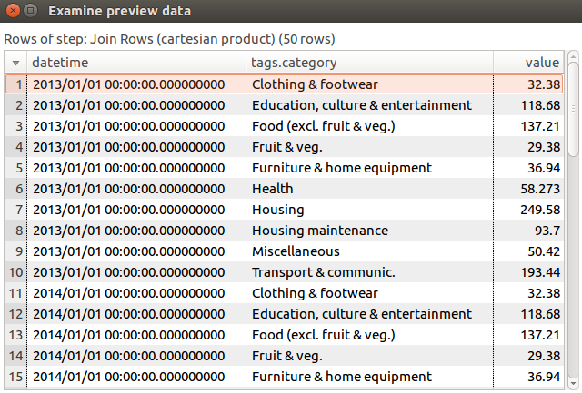
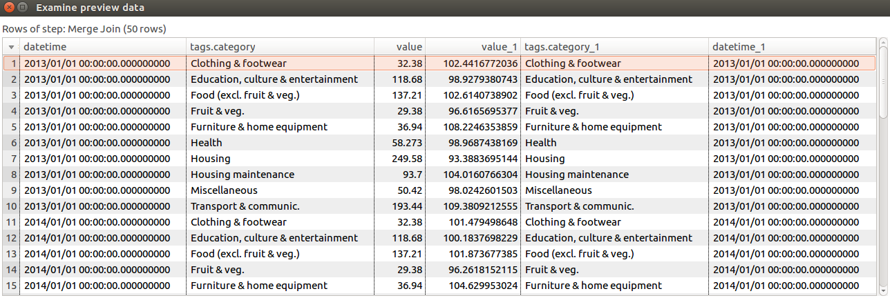
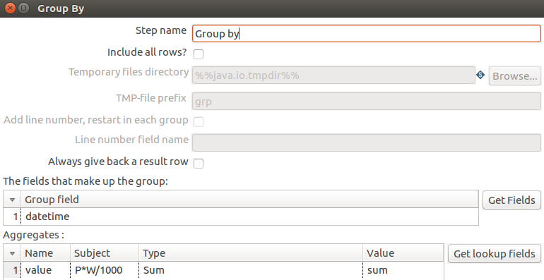
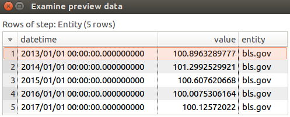

# Pentaho Data Integration

## Overview

Pentaho Data Integration at `https://community.hitachivantara.com/community/products-and-solutions/pentaho` (PDI) provides a graphical design environment to create and edit ETL (Extract, Transform, Load) jobs and workflows. The following guide includes examples of loading time series data from ATSD, calculating derived time series in PDI and storing the results in ATSD.

## Prerequisites

### Install PDI

* Install Pentaho Data Integration 7.1

### Install ATSD JDBC Driver

* Download ATSD [JDBC driver](https://github.com/axibase/atsd-jdbc/releases) with dependencies.
* Copy the driver `atsd-jdbc-*-DEPS.jar` file into the `lib` directory in the PDI installation directory.
* Restart the PDI process

### Load Sample Data

To complete this exercise, sample data must be available in your ATSD instance.

1. Log into the ATSD web interface
2. Open **Metrics > Data Entry**, select the **Commands** tab.
3. Copy the [`series` commands](./resources/commands.txt) into the form and click Submit/Send.


The commands contain the Consumer Price Index (CPI) for each category of items in a consumer's basket as well as a weight for each category in the CPI basket. The weights are stored as fractions of 1000. The CPI is tracked from 2013 to 2017 and uses Year 2016 values as the baseline. Weight values are available only for 2017. The underlying data is available in the following [Excel file](./resources/eng_e02.xls).

To calculate a weighted inflation index we need to multiply the CPI of each category by its weight divided by 1000 and sum the products.

## Configure Database Connection

* Create new **Transformation** by selecting **File > New > Transformation**
* Open `View` pane:


* Right-click on **Database connections > New**.
* Select **General** in the left menu.
* Select **Generic database** as **Connection Type**.
* Select **Native (JDBC)** as **Access**.

### Configure Connection Properties

* Enter JDBC URL into the `Custom Connection URL` field where `atsd_hostname` is the hostname of the ATSD database instance:

  `jdbc:atsd://atsd_hostname:8443;tables=inflation%`

> `tables` is an optional metric name filter. Review ATSD JDBC [URL parameters](https://github.com/axibase/atsd-jdbc#jdbc-connection-properties-supported-by-driver) for additional details.

* Set 'Custom Driver Class Name' field to `com.axibase.tsd.driver.jdbc.AtsdDriver`.
* Enter ATSD account credentials in the **User Name** and **Password** fields.
* Set 'Connection Name' to `ATSD Connection`.


* Click **Test** to verify connection.

## View Schema

* Edit `Custom Connection URL` field in ATSD Connection properties.
* Modify the `tables` parameter in the `Custom Connection URL` field. The parameter is a list of comma-separated metrics or metric expressions to be displayed as tables in the Database Browser.

Filter examples:

* `%java%` for metrics that contains `java` keyword
* `custom.metric%` for metrics whose name starts with `custom.metric`
* `%2017` for metrics whose name ends with `2017`

Click **Explore** to view the schema:


## Load Data

* Drag and Drop `ATSD Connection` from the **View** pane in the Database Connections folder.
* Set `Step name` to a unique name for this transformation.
* Write an SQL query used as a `Table input` for this transformation.
* Click `Preview` to verify query results.


## Calculate Derived Series

To calculate the category-weighted consumer price index (CPI) for each year, the CPI value for a given category must be multiplied by its weight and divided by 1000 since its weights are stored as units of 1000 (not 100). The resulting products are summed as the weighted CPI for the given year.

### Load Data from ATSD

* Create three `Table input` steps from ATSD: `Prices`, `Datetimes` and `Weights`.

* `Prices` are weighted prices for categories from 2013-2017 for 10 categories

```sql
SELECT value, tags.category, datetime
  FROM inflation.cpi.categories.price
ORDER BY datetime, tags.category
```

* `Datetimes` has timestamps for 2013-2017 years

```sql
SELECT datetime
  FROM inflation.cpi.categories.price
GROUP BY datetime
  ORDER BY datetime
```

* `Weights` has weights for 10 categories for 2017 year

```sql
SELECT tags.category, value
  FROM inflation.cpi.categories.weight
ORDER BY datetime, tags.category
```


### Duplicate Weights

Since the `Weights` are available for only one year, assume that the category weights are constant through the timespan and therefore can be repeated for each year from 2013 to 2017.

* Open the `Design` pane.
* Locate `Join Rows (cartesian product)` in `Joins` category.
* Drag and drop it to the `Transformation` pane.
* Connect your `Join Rows (cartesian product)` with `Datetimes` and `Weights` using `Input Connection` button. That button is displayed when the mouse hovers over `Join Rows` or any item inside the `Transformation` pane.


* Use `connect`:

Diagram example:


`Join Rows (cartesian product)` preview:



> Note to preview data right-click on step icon and select **Preview > Quick Launch**

### Merge Tables

In this step you append two tables to perform calculations on one table. This table has a unique row identifier (pair `datetime - tags.category`) so we can join them with the INNER JOIN operation.

* Open the `Design` pane and find `Merge Join` in the `Joins` category. Drag and drop it to the `Transformation` pane
* Connect `Merge Join` to `Join Rows (cartesian product)` and choose `Right hand side stream of the join`
* Connect `Merge Join` to `Prices` and choose `Left hand side stream of the join`
* Configure `Merge Join` as shown in the screenshot below:
> That operation joins two tables into one table.


Preview of `Merge Join`:



Diagram example:


### Remove Redundant Columns

* Open the `Design` pane.
* Locate the `Select values` option in the `Transform` category.
* Drag and drop it to `Transformation` pane.
* Connect `Select values` to `Merge Join`.
* Configure `Select values` as shown in the screenshot below:


Preview of `Remove columns`:


### Calculations

#### Price * Weight

Multiply two columns element-wise:

* Open the `Design` pane.
* Find `Calculator` in `Transform` category. Drag and drop it to the `Transformation` pane.
* Connect `Calculator` to `Remove columns`.
* Configure `Calculator` as shown in the screenshot below:

> This operation calculates a new field `P*W` (price multiplied by weight)


`Price * Weight` preview:


#### Add Column With a Constant

> This column is required for element-by-element division.

* Open the `Design` pane.
* Locate `Add constants` in `Transform` category. Drag and drop it to the `Transformation` pane.
* Connect `Add constants` to `Price * Weight`.
* Configure `Add constants` as shown in the screenshot below:

> This operation adds a new column `1000` that has a value of `1000` in each row.


Constant Column Preview:


#### Divide by 1000

Add a new column that has `Price * Weight` divided by 1000 due to the fact that weights are stored proportional to 1000.

* Open the `Design` pane.
* Find `Calculator` in the `Transform` category. Drag and drop it to the `Transformation` pane.
* Connect the `Calculator` step to `1000` step.
* Configure the `Calculator` as shown in the screenshot below:

> This operation calculates a new field `P*W/1000` as price multiplied by weight and divided by 1000.


Division preview:


#### Group By

Group rows by `datetime` and sum weighted price values for each year.

* Open the `Design` pane.
* Locate `Group by` in the`Statistics` category. Drag and drop it to `Transformation` pane.
* Connect `Group by` step to `/1000` step.
* Configure `Group by` as shown in the screenshot below:

> The operation groups records by `datetime` and calculates the sum of `P*W/1000` values for each group.



`Group By` preview:


#### Add Entity Column

The entity column is required to store computed metrics back in ATSD.

* Open the `Design` pane.
* Locate `Add constants` in the `Transform` category. Drag and drop it to the `Transformation` pane.
* Connect `Add constants` step to `Group by` step.
* Configure `Add constants` as shown in the screenshot below:

> This operation adds a new column `entity` that has the value `bls.gov` in each row.


`Entity` preview:



### Store Derived Series in ATSD

* Open the `Design` pane.
* Locate `Table output` in the `Output` category. Drag and drop it to `Transformation` pane.
* Connect `Table output` to `Entity`.
* Configure `Table output` as shown in the screenshot below.

> This operation inserts calculated data into ATSD.


* The `Target table` is the name of the metric which contains the calculated series.
* The metric does not have to be visible in the Schema.

Complete diagram:


### Check Results

Log in to ATSD and execute the following query in the SQL tab to verify the results:

```sql
SELECT entity, datetime, value FROM inflation.cpi.composite.price
```

```ls
| entity  | datetime                 | value              |
|---------|--------------------------|--------------------|
| bls.gov | 2013-01-01T00:00:00.000Z | 100.89632897771745 |
| bls.gov | 2014-01-01T00:00:00.000Z | 101.29925299205442 |
| bls.gov | 2015-01-01T00:00:00.000Z | 100.60762066801131 |
| bls.gov | 2016-01-01T00:00:00.000Z | 100.00753061641115 |
| bls.gov | 2017-01-01T00:00:00.000Z | 100.12572021999999 |
```

## Transformation File

* [Link to the `ktr` file](./resources/transformation.ktr) containing this transformation.

## Reference

PDI tools applied in this transformation:

* [Join Rows (cartesian product)](https://wiki.pentaho.com/display/EAI/Join+Rows+%28Cartesian+product%29)
* [Merge Join](https://wiki.pentaho.com/display/EAI/Merge+Join)
* [Calculator](https://wiki.pentaho.com/display/EAI/Calculator)
* [Insert / Update](https://wiki.pentaho.com/display/EAI/Insert+-+Update)
* [Group by](https://wiki.pentaho.com/display/EAI/Group+By)
* [Add constants](https://wiki.pentaho.com/display/EAI/Add+Constants)
* [Add sequence](https://wiki.pentaho.com/display/EAI/Add+sequence)
