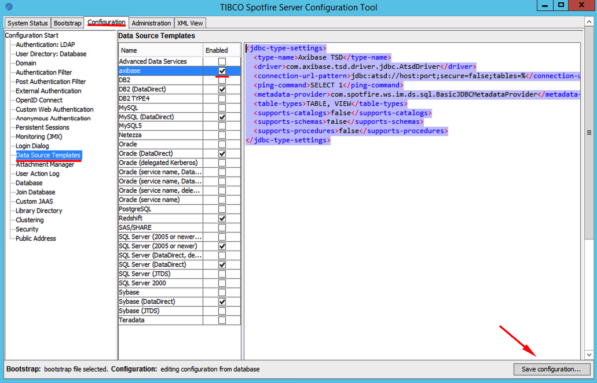
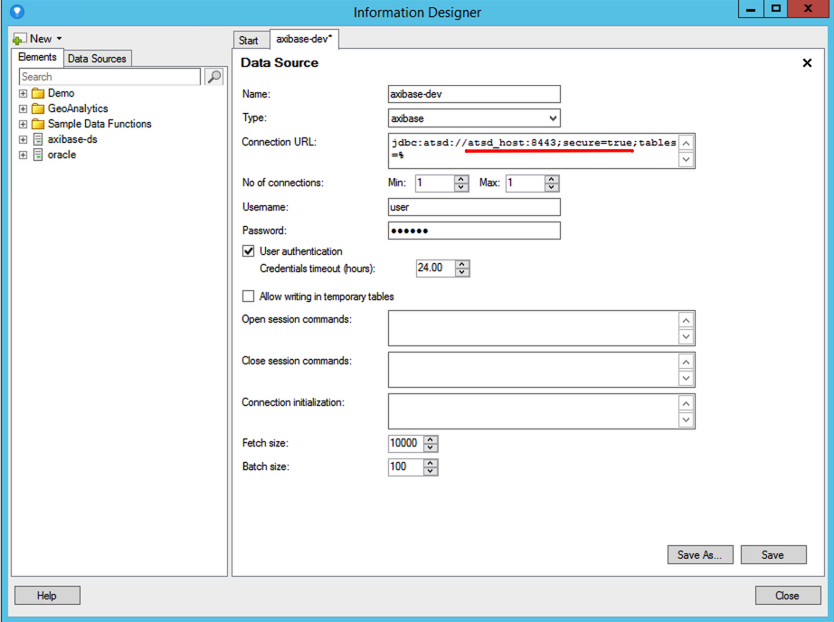

# TIBCO Spotfire

## Prerequisites

* [TIBCO Spotfire Server](https://edelivery.tibco.com/storefront/eval/tibco-spotfire-server/prod10256.html) `7.x`

## Install JDBC Driver

Download the ATSD [JDBC driver](https://github.com/axibase/atsd-jdbc/releases) with dependencies `atsd-jdbc-1.x.x-DEPS.jar` to the Spotfire server.

Copy the JAR file to the `tomcat/lib` folder in the Spotfire base directory directory.

:::tip NOTE
On Windows, the Spotfire `7.14.0` server base directory is located in the `C:\tibco\tss\7.14.0` directory.
Copy the JAR file to `C:\tibco\tss\7.14.0\tomcat\lib`.
:::

Restart the Spotfire server service to import the driver.

## Add Data Source Template

Launch the Spotfire configuration tool.

```bash
/path-to-spotfire-basedir/tomcat/bin/uiconfig.bat
```

Unlock the tool with the `spotfireadmin` user password.

Open **Configuration** tab and click **Data Source Templates**.

Create a new template for ATSD.

```xml
<jdbc-type-settings>
  <type-name>Axibase TSD</type-name>
  <driver>com.axibase.tsd.driver.jdbc.AtsdDriver</driver>
  <connection-url-pattern>jdbc:atsd://host:port;secure=true;tables=%</connection-url-pattern>
  <ping-command>SELECT 1</ping-command>
  <metadata-provider>com.spotfire.ws.im.ds.sql.BasicJDBCMetadataProvider</metadata-provider>
  <table-types>TABLE, VIEW</table-types>
  <supports-catalogs>false</supports-catalogs>
  <supports-schemas>false</supports-schemas>
  <supports-procedures>false</supports-procedures>
</jdbc-type-settings>
```



Enable the template and click **Save configuration**.

Refer to [JDBC Data Access Connectivity Details](https://community.tibco.com/wiki/tibco-spotfire-jdbc-data-access-connectivity-details) for more details.

## Configure Connection

Open **Tools > Information Designer** in the Spotfire Analyst tool.

Click **New** in the top left corner and specify ATSD hostname and port:

* `jdbc:atsd://192.0.2.1:8088;secure=false` if port is insecure (HTTP).

* `jdbc:atsd://192.0.2.1:8443;secure=true` if port is secure (HTTPS)

Append an optional [`tables`](https://github.com/axibase/atsd-jdbc#database-metadata) property to the URL to filter the list of tables displayed in the **Information Designer**.

```ls
jdbc:atsd://192.0.2.1:8443;secure=true;tables=jvm%
```

Refer to [ATSD JDBC URL format](https://github.com/axibase/atsd-jdbc#jdbc-url) for more details.

