# SPSS Modeler

## Overview

The IBM SPSS Modeler provides a set of tools to build data transformations and analysis models for users without programming experience. The following guide includes examples of loading time series data from ATSD,
calculating derived time series in the IBM SPSS Modeler interface and storing the results back in ATSD.

## Sample Dataset

Download sample [`series` commands](./resources/commands.txt).
The series contain the Consumer Price Index (CPI) for each category
of items in a consumer's basket as well as a weight for each category in the CPI
basket. The weights are stored as fractions of 1000. The CPI is tracked from 2013 to
2017 and uses Year 2016 values as the baseline. Weight values are available only for
year 2017.

To load the data into ATSD, log in to the database web interface and submit
these commands on the **Metrics > Data Entry** page.


## Prerequisites

* Install IBM SPSS Modeler, version 18
* Install [ODBC-JDBC bridge](../../odbc/README.md).

## Create Data Source

* Create a new stream. A stream is a configuration that includes all the steps to load and analyze the data in the SPSS Modeler.

* Select the **Sources** tab from the bottom panel and choose **Database**

  

* Add the **Database** source to the stream by dragging-and-dropping it into the stream workspace.

  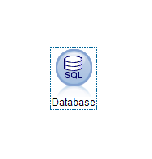

* Right-click the source and click **Edit...**

  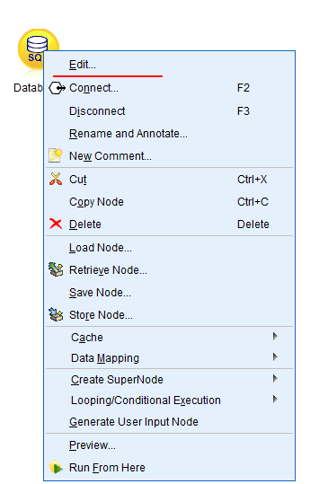

* Expand the **Data source** menu and choose **Add new database connection**

  

* Choose ATSD ODBC as the data source. If there are no data sources visible - create an ODBC-bridged connection to ATSD as described [here](../../odbc/README.md#configure-odbc-data-source) and click **Refresh**

  

* Enter your username and password and click **Connect**

  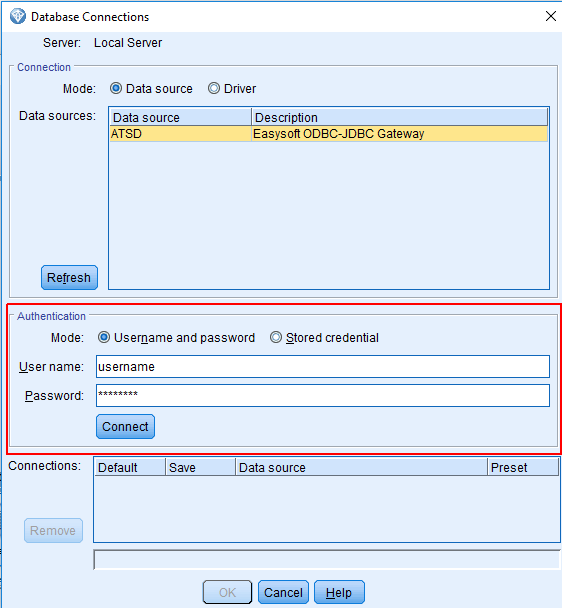

* The connection is now visible in the **Connections** table

  

* Click **OK**. Select the newly created ATSD data source.

  

* Click **Select...** to view the list of available ATSD tables. The list of tables is based on the `tables=` property specified in the JDBC URL. If you do not see the desired table in the list, update ODBC data source as described [here](../../odbc/table-config.md), delete your connection in SPSS Modeler and create it again. Specify `tables=%` to view all tables in ATSD.

  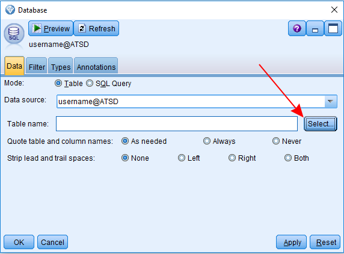

* Clear the **Show table owner** box shown below, select `inflation.cpi.categories.price` table and click **OK**

  

* Check **Never** in **Quote table and column names**

  

* Go to **Filter** tab and click arrows in the Filter column to disable the `time`, `text` and `metric` columns.

  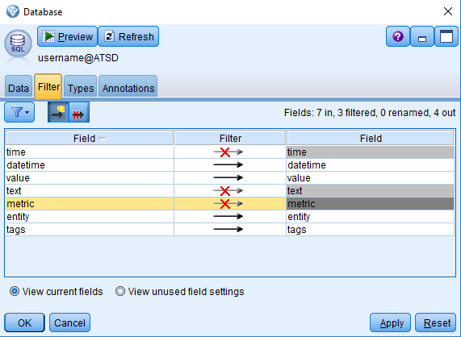

* Database source setup is finished. Click **Preview** to verify the results by reviewing the first 10 rows in the table.

  

  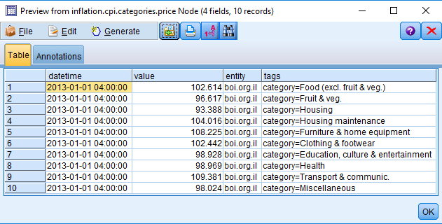

* Close the preview table and click **OK** in database source settings window to save changes.

* Repeat these steps to create another data source for table `inflation.cpi.categories.weight`

  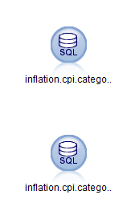

## Join Tables

* Select the **Record Ops** tab in the bottom panel, choose the **Merge** node and add it to the stream

  

* Right-click one of the database source shapes and select **Connect...**

  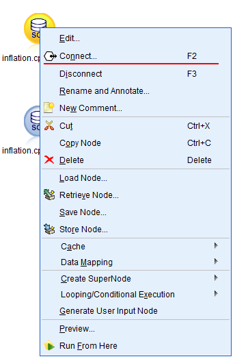

* Select **Merge** shape. A link appears between the source and the **Merge** shapes.

  

* Connect the other source with the **Merge** shape using the same technique.

  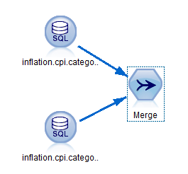

* Right-click the **Merge** shape and select **Edit...**. Set **Merge method** to **Keys** and add the `tags` field to **Keys for merge** field

  

* Open the **Filter** tab and disable `entity` and `datetime` fields for the `inflation.cpi.categories.weight` table.

  

* Rename the `value` field in the `inflation.cpi.categories.price` table to `price` and the `value` field in `inflation.cpi.categories.weight` to `weight`

  

* Click **Preview** to check the results

  

* Close the **Preview** window and click **Ok** to save changes.

## Calculate Weighted Price

* Select the **Field Ops** tab in the bottom panel, choose the **Derive** shape and add it to the stream.

  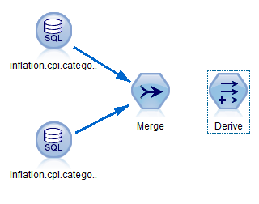

* Connect the **Merge** and **Derive** shapes

  

* Right-click the **Derive** shape and select **Edit...**
  * Set **Derive field** to **weighted_price**
  * Set field type to **Continuous**
  * Add the formula **price * weight / 1000**

  

* Click **Preview** to check results. The **weighted_price** column is displayed.

  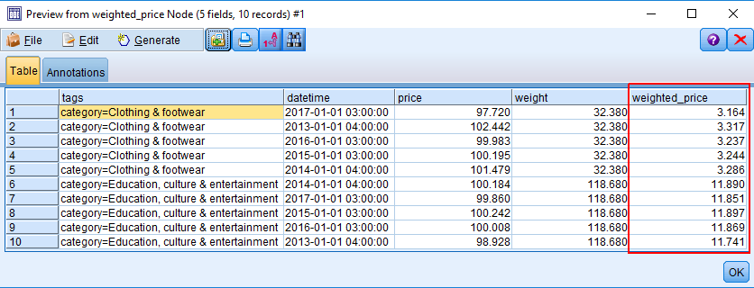

* Close the **Preview** window and click **Ok** to save changes.

## Calculate Weighted Inflation per Year

* Select the **Record Ops** tab, choose the **Aggregate** shape and add it to the stream.

  

* Connect the **Derive** (weighted_price) and **Aggregate** shapes

  

* Right-click the **Aggregate** shape and select **Edit...**
  * Add `datetime` in **Key fields**
  * Clear the **Include record count in field** box.

  

* In the **Aggregate expressions** table, enter the field name `value` and click **Launch expression builder**

  

* In the Expression Builder window, enter the formula `SUM('weighted_price')` and click **OK**

  

* Click **Preview** to check the results

  

* Close the preview table and click **OK** to save the changes.

## Add Entity Field

* Select the **Field Ops** tab, choose the **Derive** shape and add it to the stream

  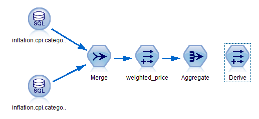

* Connect the **Aggregate** and **Derive** shapes

  

* Right-click the **Derive** shape and select **Edit...**
  * Set the **Derive field** to **entity**
  * Set field type to **Categorical**
  * Add formula **"bls.gov"**

  

* Click **Preview** to check the results with the **entity** column added.

  

* Close the preview table and click **OK** to save changes.

## Export Results

* Select the **Export** tab, choose the **Database** shape and add it to the stream

  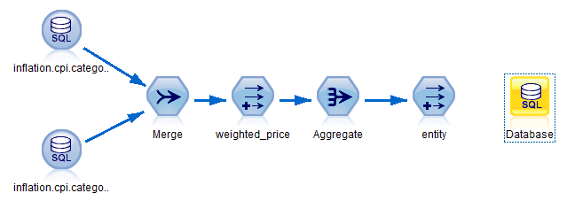

* Connect the **Derive** (entity) and **Database** shapes

  

* Right-click the **Database** shape and select **Edit...**
  * Choose **Data source**
  * Type `inflation.cpi.composite.price` in **Table name**. This is the name of the new metric inserted into ATSD.
  * Select the **Insert into table** option
  * Set **Quote table and column names** to **Never**

  

* Click **Advanced...**

  

* In the Advanced Options window
  * Check **Use batch commit**
  * Set batch size large enough to load all your export data in a single batch
  * Set **Use bulk loading** to **Via ODBC**
  * Click **OK** to save and exit.

  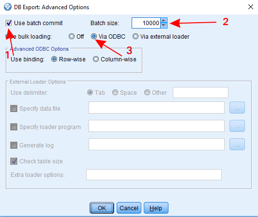

* Click **Run** to export data into ATSD

  

## Verify Insertion

To check that data is successfully exported to ATSD go to the ATSD web interface, click **SQL** and execute the
following query

```sql
SELECT entity, datetime, value
  FROM inflation.cpi.composite.price
```

  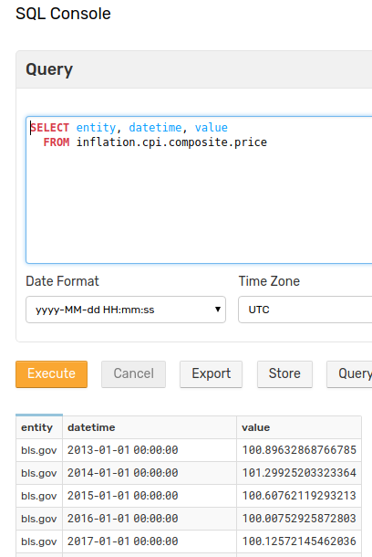

## Stream File

Download the [stream file](./resources/Stream.str) used for this guide for review in your own IBM SPSS Modeler installation.
