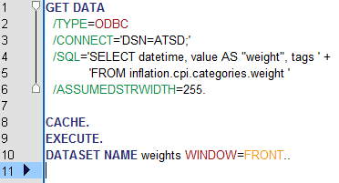
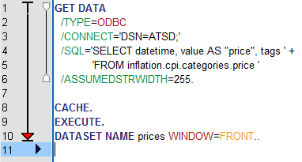
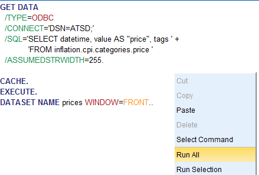
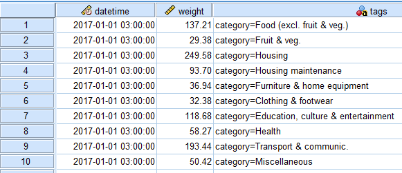

# Configuring the Data Source in IBM SPSS Statistics

* Open the attached scripts:

[`weight.sps`](./resources/weight.sps)

[`price.sps`](./resources/price.sps)

* Right-click the script window and select **Run All** to export the data into ATSD.

The script connects to ATSD (`CONNECT='DSN=ATSD'`), executes the query specified in the `SQL` variable and displays the dataset.

