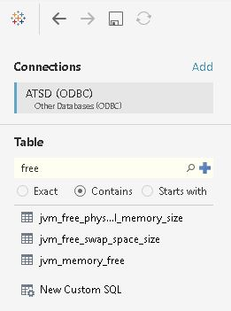
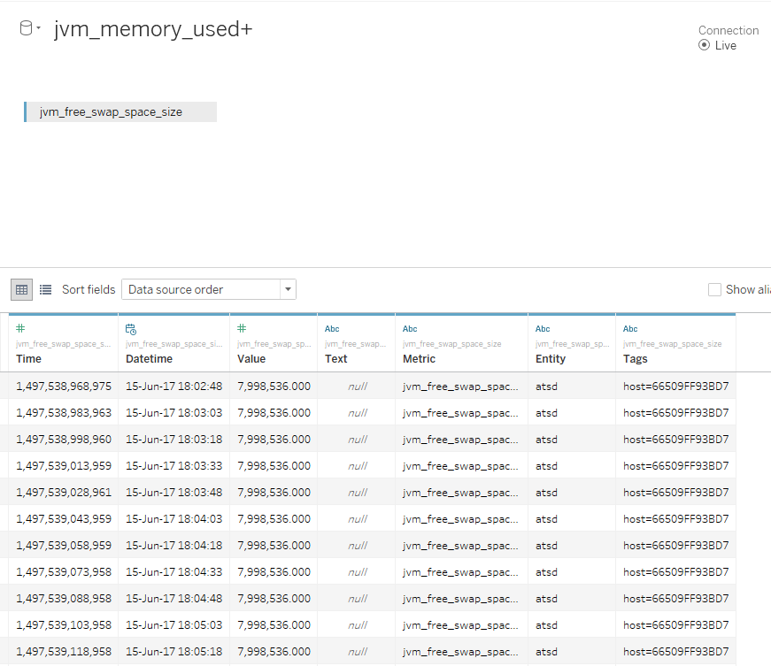
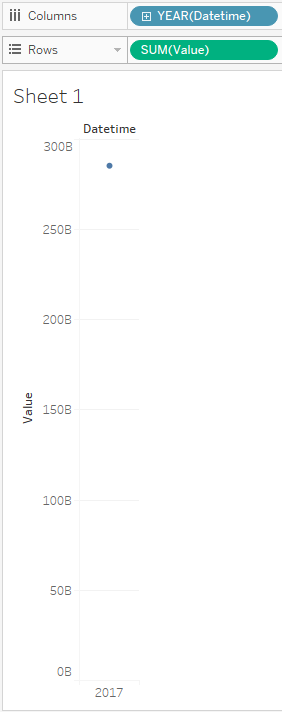

# TABLEAU

- [Prerequisites](#prerequisites)
- [Configure Database Connection](#configure-database-connection)
- [Review Tables in the Data Source Pane](#review-tables-in-data-source-pane)
- [Visualization](#vizualization)

## Prerequisites

### Install Tableau

- Install [Tableau Desktop 10.2](https://www.tableau.com/support/releases/desktop/10.2) 
- Add [ATSD.tdc](resources/ATSD.tdc) to your Tableau Repository on Windows, for example: C:\Users\You\Documents\My Tableau Repository\Datasources\ATSD.tdc

### Install ODBC-JDBC gateway
- Install [ODBC-JDBC gateway](../odbc/README.md)  
> Note you should put ticks at 'Strip Quote' and 'Strip Escape'. 
> Don't forget to choose some table (specify a JDBC URL like jdbc:atsd://ATSD_HOSTNAME:8443;tables=TABLE_NAME_FILTER).
> `TABLE_NAME_FILTER` is a list of comma-separated metrics or metric expressions to be displayed as tables in the Tableau.
> `TABLE_NAME_FILTER` examples:
>  - `*java*` for metrics that contains word `java`
>  - `custom.metric*` for metrics whose name starts with `custom.metric`
>  - `*2017` for metrics whose name ends with `2017`
>  - `*` for all metrics.

## Configure Database Connection

- launch Tableau.
- Select 'Connect' - 'To a Server' - 'Other Databases(ODBC)'.
- Select DSN from drop-down.
- Press 'Connect', wait a few seconds.
- Leave the 'Server','Port', 'Database' and 'String Extras' fields empty.
- Press 'Sign In'.

Example:

`DSN` is DSN specified by you during ODBC-JDBC gateway configuration (DSN Setup).

## Review Tables in the Data Source Pane

- Specify required tables and press search icon. 
- Drag table to the Data Source Pane.
- Press 'Update Now'.

Expected result:

      

## Visualization

- Press 'Sheet 1'.
- Press 'Ok' in the limitations message.
- Set 'Datetime' to the columns field.
- Set 'Value' to the rows field.

Expected result:

> Sometimes visualization process requests a few seconds, for example due to big volumes of data.

You can inspect part of visualized data:
- Select some points on view.
- Right-click - 'View Data'

Expected result:

See other examples of visualization:

- [Month and day aggregation](month_and_day_aggregation.md)
- [Value aggregation](value_aggregation.md)
- [Use of two metrics](use_of_two_metrics.md)