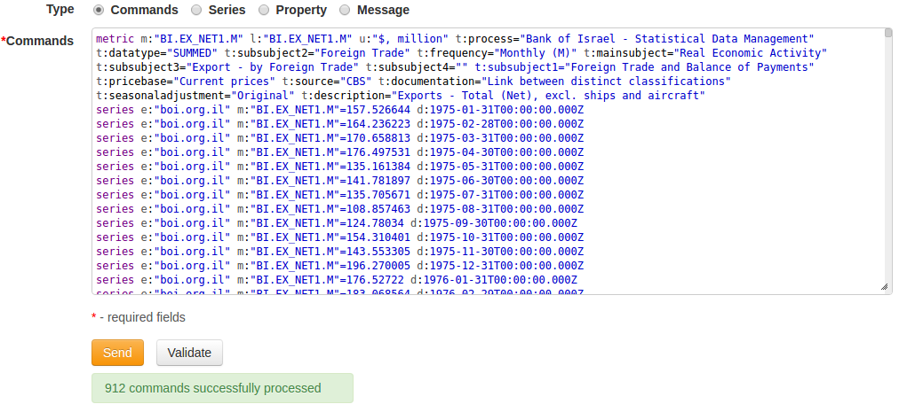
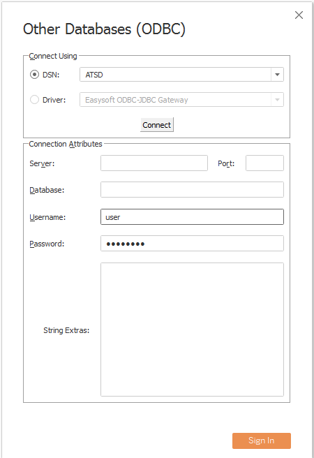
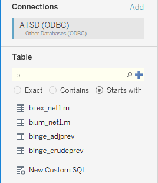
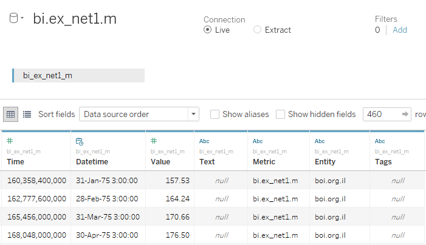
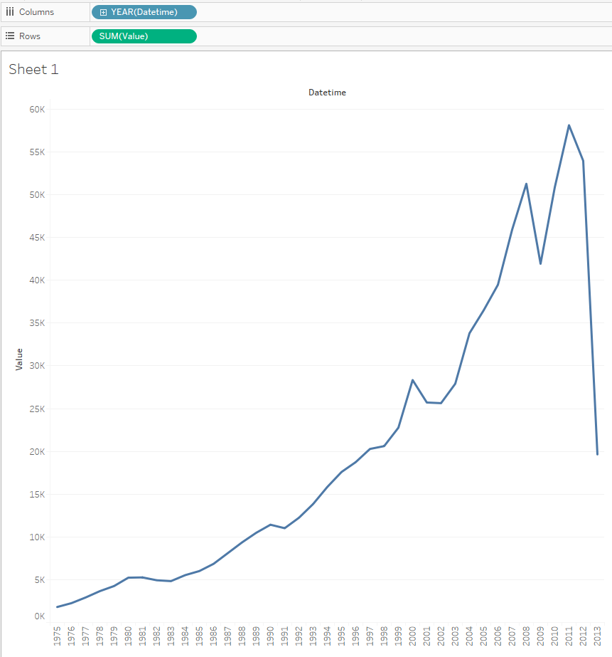
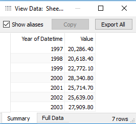

# TABLEAU

- [Prerequisites](#prerequisites)
- [Configure Database Connection](#configure-database-connection)
- [Review Tables in Data Source Pane](#review-tables-in-data-source-pane)
- [Visualization](#visualization)

## Prerequisites

### Install Tableau

- Install [Tableau Desktop 10.2](https://www.tableau.com/support/releases/desktop/10.2) 
- Add [ATSD.tdc](resources/ATSD.tdc) to your Tableau Repository on Windows, for example: C:\Users\You\Documents\My Tableau Repository\Datasources\ATSD.tdc

### Install ODBC-JDBC gateway
- Install [ODBC-JDBC gateway](../odbc/README.md)  
> Note you should put ticks at 'Strip Quote' and 'Strip Escape'. 
> You can choose some table (specify a JDBC URL like jdbc:atsd://ATSD_HOSTNAME:8443;tables=TABLE_NAME_FILTER).
> `TABLE_NAME_FILTER` is a list of comma-separated metrics or metric expressions to be displayed as tables in the Tableau.
> `TABLE_NAME_FILTER` examples:
>  - `*java*` for metrics that contains word `java`
>  - `custom.metric*` for metrics whose name starts with `custom.metric`
>  - `*2017` for metrics whose name ends with `2017`
>  - `*` for all metrics.

> There is `tables=*` by default.

### Load Sample Data

To complete this exercise, sample data must be available in your ATSD instance.

1. Log into the ATSD web interface
2. Open **Metrics -> Data Entry**, select the **Commands** tab.
3. Copy the [series commands](resources/commands.txt) into the form and click Submit/Send.

## Configure Database Connection

- launch Tableau.
- Select **Connect -> To a Server -> Other Databases(ODBC)**.
- Select DSN from drop-down.
- Press **Connect**, wait a few seconds.
- Leave the **Server**,**Port**, **Database** and **String Extras** fields empty.
- Press **Sign In**.

Example:

`DSN` is DSN specified by you during ODBC-JDBC gateway configuration (DSN Setup).

## Review Tables in Data Source Pane

- Specify required tables and press search icon. In our exercise we will need `bi.ex_net1.m` metric:

  

- Drag table to Data Source Pane.
- Press **Update Now**.

Expected result:

## Visualization

- Press **Sheet 1**.
- Press **OK** in the limitations message.
- Set _Datetime_ to the columns field.
- Set _Value_ to the rows field.

> Note you shouldn't use both _Time_ and _Datetime_ due to they are the same attributes and ATSD raises an error in some cases (for example, if your visualization requires query with more than one time column in the `GROUP BY` clause).
 

Expected result:

> Sometimes visualization process requests a few seconds, for example due to big volumes of data.

You can inspect part of visualized data:
- Select some points on view.
- **Right-click -> View Data**.

Expected result:

See other examples of visualization:

- [Month and year aggregation](month_and_year_aggregation.md)
- [Value aggregation](value_aggregation.md)
- [Max number of measures](max_number_of_measures.md)
- [Comparision of two metrics at one bar graph](comparision_of_two_metrics_at_one_bar_graph.md)
- [Detailed values by date (no aggregation) for one metric](detailed_values_by_date_for_one_metric.md)
- [Detailed values by date (no aggregation) for two metric](detailed_values_by_date_no aggregation_for_two_metric.md)
- [Average by year for one metric](average_by_year_for_one_metric.md)
- [Sum by year for one metric](sum_by_year_for_one_metric.md)
- [Min and Max by year for one metric](min_and_max_by_year_for_one_metric.md)
- [Max-Min by year for one metric](max-min_by_year_for_one_metric.md)
- [Sum by year for two metrics](sum_by_year_for_two_metrics.md)
- [Export - Import by year](export-import_by_year.md)
- [SUM(export)-SUM(import) by year](sum(export)-sum(import)_by_year.md)