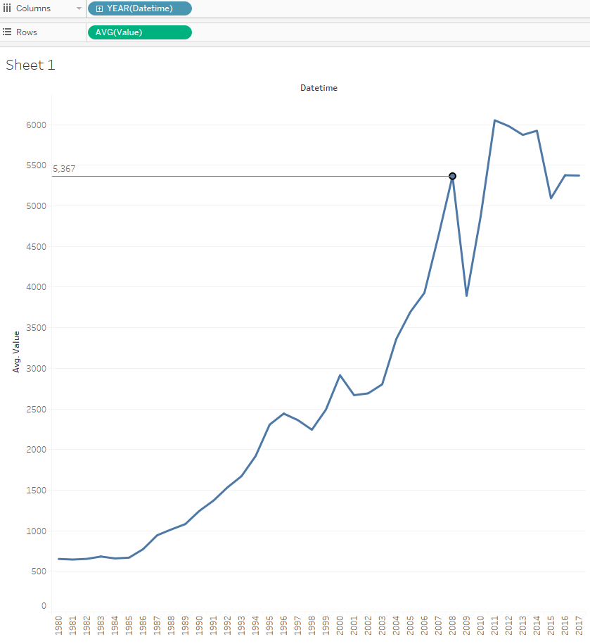

# Average by year for one metric

Let's see average import value for each year.

We will need `bi.im_net1.m` table:

- Drag-and-drop _Datetime_ to the columns field
- Drag-and-drop _Value_ to the rows field, change aggregation from SUM to AVG
- Optionally add [drop lines](comparision_of_two_metrics_at_one_bar_graph.md#drop-lines)

