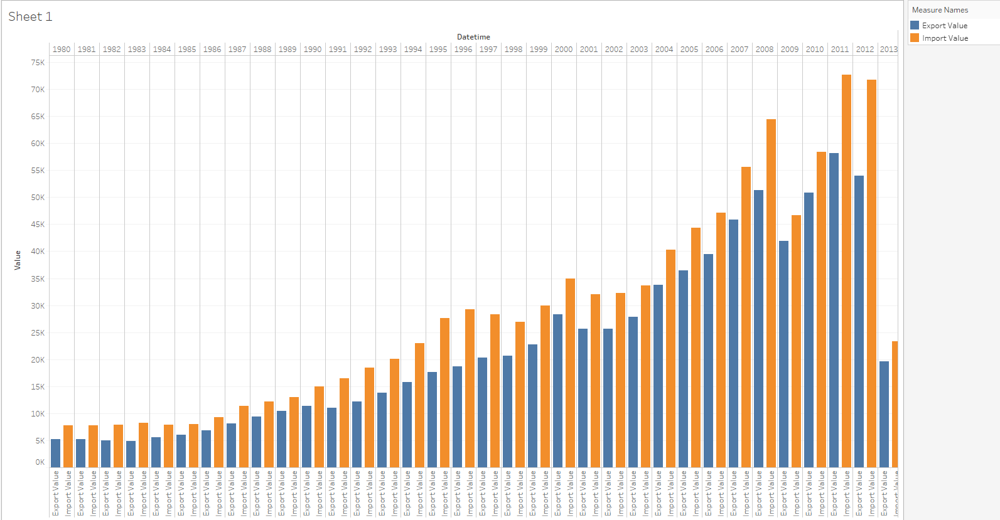
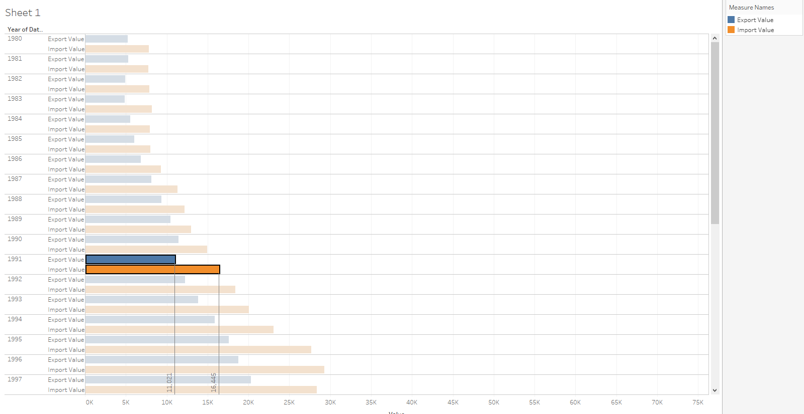

# Comparision of two metrics at one bar graph

Let's try to see the difference between the total values of each year for export and import metrics.

We will need `bi.ex_net1.m` and `bi.im_net1.m` tables:

> Don't forget to specify at least time/datetime and entity in INNER/FULL OUTER join

- Drag-and-drop _Datetime_ to the column field
- Drag-and-drop both _Value_ to the rows field

> You can rename values:
> - Right click on _Value_ and choose **Rename**

- Show Me Card > _side-by-side bars_ 

You can click Ctrl+W and swap columns and rows.

## Drop Lines
It would be useful to add **Drop Lines** and **Labels**:

- Select some column
- Right click and choose **Drop Lines** > **Show Drop Lines**
- Right click and choose **Drop Lines** > **Edit Drop Lines** > **Labels** > **Automatic**

