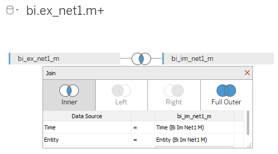
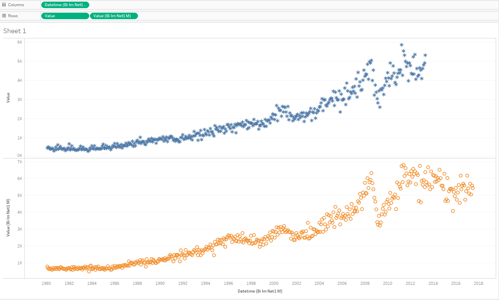

# Detailed values by date (no aggregation) for two metric

There is an explanation of how to visualize two metrics at one sheet.

We will need `bi.ex_net1.m` and `bi.im_net1.m` metrics:

- Drop each of them to Data Source Pane.
- Select _Inner Join_, specify _Time_ and _Entity_ as equal fields:

> Note you should specify at least time/datetime and entity, otherwise ATSD will rise an error.
> You shouldn't combine INNER and FULL OUTER joins due to Tableau sends invalid queries into ATSD.
> There is only the equals (=) comparison operator can used in  joins.
> LEFT/RIGHT joins are not supported.

- Drag-and-drop _Datetime_ to the columns field (you can use any of _Datetime_), change from YEAR aggregation to _Exact Date_ 
- Drag-and-drop both _Value_ to the rows field, change from SUM aggregation to _Dimension_
- Specify color: _Marks_ > _Value_ (you can use any of _Value_) > _Color_
- Specify shape: _Marks_ > _Value_ (you can use any of _Value_) > _Shape_

It is possible to compare two metrics now:

