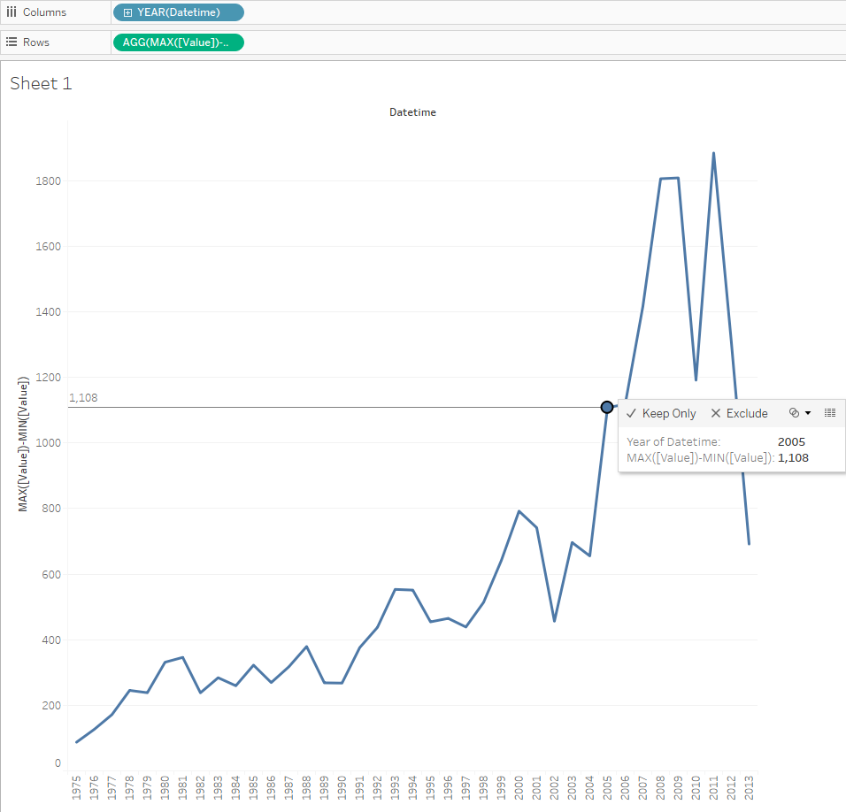

# MAX-MIN by year for one metric

## Overview

Report illustrating the difference between the maximum and minimum export value each year.

## Data Source

* Table: `bi.ex_net1.m`

## Steps

* Drag-and-drop the table to Canvas area
* Click **Sheet 1**
* Click **OK** to acknowledge the warning about limitations
* Drag-and-drop `Datetime` onto the column field
* Copy `MAX([Value])-MIN([Value])` > double-click the rows field, paste, click **Enter**

> MAX([Value])-MIN([Value]) is a customer calculation: Tableau provides a wide set of [Table Calculation Functions](https://onlinehelp.tableau.com/current/pro/desktop/en-us/functions_functions_tablecalculation.html)

## Results

