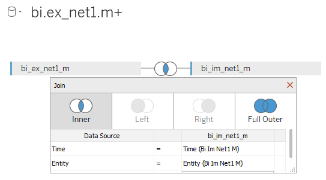

# SUM(Export)-SUM(Import) by Year

## Data Source

* Tables: `bi.im_net1.m` and `bi.ex_net1.m`

## Steps

* Drag-and-drop both tables to Canvas area
* Select `Inner Join`, specify `Time` and `Entity` as equal fields:

* Click **Sheet 1**
* Click **OK** to acknowledge the warning about limitations
* Drag-and-drop `Datetime` onto the column field
* Rename both `Value` to **Export Value** and **Import Value**: right-click **Value** and choose **Rename**
* Copy `SUM([Export Value])-SUM([Import Value])` > double-click the rows field, paste, click **Enter**
> In case of error remove ']' and select value from tooltip
* Select `Line` in the dropdown at Marks Card
* Optionally add [drop lines](comparison_of_two_metrics_at_one_bar_graph.md#drop-lines)

## Results

