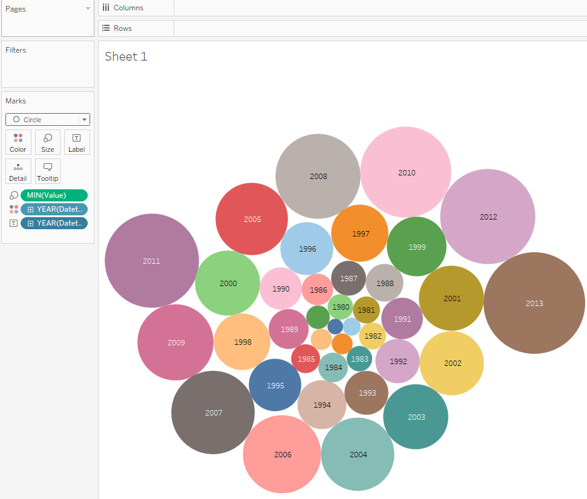
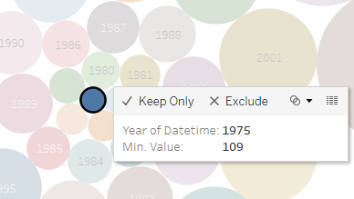

# Value Aggregation

## Overview

Display the minimum exports each year.

## Data Source

* Table: `bi.ex_net1.m`

## Steps

* Drag-and-drop the table to Canvas area
* Click **Sheet 1**
* Click **OK** to acknowledge the warning about limitations
* Drag-and-drop `Value` to the Marks Card, right-click **Measure** > **Minimum**, replace `Detail` with `Size`
* Drag-and-drop `Datetime` to the Marks Card, replace `Detail` with `Color`
* Drag-and-drop `Datetime` to the Marks Card, right-click the **QUARTER > YEAR**, replace `Detail` with `Label`
* Change _Automatic_ to _Circle_ in the drop-down list on the Marks Card

## Results

In year 1975 the value was equal to 109 which is the minimum of all values for the `bi.ex_net1.m` metric:

