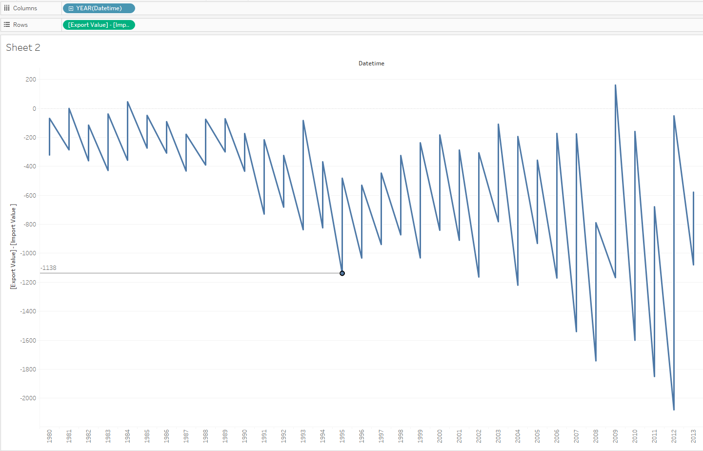

# Export - Import by year

By analogy with [Max-Min by year for one metric](export-import_by_year.md) let's try to create the line showing the difference between the export and import values in each year.

We will need `bi.ex_net1.m` and `bi.im_net1.m` tables:

> Don't forget to specify at least time/datetime and entity in INNER/FULL OUTER join
 
- Drop _Datetime_ to the column field
- Rename both _Value_ to 'Export Value' and 'Import Value'
- Copy: _[Export Value] - [Import Value ]_ -> double-click to the rows field -> paste -> **Enter**
- Select _Line_ in drop-down at Marks Card

