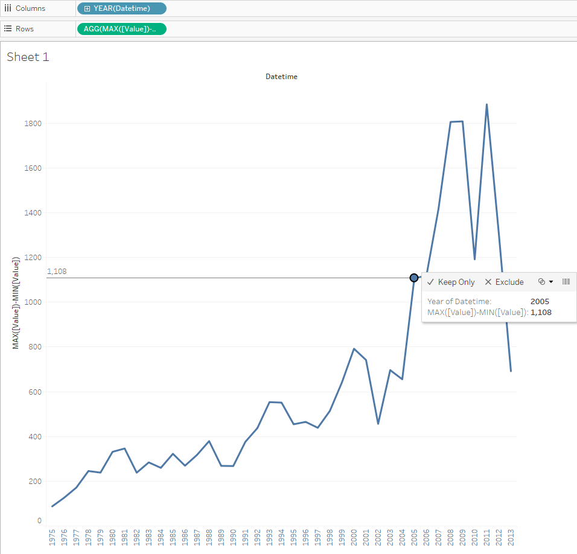

# Max-Min by year for one metric

 Let's try to create the line showing the difference between the maximum and minimum export value in each year. There you can find explanation of making calculation.
 
 We will need `bi.ex_net1.m` table:
 
- Drag-and-drop _Datetime_ to the column field
- Copy: _MAX([Value])-MIN([Value])_ > double click to the rows field > paste > **Enter**
 
> MAX([Value])-MIN([Value]) is a customer calculation: Tableau provides a wide set of [Table Calculation Functions](http://onlinehelp.tableau.com/current/pro/desktop/en-us/functions_functions_tablecalculation.html)

