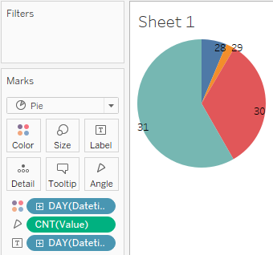

# MAX number of measures

Let's try to understand which day contains max number of export measures.
 
 
We will need `bi.ex_net1.m` metric:

 - Drag-and-drop _Datetime_ to the Marks Card, right click on the _Year > Day_, replace _Detail_ with _Color_
 - Drag-and-drop _Datetime_ to the Marks Card, right click on the _Year > Day_, replace _Detail_ with _Label_
 - Change _Automatic_ to _Pie_ in drop-down at Marks Card
 - Drag-and-drop _Value_ to the Marks Card, change aggregation from SUM to COUNT, replace _Detail_ with _Angle_
 
 The greatest number of records was made the 31st:
 
 