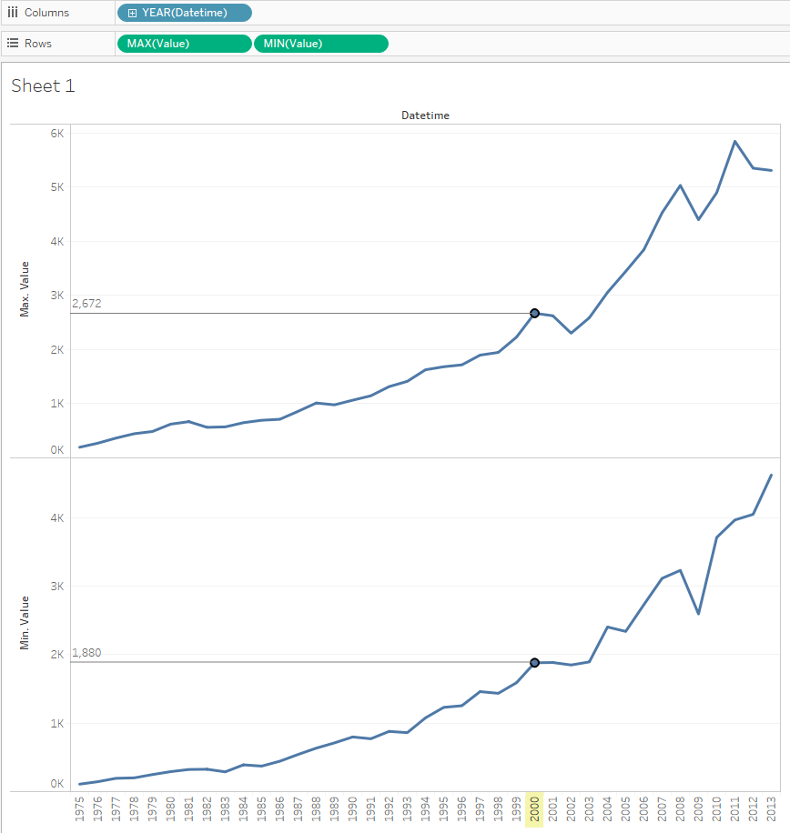

# Min and Max by year for one metric

Let's compare trends of min and max value.

We will need `bi.ex_net1.m` table:

- Drag-and-drop _Datetime_ to the columns field
- Drag-and-drop _Value_ to the rows field, change aggregation from SUM to MIN
- Drag-and-drop _Value_ to the rows field, change aggregation from SUM to MAX
- Optionally add drop lines (see [Drop Lines](comparision_of_two_metrics_at_one_bar_graph.md/#drop-lines))

