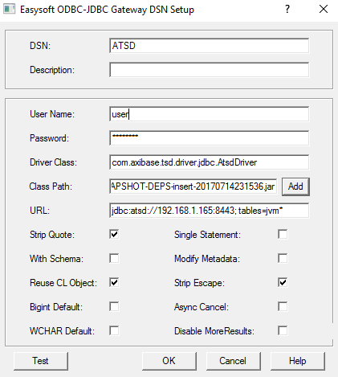
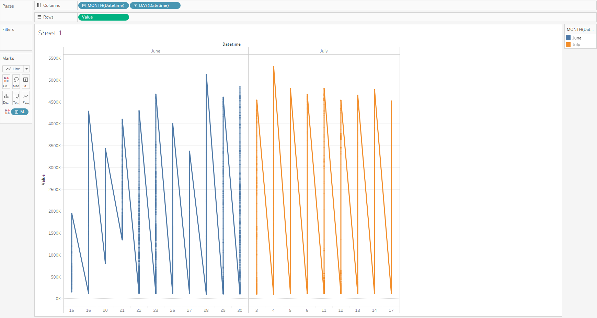

# Month and day aggregation

> It is assumed that you have passed all the steps from a [README.md]()

It's often useful to monitor disk space, so let's try to visualize free physical memory size in the ATSD:

- Specify table in the URL: 
```
    jdbc:atsd://ATSD_HOSTNAME:8443; tables=jvm*
```



- Launch Tableau
- Drag&drop 'jvm_free_physical_memory_size' to the data Source Pane
- Set 'Datetime' to the columns field and 'Value' to the rows field
- Right-click on the 'Year' - 'Month' - '+'
- Right-click on the 'Value' - 'Dimension' 
- 'Marks' - Drop-down - 'Line'
- Drag 'Datetime' to the 'Color', choose aggregation from year to month


Expected result:


