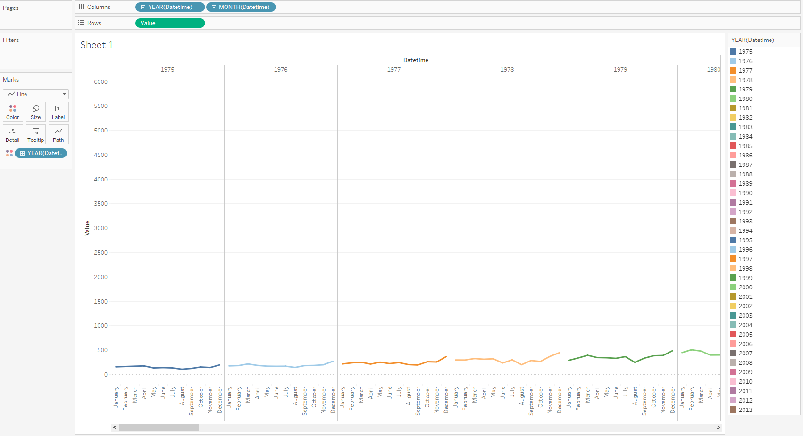
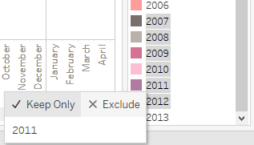
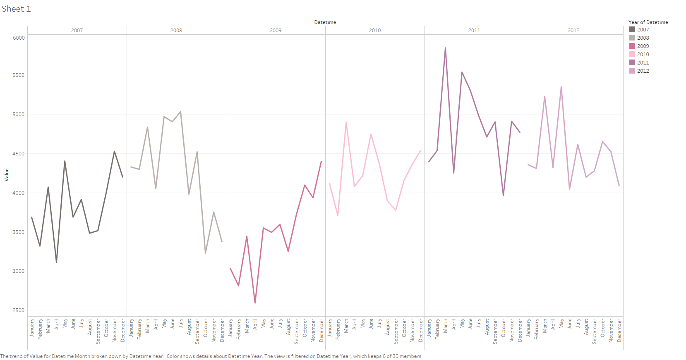

# Month and year aggregation

As in the previous step we will need `bi.ex_net1.m` metric

- Launch Tableau
- Drag `bi.ex_net1.m` to the data Source Pane
- Go to **Sheet 1**: set _Datetime_ to the columns field and _Value_ to the rows field
- _Value_ -> _Right-click_ -> _Dimension_
- Marks Card -> Drop-down -> Line
- _YEAR -> +_, **Right-click** on the _QUARTER -> MONTH_
- Drag _Datetime_ to the _Color_ (Marks Card), select **Add all members**

Let's see statistics for only 2007-2012 years:

- Select 2007-2012 rows in YEAR(Datetime) card (right side) **-> Keep Only**

You can see next result:

