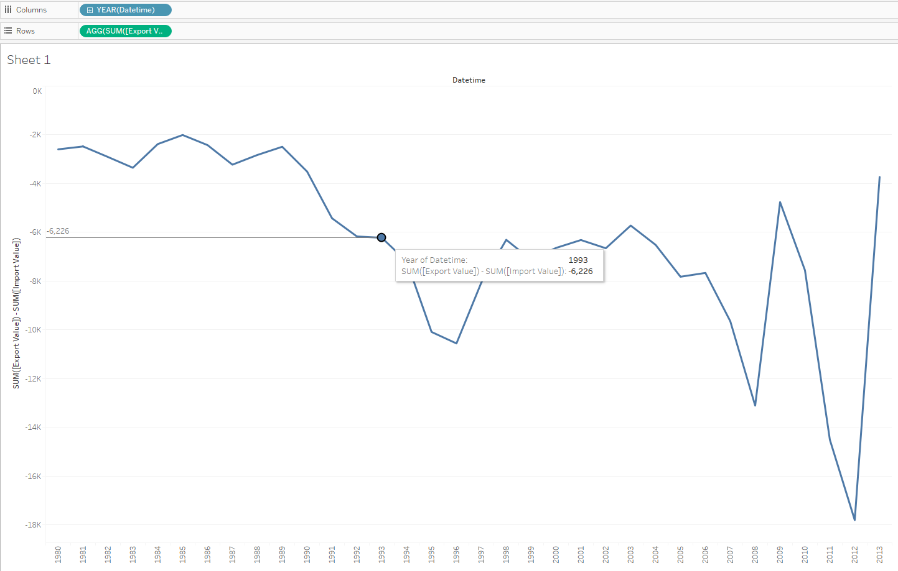

#  SUM(export)-SUM(import) by year

We will need `bi.ex_net1.m` and `bi.im_net1.m` tables:

> Don't forget to specify at least time/datetime and entity in INNER/FULL OUTER join

- Drag-and-drop _Datetime_ to the column field
- Rename both _Value_ to 'Export Value' and 'Import Value'
- Copy: `SUM([Export Value]) - SUM([Import Value])` > double click to the rows field > paste > **Enter**

