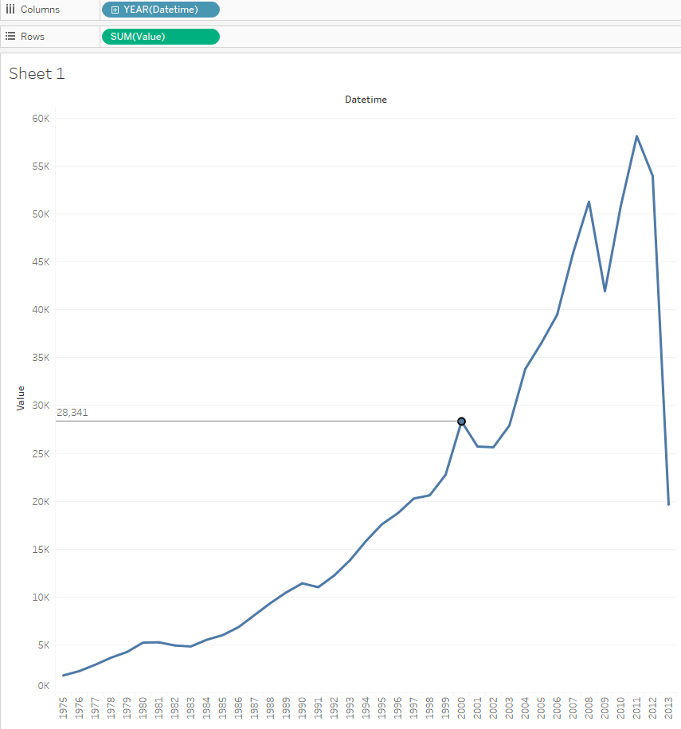

# Sum by year for one metric

What is the trend of the total value export in a few years?

We will need `bi.ex_net1.m` table:

- Drag _Datetime_ to the columns field
- Drag _Value_ to the rows field
- Optionally add [drop Lines](comparision_of_two_metrics_at_one_bar_graph.md/#drop-lines)

