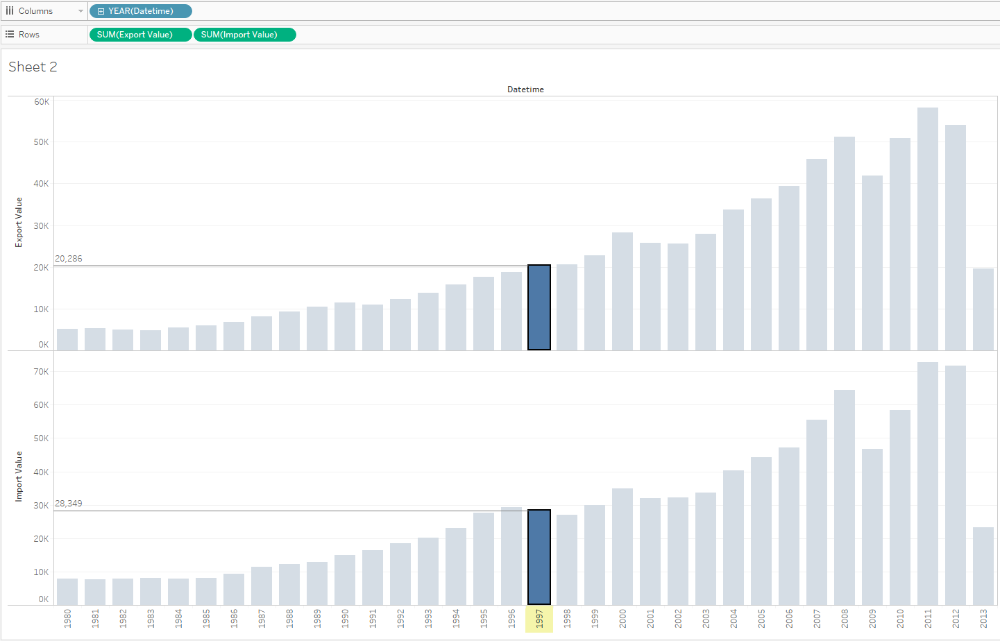

# Sum by year for two metrics

We already know how to see [difference between two metrics at one bar graph](comparision_of_two_metrics_at_one_bar_graph.md), let's find out how to make it at separate graphs.

We will need `bi.ex_net1.m` and `bi.im_net1.m` tables:

> Don't forget to specify at least time/datetime and entity in INNER/FULL OUTER join

- Drop _Datetime_ to the column field
- Drop both _Value_ to the rows field
- Change _Automatic_ to _Bar_ in drop-down at Marks Card

