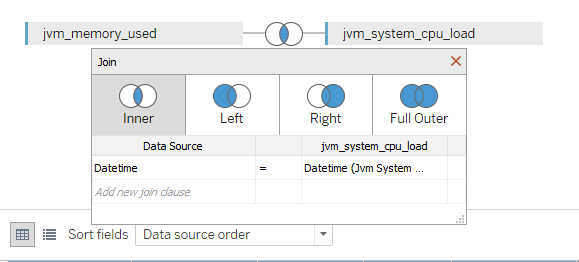
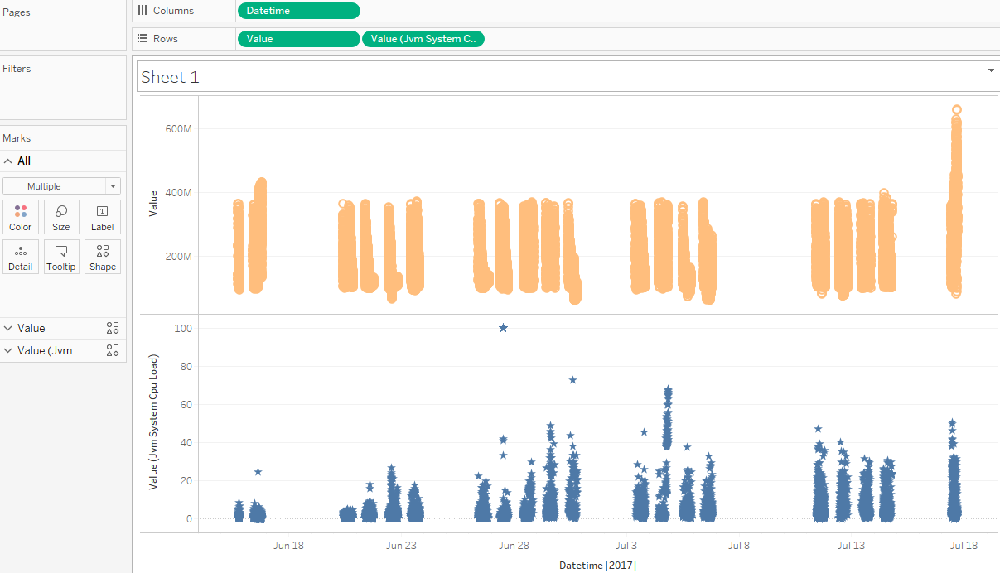

# Use of two metrics

There is an explanation of how to visualize two metrics at one sheet.

- Specify table in the URL: 
```
    jdbc:atsd://ATSD_HOSTNAME:8443; tables=jvm*
```

We will need 'jvm_memory_used' and 'jvm_system_cpu_load' metrics, you should drop each of them to the Data Source Pane, select 'Inner Join' and specify 'Datetime' as equal fields:



- Drag 'Datetime' to the columns field (you can use any of 'Datetime'), change from YEAR aggregation to 'Exact Date' 
- Drag both 'Value' to the rows field, change from SUM aggregation to 'Dimension'
- Specify color:'Marks' - 'Value'  (you can use any of 'Value') - 'Color'
- Specify shape:'Marks' - 'Value'  (you can use any of 'Value') - 'Shape'

Expected result:

