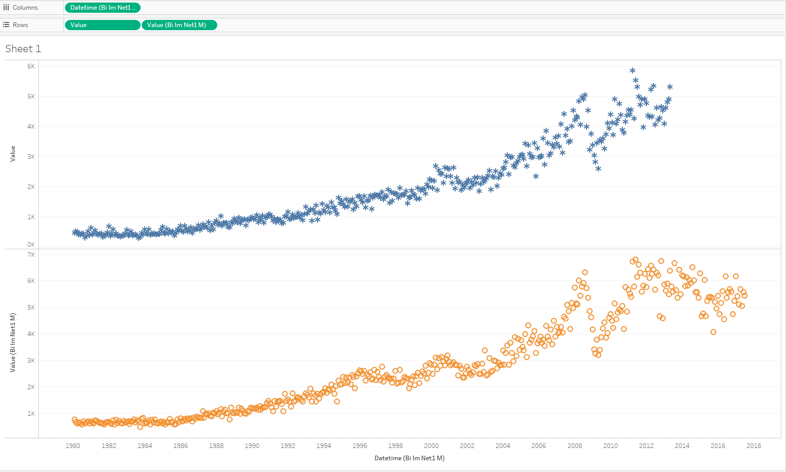

# Use of two metrics

There is an explanation of how to visualize two metrics at one sheet.

We will need `bi.ex_net1.m` and `bi.im_net1.m` metrics:

- Drop each of them to Data Source Pane.
- Select _Inner Join_, specify _Time_ and _Entity_ as equal fields:

> Note you should specify at least time/datetime and entity, otherwise ATSD will rise an error.

- Drag _Datetime_ to the columns field (you can use any of _Datetime_), change from YEAR aggregation to _Exact Date_ 
- Drag both _Value_ to the rows field, change from SUM aggregation to _Dimension_
- Specify color:_Marks_ - _Value_ (you can use any of _Value_) - _Color_
- Specify shape:_Marks_ - _Value_ (you can use any of _Value_) - _Shape_

It is possible to compare two metrics now:

