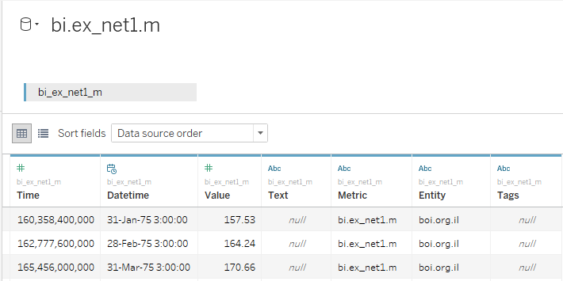
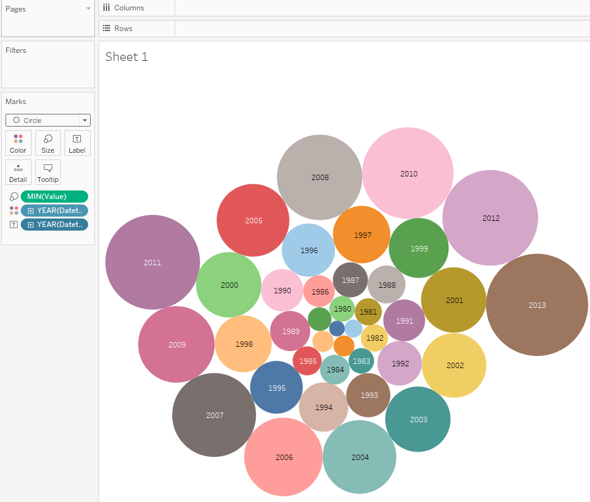
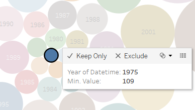

# Value aggregation

We will need `bi.ex_net1.m` metric:

Let's try to find year with min value:

- Drag-and-drop _Value_ to the Marks Card, change aggregation from SUM to MIN, replace _Detail_ with _Size_
- Drag-and-drop _Datetime_ to the Marks Card, replace _Detail_ with _Color_
- Drag-and-drop _Datetime_ to the Marks Card, **Right-click** on the _QUARTER > YEAR_, replace _Detail_ with _Label_
- Change _Automatic_ to _Circle_ in drop-down at Marks Card

We can see that in 1975 value was equal 109 and it is an absolute minimum among all measures in `bi.ex_net1.m` metric:

 
 
