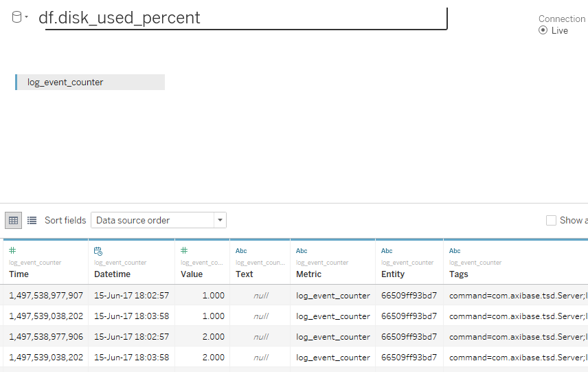
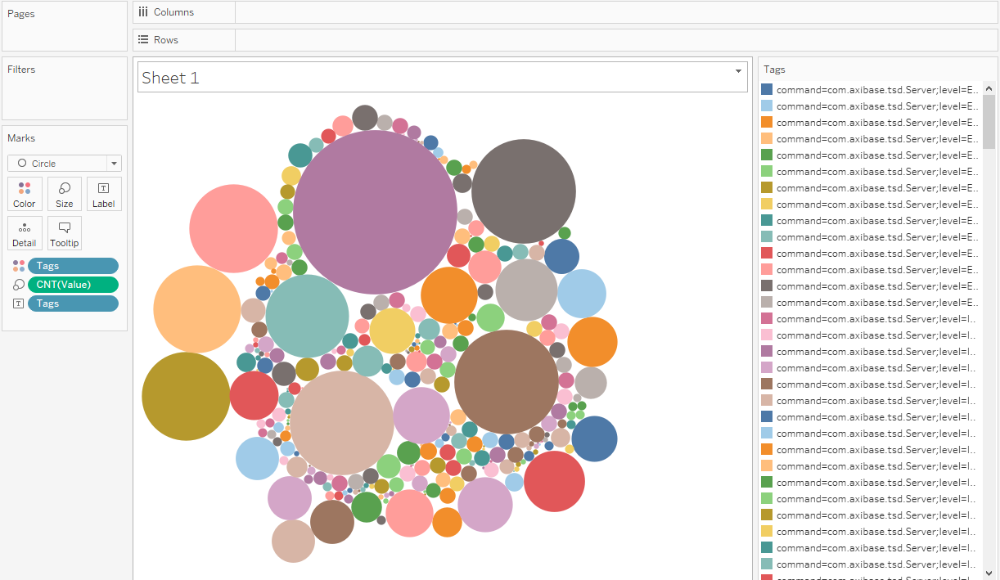
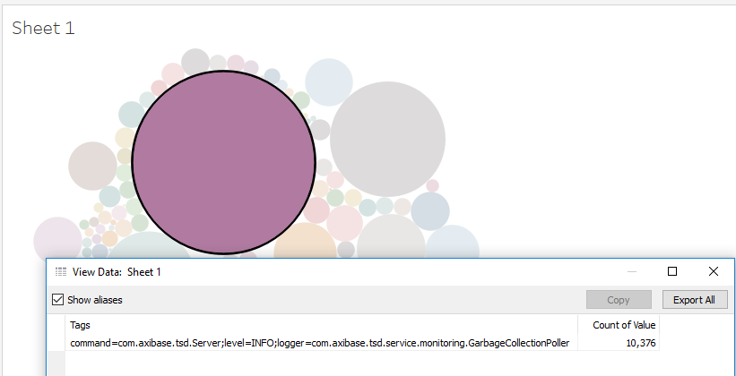

# Value aggregation

Let's try to understand which metrics contain the biggest number of records.

- Specify table in the URL: 
```
    jdbc:atsd://ATSD_HOSTNAME:8443; tables=log*
```

We will need a 'log_event_counter' metric:



- Drag 'Value' to the Marks Card, change aggregation from SUM to COUNT, replace 'Detail' with 'Size'
- Drag 'Tags' to the Marks Card, replace 'Detail' with 'Color'


Expected result:



Now we can see that metric with tags 

`command = com.axibase.tsd.Server;
 level=INFO;
 logger=com.axibase.tsd.service.monitoring.GarbageCollectionPoller` 
 
 contains more than other rows:
 
 