# Monitoring Zookeeper cluster with ATSD

This document describes how to monitor availability and performance of [Apache Zookeeper](https://zookeeper.apache.org/) cluster (3 nodes) using Axibase Time Series Database.

## Step 1: Configure Axibase Collector

### Create hosts list

1) Login into Axibase Collector at https://collector_hostname:9443

2) Click the `Collections` tab in the top menu and press `Item Lists` button.

3) Click `Add` button and create item list with zookeeper hosts. 
Enter name `zookeeper-jmx-hosts`, choose type `TEXT` and add comma-separated addresses of zookeeper hosts in format:
`host,port,username,password,entity,cluster`

   **host** — Zookeeper hostname.  
   **port** — JMX port.  
   **username** — JMX user name.  
   **password** — Password for JMX user.  
   **entity** — ATSD entity for zookeeper node.  
   **cluster** — ATSD series tag for indicating that nodes are in the same cluster.
   
For example:

```
host1.com,9010,user,pass,prod-zoo-host1,prod
host2.com,9010,user,pass,prod-zoo-host2,prod
host3.com,9010,user,pass,prod-zoo-host3,prod
```

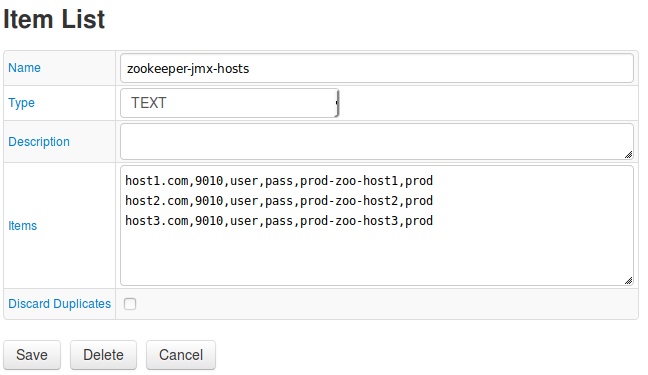

Save changes.

### Import job

Click the Jobs tab in the top menu and press the Import button.
1. Import the [zookeeper-jmx](resources/jobs.xml) job.
2. Locate the `zookeeper-jmx` job in the list of jobs.
3. Adjust the cron expression if required. For more information on cron expressions, see [Scheduling](https://github.com/axibase/axibase-collector/blob/master/scheduling.md).
4. Select a target ATSD database for storing data.
5. Click Save.

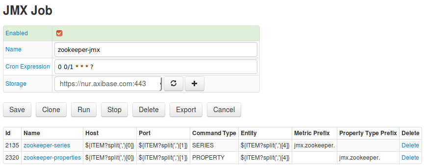

6. Test job configurations. Click on `zookeeper-series`.
If it is required, change default parameters.
For more information on JMX configuration, see [JMX](https://github.com/axibase/axibase-collector/blob/master/jobs/jmx.md). Click **Test** button

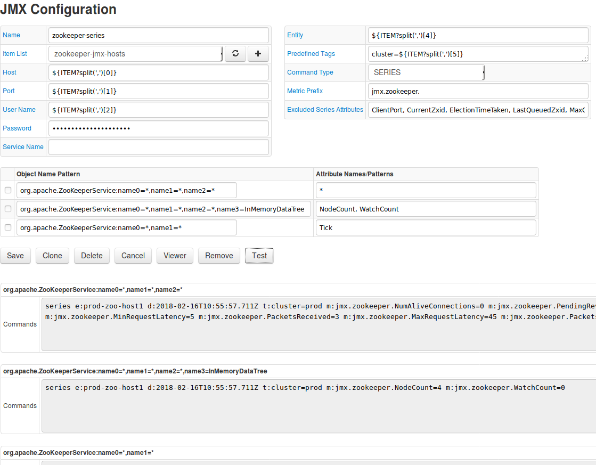

7. Repeat test for `zookeeper-properties`.

8. On the **JMX Job** page set **Enabled** checkbox and save job.

### Check data collection

Login into the target Axibase Time Series Database instance at https://atsd_hostname:8443.

Go to Metrics page and verify that `jmx.zookeeper.*` metrics are available.

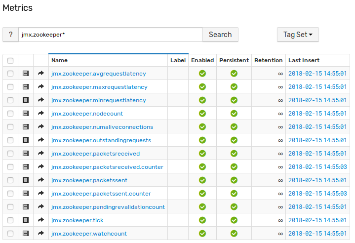

1. Go to Entities page and verify that `jmx.zookeeper.*` properties are available for entities from `zookeeper-properties` configuration.

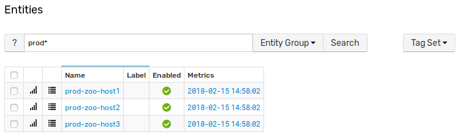

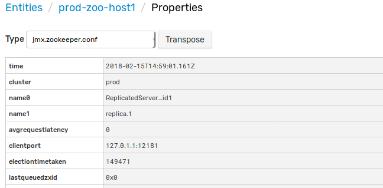

## Step 2: Configure Zookeeper in ATSD

### Import entity group

1. Go to `Settings -> Entity Groups` and import [entity group](resources/groups.xml).
1. Locate `Zookeeper Nodes` group, click on it
1. Check that entities were discovered

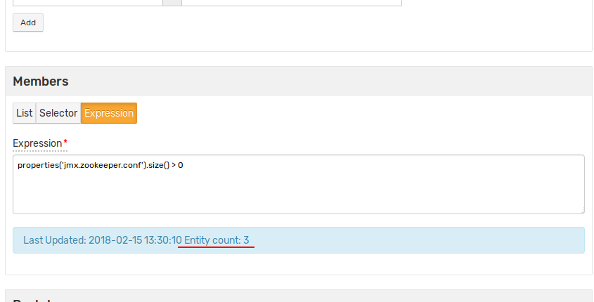

### Import portals

1. Go to `Portals -> Configure` and import [portals](resources/portal-configs.xml) (check on the Auto-enable New Portals check box).
2. Verify that new portals are displayed on `Portals -> Configure` page

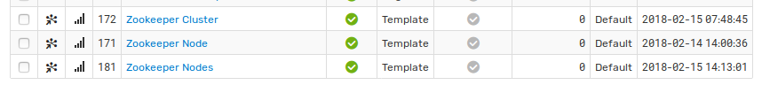

### Import rules

1. Go to `Alerts -> Rules` and import [rules](resources/rules.xml) (check on the Auto-enable New Rules check box).
2. Check that rules were imported

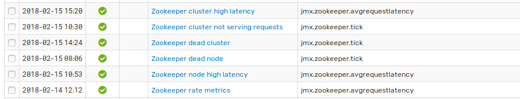

 * `Zookeeper cluster high latency` - alert opens when more than 50% nodes in a cluster have average latency more than 100 ms in 3 minutes.
 * `Zookeeper cluster not serving requests` - alert opens when node status is `leaderelection`, which means that nodes cannot choose leader.
 * `Zookeeper dead cluster` - opens when no data was collected from cluster in 2 minutes.
 * `Zookeeper dead node` - opens when no data was collected from a single node in 2 minutes.
 * `Zookeeper node high latency` - opens when node average latency is above 100 in 3 consecutive measurements.
 * `Zookeeper rate metrics` - always open. Used for transform `packetsreceived` and `packetssent` metrics from cumulative to difference (packets per minute) metrics. Uses derived commands.

3. Verify rules. Stop one node and check that `Zookeeper dead node` rule opens (it may take up to 2 minutes). Go to Alerts - Open Alerts to see all opened rules.

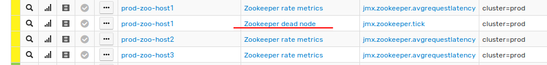

 * To check `Zookeeper cluster not serving requests` rule stop more than 50% nodes (in this case 2 of 3, if zookeeper quorum is default).

 * To check `Zookeeper dead cluster` stop all nodes.

 * To check `Zookeeper cluster high latency` send large latency values using `Data -> Data Entry` page. For example

```
series e:prod-zoo-host1 m:jmx.zookeeper.avgrequestlatency=1400 t:cluster=prod
series e:prod-zoo-host2 m:jmx.zookeeper.avgrequestlatency=1500 t:cluster=prod
```

 * To check `Zookeeper node high latency` send large latency for single node 3 times using `Data Entry`

```
series e:prod-zoo-host1 m:jmx.zookeeper.avgrequestlatency=1400 t:cluster=prod
```

 * To check `Zookeeper rate metrics` go to `Metrics` and verify that metrics `jmx.zookeeper.packetsreceived.counter` and `jmx.zookeeper.packetssent.counter` are collecting.

For more information on Rule Engine, see [ATSD Rule Engine](https://github.com/axibase/atsd/tree/master/rule-engine).

### Import entity view

1. Go to `Entity Views -> Configure` and import [entity view](resources/entity-views.xml).
2. Check entity view. Go to `Entity Views -> Zookeeper`

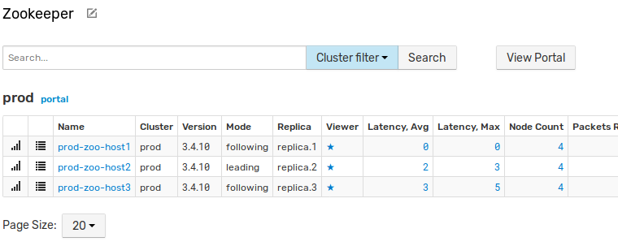

3. Click on `portal` link and check cluster portal

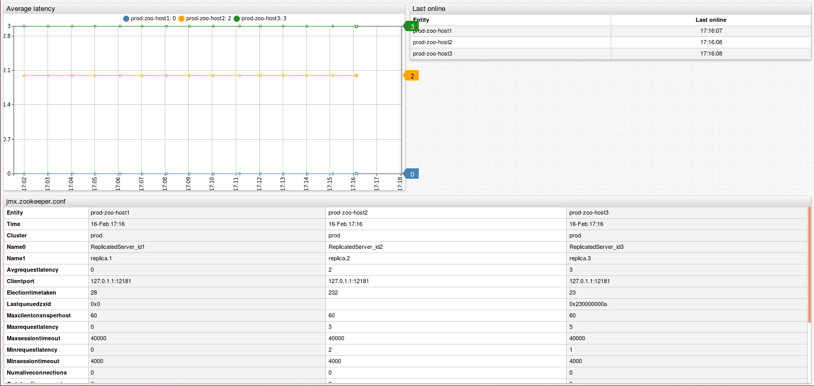