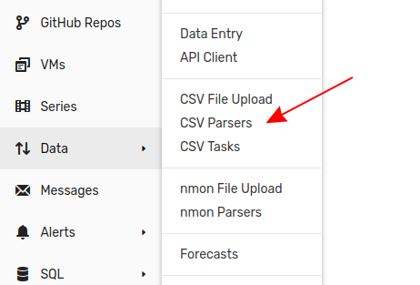
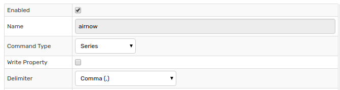
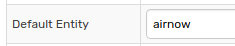
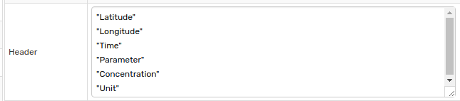
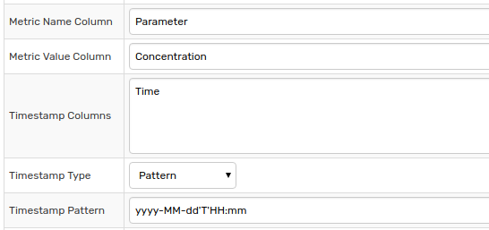
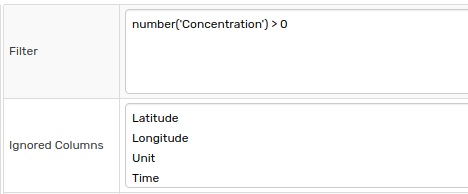

# Air Quality CSV Example

## Example CSV File

```txt
"36.785378","-119.773206","2018-07-09T00:00","CO","0.12","PPM"
"36.785378","-119.773206","2018-07-09T00:00","NO2","2.0","PPB"
"36.785378","-119.773206","2018-07-09T00:00","OZONE","48.0","PPB"
"36.785378","-119.773206","2018-07-09T00:00","PM10","37.0","UG/M3"
"36.785378","-119.773206","2018-07-09T00:00","PM2.5","7.5","UG/M3"
"36.785378","-119.773206","2018-07-09T00:00","SO2","1.0","PPB"
"36.785378","-119.773206","2018-07-09T01:00","CO","0.12","PPM"
"36.785378","-119.773206","2018-07-09T01:00","NO2","2.0","PPB"
"36.785378","-119.773206","2018-07-09T01:00","OZONE","46.0","PPB"
"36.785378","-119.773206","2018-07-09T01:00","PM10","37.0","UG/M3"
"36.785378","-119.773206","2018-07-09T01:00","PM2.5","7.4","UG/M3"
"36.785378","-119.773206","2018-07-09T01:00","SO2","1.0","PPB"
"36.785378","-119.773206","2018-07-09T02:00","CO","0.12","PPM"
"36.785378","-119.773206","2018-07-09T02:00","NO2","3.0","PPB"
"36.785378","-119.773206","2018-07-09T02:00","OZONE","44.0","PPB"
"36.785378","-119.773206","2018-07-09T02:00","PM10","37.0","UG/M3"
"36.785378","-119.773206","2018-07-09T02:00","PM2.5","7.3","UG/M3"
"36.785378","-119.773206","2018-07-09T02:00","SO2","1.0","PPB"
"36.785378","-119.773206","2018-07-09T03:00","CO","0.14","PPM"
"36.785378","-119.773206","2018-07-09T03:00","NO2","4.0","PPB"
"36.785378","-119.773206","2018-07-09T03:00","OZONE","41.0","PPB"
"36.785378","-119.773206","2018-07-09T03:00","PM10","37.0","UG/M3"
"36.785378","-119.773206","2018-07-09T03:00","PM2.5","7.1","UG/M3"
"36.785378","-119.773206","2018-07-09T03:00","SO2","1.0","PPB"
"36.785378","-119.773206","2018-07-09T04:00","CO","0.13","PPM"
"36.785378","-119.773206","2018-07-09T04:00","NO2","3.0","PPB"
"36.785378","-119.773206","2018-07-09T04:00","OZONE","37.0","PPB"
"36.785378","-119.773206","2018-07-09T04:00","PM10","36.0","UG/M3"
"36.785378","-119.773206","2018-07-09T04:00","PM2.5","7.0","UG/M3"
"36.785378","-119.773206","2018-07-09T04:00","SO2","0.0","PPB"
```

## Parser Configuration

### Overview

This document describes the configuration of a CSV Parser to read the CSV file above and insert the data into ATSD. To create a new CSV parser, open the **Data > CSV Parsers** page.



### Syntax

* Define columns with **Header** because the underlying file lacks a header row.
* Specify entity with **Default Entity** because there is no entity column.
* Exclude unneeded data, `Longitude` and `Latitude` positions are constant and unneeded.
* Extract multiple metrics from one row, `Parameter` column contains the names of several metrics which represent the concentration of various particles.

### Configuration

For information on all settings on the **CSV Parser Editor** page, including those not used in this tutorial, refer to the [Uploading CSV Files](../README.md) tutorial.

Enable the parser, define a unique identifier, specify the command type, and indicate the delimiter symbol.



| Field | Setting | Explanation |
| --- | --- | --- |
|  Enabled  |  Checked  |  Enables CSV parser.<br>Enabled parsers are active and able to be used by Collector  |
|  Name  | `airnow`  |  Name field identifies a specific parser.<br>This is the name which is referenced by Collector to assign parser tasks.  |
|  Command Type  | `series`  |  Parsed cells are written in the database as [series commands](https://axibase.com/docs/atsd/api/network/series.html).  |
|  Delimiter  |  Comma  |  File columns are separated by commas.  |



| Field | Setting | Explanation |
| --- | --- | --- |
|  Default Entity  |  `airnow`  |  No entity name is present in the CSV file. Instead entity name is set manually to the ID of the monitoring station.  |



| Field | Setting | Explanation |
| --- | --- | --- |
| Header | See above screenshot. | Define header row in the order which titles are assigned.



| Field | Setting | Explanation |
| --- | --- | --- |
Metric Name Column | `Parameter` | Define the column which contains metric names.
Metric Value Column | `Concentration` | Define the column which contains metric values.
Timestamp Columns | `Time` | Define the timestamp column
Timestamp Time | `Pattern` | Specify how the timestamp is read by the parser.
Timestamp Pattern | `yyyy-MM-ddTHH:mm` | [Time Pattern](../../../shared/time-pattern.md) used when `Pattern` option is selected.



| Field | Setting | Explanation |
| --- | --- | --- |
Filter | `number('Concentration') > 0` | Samples which have a value less than or equal to `0` are discarded.<br>For more information about `Filter` expressions, refer to [Rule Engine Documentation](https://axibase.com/docs/atsd/rule-engine/filters.html#filter-expression).
Ignored Columns | See above screenshot. | Define columns which are not included in resultant series commands.

## Commands

Raw data row:

```txt
"36.785378","-119.773206","2018-07-09T00:00","CO","0.12","PPM"
```

Resulting series command:

```ls
series e:airnow d:2018-07-09T00:00:00Z m:co=0.12
```

Series commands produced by the above parser configuration based on the [example CSV](#example-csv-file) are shown below.

```ls
series e:airnow d:2018-07-09T00:00:00Z m:co=0.12
series e:airnow d:2018-07-09T00:00:00Z m:no2=2.0
series e:airnow d:2018-07-09T00:00:00Z m:ozone=48.0
series e:airnow d:2018-07-09T00:00:00Z m:pm10=37.0
series e:airnow d:2018-07-09T00:00:00Z m:pm2.5=7.5
series e:airnow d:2018-07-09T00:00:00Z m:so2=1.0
series e:airnow d:2018-07-09T01:00:00Z m:co=0.12
series e:airnow d:2018-07-09T01:00:00Z m:no2=2.0
series e:airnow d:2018-07-09T01:00:00Z m:ozone=46.0
series e:airnow d:2018-07-09T01:00:00Z m:pm10=37.0
series e:airnow d:2018-07-09T01:00:00Z m:pm2.5=7.4
series e:airnow d:2018-07-09T01:00:00Z m:so2=1.0
series e:airnow d:2018-07-09T02:00:00Z m:co=0.12
series e:airnow d:2018-07-09T02:00:00Z m:no2=3.0
series e:airnow d:2018-07-09T02:00:00Z m:ozone=44.0
series e:airnow d:2018-07-09T02:00:00Z m:pm10=37.0
series e:airnow d:2018-07-09T02:00:00Z m:pm2.5=7.3
series e:airnow d:2018-07-09T02:00:00Z m:so2=1.0
series e:airnow d:2018-07-09T03:00:00Z m:co=0.14
series e:airnow d:2018-07-09T03:00:00Z m:no2=4.0
series e:airnow d:2018-07-09T03:00:00Z m:ozone=41.0
series e:airnow d:2018-07-09T03:00:00Z m:pm10=37.0
series e:airnow d:2018-07-09T03:00:00Z m:pm2.5=7.1
series e:airnow d:2018-07-09T03:00:00Z m:so2=1.0
series e:airnow d:2018-07-09T04:00:00Z m:co=0.13
series e:airnow d:2018-07-09T04:00:00Z m:no2=3.0
series e:airnow d:2018-07-09T04:00:00Z m:ozone=37.0
series e:airnow d:2018-07-09T04:00:00Z m:pm10=36.0
series e:airnow d:2018-07-09T04:00:00Z m:pm2.5=7.0
```

> The final line for the [example CSV](#example-csv-file) is excluded based on the `Filter` expression.