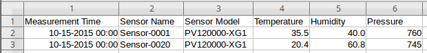
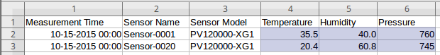
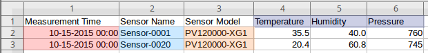

# Basic Schema Parser

## Example CSV File



```csv
Measurement Time,Sensor Name,Sensor Model,Temperature,Humidity,Pressure
2015-10-15 00:00,Sensor-0001,PV120000-XG1,       35.5,    40.0,     760
2015-10-15 00:00,Sensor-0020,PV120000-XG1,       20.4,    60.8,     745
```

## Parser Configuration

### Overview

Schema-based parsers are JavaScript programs that traverse an underlying CSV file in left-right, top-down directions and convert cells into [series](https://axibase.com/docs/atsd/api/network/series.html), property, or message commands. These programs support built-in [functions](../csv-schema.md#schema-functions) which look up cells by row and column index, to validate their contents and modify their values as they assemble commands.

For a schema-based parser, only **Name**, **Schema** and **Timestamp Pattern** fields are mandatory. The **Schema** field contains the JavaScript program code implementing parsing logic.

### Syntax

* Schema is a JavaScript program that consists of one or multiple statements.
* Each statement must end with a semicolon (`;`).
* A statement can consist of multiple function invocations, chained with a period (`.`).
* Regular JavaScript comment characters are supported.
* String literals such as constant metric or entity names must be enclosed in single or double quotes.

### Timestamp Pattern

* To parse the dates in the CSV file, specify the timestamp column pattern using [`SimpleDateFormat`](https://docs.oracle.com/javase/7/docs/api/java/text/SimpleDateFormat.html).
* In the example above, the pattern to read `Measurement Time` column values is `yyyy-MM-dd HH:mm`.
* Enter timestamp pattern in the **Timestamp Format** field

### Schema Program

```java
select("#row=2-*").         // Select which rows to process
select("#col=4-*").         // Select which columns to process in each row
addSeries().                // Specify which command to build
metric(cell(1, col)).       // Set command fields from cell values
entity(cell(row, 2)).
tag('model',cell(row, 3)).
timestamp(cell(row, 1));
```

A step-by-step explanation of the schema program is provided below:

**`select` Functions**:

Select which parts of the file to iterate over.

* `select("#row=2-*")`: Select each row starting with the second row until the last row.
* `select("#col=4-*")`: Select each column in each row starting with the forth column until the last column.

The result of the previous two functions is a collection of cells that are processed sequentially. The `addSeries` function is invoked for each cell in the collection: cell `(2, 4)`, cell `(2, 5)`, etc.

The collection must contain numeric values for which series commands are created, which is why the first row containing the header is not included in the row selector. The row selector starts with the second row.



**`addSeries` Functions**

The `addSeries` function returns a series object with setter functions to populate various command fields from cell values. The `row` and `col` fields are set to the row and column index of the current, or active, cell.

* `timestamp(cell(row, 1))`: Timestamp is located in the first column of the current row: `2015-10-15 00:00`. The text value is parsed using the [**Timestamp Pattern**](#timestamp-pattern).
* `entity(cell(row, 2))`: Entity name is located in the second column of the current row: `Sensor-0001`.
* `tag('model',cell(row, 3))`: The value of tag with constant name `model` is located in the third column of the current row: `PV120000-XG1`.
* `metric(cell(1, col))`: Metric name is located in the active column in the first row: `Temperature`, `Humidity`, `Pressure`.



## Commands

The series commands produced by the above schema program are shown below.

```ls
series e:sensor-0001 d:2015-11-15T00:00:00Z m:temperature=35.5 m:humidity=40.0 m:pressure=760 t:model=PV120000-XG1
series e:sensor-0020 d:2015-11-15T00:00:00Z m:temperature=20.4 m:humidity=60.8 m:pressure=745 t:model=PV120000-XG1
```