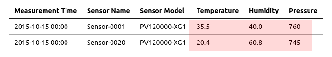
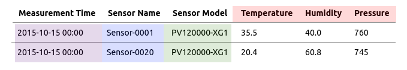

# Basic Schema Parser


## Example CSV File

```csv
Measurement Time,Sensor Name,Sensor Model,Temperature,Humidity,Pressure
2015-10-15 00:00,Sensor-0001,PV120000-XG1,       35.5,    40.0,     760
2015-10-15 00:00,Sensor-0020,PV120000-XG1,       20.4,    60.8,     745
```

## Parser Configuration

### Overview

* With schema-based parser, only **Name**, **Schema** and **Timestamp Pattern** fields are mandatory.
* The parser converts cells into [series commands](https://axibase.com/docs/atsd/api/network/series.html) and inserts the commands into the database.

### Syntax

* Schema lines terminate with a `.` period.
* Schema configurations terminate with a `;` semicolon.
* Include comments using the `/*` open and `*/` close characters.
* Wildcard `*` characters indicate all rows or columns are read by the parser.
* Hardcode metric, entity, or tag names with `metric('my_metric')` syntax.

### Timestamp Pattern

* Define timestamp pattern with Java [`SimpleDateFormat` pattern](https://docs.oracle.com/javase/7/docs/api/java/text/SimpleDateFormat.html).
* The pattern to read `Measurement Time` column values is `yyyy-MM-dd HH:mm`.
* Enter this pattern in the **Timestamp Format** field

### Schema

```java
/* select parameters */
select("#row=2-*").select("#col=4-*").
addSeries().

/* series parameters */
metric(cell(1, col)).
entity(cell(row, 2)).
tag('model',cell(row, 3)).
timestamp(cell(row, 1));
```

The schema converts the CSV file into a tabular model. A row-by-row explanation of the schema is provided below:

**`select` Parameters**:

Define value cells of the CSV file.

* `select("#row=2-*")`: Select each row starting with the second row until the last row.
* `select("#col=4-*")`: Select each column in the second row starting with the forth column until the last column.



**`series` Parameters**

Define the meaning of the rows and columns in the body of the CSV file.

* `timestamp(cell(row, 1))`: Timestamp is located in each selected row of the first column: `Measurement Time`. The text value is parsed using the [**Timestamp Pattern**](#timestamp-pattern).
* `entity(cell(row, 2))`: Entity name is located in each selected row of the second column: `Sensor-0001`, `Sensor-0020`.
* `tag('model',cell(row, 3))`: Tag value is located in each selected row of the third column: `PV120000-XG1`. `tag` name is defined by the first argument: `model`
* `metric(cell(1, col))`: Metric name is located in each selected column of the first row: `Temperature`, `Humidity`, `Pressure`.



## Commands

The series commands produced by the above schema and inserted in the database are shown below.

```ls
series e:sensor-0001 d:2015-11-15T00:00:00Z m:temperature=35.5 m:humidity=40.0 m:pressure=760 t:model=PV120000-XG1
series e:sensor-0020 d:2015-11-15T00:00:00Z m:temperature=20.4 m:humidity=60.8 m:pressure=745 t:model=PV120000-XG1
```
