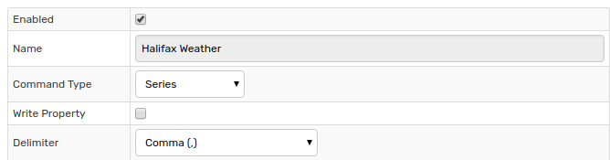
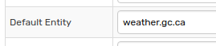
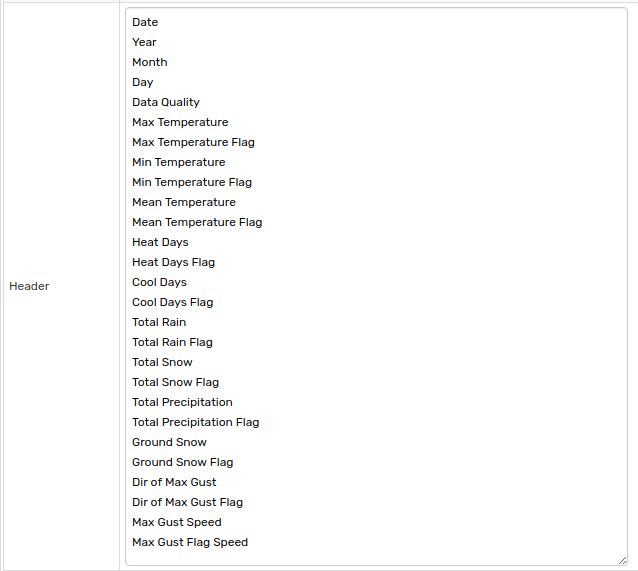
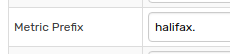
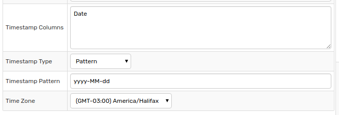
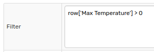
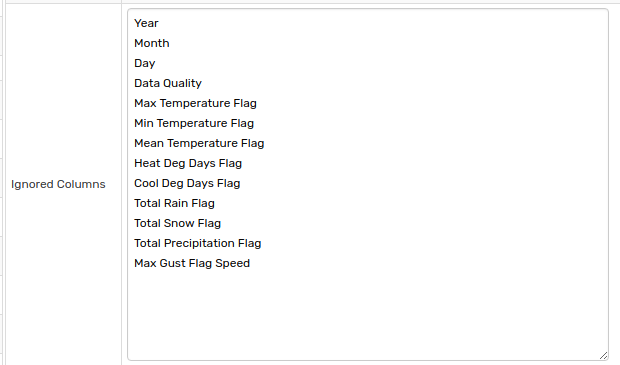

# Weather CSV Example

## Example CSV File

```txt
"Station Name","HALIFAX INTL A"
"Province","NOVA SCOTIA"
"Latitude","44.88"
"Longitude","-63.51"
"Elevation","145.40"
"Climate Identifier","8202251"
"WMO Identifier","71395"
"TC Identifier","YHZ"

"Legend"
"A","Accumulated"
"C","Precipitation occurred, amount uncertain"
"E","Estimated"
"F","Accumulated and estimated"
"L","Precipitation may or may not have occurred"
"M","Missing"
"N","Temperature missing but known to be > 0"
"S","More than one occurrence"
"T","Trace"
"Y","Temperature missing but known to be < 0"
"[empty]","No data available"
"^","The value displayed is based on incomplete data"
"†","Data for this day has undergone only preliminary quality checking"
"‡","Partner data that is not subject to review by the National Climate Archives"

"Date/Time","Year","Month","Day","Data Quality","Max Temp (°C)","Max Temp Flag","Min Temp (°C)","Min Temp Flag","Mean Temp (°C)","Mean Temp Flag","Heat Deg Days (°C)","Heat Deg Days Flag","Cool Deg Days (°C)","Cool Deg Days Flag","Total Rain (mm)","Total Rain Flag","Total Snow (cm)","Total Snow Flag","Total Precip (mm)","Total Precip Flag","Snow on Grnd (cm)","Snow on Grnd Flag","Dir of Max Gust (10s deg)","Dir of Max Gust Flag","Spd of Max Gust (km/h)","Spd of Max Gust Flag"
"2015-01-01","2015","01","01","‡","-2.2","","-14.9","","-8.6","","26.6","","0.0","","0.0","","1.6","","1.6","","0","","","M","<31",""
"2015-01-02","2015","01","02","‡","1.3","","-10.2","","-4.5","","22.5","","0.0","","0.0","","0.4","","0.4","","1","","","M","70",""
"2015-01-03","2015","01","03","‡","-10.0","","-14.8","","-12.4","","30.4","","0.0","","0.0","","0.0","T","0.0","T","1","","","M","54",""
"2015-01-04","2015","01","04","‡","8.1","","-13.4","","-2.7","","20.7","","0.0","","8.2","","12.8","","21.0","","8","","","M","70",""
"2015-01-05","2015","01","05","‡","8.2","","-12.7","","-2.3","","20.3","","0.0","","6.6","","0.0","T","6.6","","1","","","M","91",""
"2015-01-06","2015","01","06","‡","-12.6","","-16.2","","-14.4","","32.4","","0.0","","0.0","","1.6","","1.6","","0","","","M","67",""
"2015-01-07","2015","01","07","‡","-11.6","","-19.4","","-15.5","","33.5","","0.0","","0.0","","0.8","","0.8","","0","","","M","<31",""
"2015-01-08","2015","01","08","‡","-13.1","","-17.9","","-15.5","","33.5","","0.0","","0.0","","0.0","T","0.0","T","0","","","M","43",""
"2015-01-09","2015","01","09","‡","3.6","","-16.8","","-6.6","","24.6","","0.0","","3.2","","2.6","","5.8","","0","","","M","70",""
"2015-01-10","2015","01","10","‡","-5.3","","-10.6","","-8.0","","26.0","","0.0","","0.0","","0.6","","0.6","","2","","","M","43",""
"2015-01-11","2015","01","11","‡","-4.2","","-10.6","","-7.4","","25.4","","0.0","","0.0","","0.0","T","0.0","T","2","","","M","35",""
"2015-01-12","2015","01","12","‡","3.9","","-4.2","","-0.2","","18.2","","0.0","","2.4","","6.0","","8.4","","2","","","M","44",""
"2015-01-13","2015","01","13","‡","-3.0","","-17.3","","-10.2","","28.2","","0.0","","0.0","","2.6","","2.6","","8","","","M","57",""
"2015-01-14","2015","01","14","‡","-6.0","","-18.1","","-12.1","","30.1","","0.0","","0.0","","0.0","T","0.0","T","8","","","M","<31",""
"2015-01-15","2015","01","15","‡","-2.2","","-12.1","","-7.2","","25.2","","0.0","","0.0","","0.0","T","0.0","T","7","","","M","<31",""
"2015-01-16","2015","01","16","‡","2.1","","-11.7","","-4.8","","22.8","","0.0","","1.0","","3.0","","4.0","","9","","","M","59",""
"2015-01-17","2015","01","17","‡","-11.7","","-16.8","","-14.3","","32.3","","0.0","","0.0","","4.8","","4.8","","10","","","M","63",""
"2015-01-18","2015","01","18","‡","5.4","","-16.9","","-5.8","","23.8","","0.0","","0.0","","0.0","","0.0","","10","","","M","56",""
"2015-01-19","2015","01","19","‡","7.5","","1.0","","4.3","","13.7","","0.0","","24.8","","0.0","","24.8","","4","","","M","93",""
"2015-01-20","2015","01","20","‡","2.4","","-7.9","","-2.8","","20.8","","0.0","","0.0","","0.0","T","0.0","T","","","","M","65",""
"2015-01-21","2015","01","21","‡","-6.4","","-12.1","","-9.3","","27.3","","0.0","","0.0","","0.0","T","0.0","T","","","","M","48",""
"2015-01-22","2015","01","22","‡","-5.0","","-13.1","","-9.1","","27.1","","0.0","","0.0","","1.0","","1.0","","1","","","M","50",""
"2015-01-23","2015","01","23","‡","-3.5","","-7.3","","-5.4","","23.4","","0.0","","0.0","","0.0","T","0.0","T","1","","","M","48",""
"2015-01-24","2015","01","24","‡","9.8","","-3.5","","3.2","","14.8","","0.0","","35.0","","2.4","","37.4","","0","","","M","78",""
"2015-01-25","2015","01","25","‡","8.6","","-9.9","","-0.7","","18.7","","0.0","","0.0","","0.0","T","0.0","T","","","","M","70",""
"2015-01-26","2015","01","26","‡","-6.7","","-11.9","","-9.3","","27.3","","0.0","","0.0","","0.0","","0.0","","","","","M","50",""
"2015-01-27","2015","01","27","‡","-3.4","","-10.5","","-7.0","","25.0","","0.0","","1.0","","13.0","","14.0","","2","","","M","72",""
"2015-01-28","2015","01","28","‡","1.3","","-10.4","","-4.6","","22.6","","0.0","","0.0","","6.0","","6.0","","13","","","M","54",""
"2015-01-29","2015","01","29","‡","-4.8","","-12.3","","-8.6","","26.6","","0.0","","0.0","","0.0","","0.0","","17","","","M","32",""
"2015-01-30","2015","01","30","‡","-2.8","","-9.6","","-6.2","","24.2","","0.0","","0.0","","0.0","T","0.0","T","16","","","M","32",""
"2015-01-31","2015","01","31","‡","0.9","","-5.6","","-2.4","","20.4","","0.0","","","M","","M","","M","4","","","M","<31",""
```

## Parser Configuration

### Overview

This document describes the configuration of a CSV Parser to read the CSV file above and insert the data into ATSD. To create a new CSV parser, navigate to the **Data > CSV Parsers** page.


### Syntax

* Define columns with **Header** because the underlying file contains an overly complex header.
* Specify entity with **Default Entity** because there is no entity column.
* Exclude unneeded data with the **Ignored Columns** field.
* Apply **Metric Prefix** in anticipation of multiple incoming files which need to be differentiated at the metric level.
* Define a time zone separate than ATSD server time zone for collected metrics to preserve local timestamp data.

### Configuration

For information on all settings on the **CSV Parser Editor** page, including those not used in this tutorial, refer to the [Uploading CSV Files](../README.md) tutorial.

Enable the parser, define a unique identifier, specify the command type, and indicate the delimiter symbol.



| Field | Setting | Explanation |
| --- | --- | --- |
|  Enabled  |  Checked  |  Enables CSV parser.<br>Enabled parsers are active and able to be used by Collector  |
|  Name  | `Halifax Weather`  |  Name field identifies a specific parser.<br>This is the name which is referenced by Collector to assign parser tasks.  |
|  Command Type  | `series`  |  Parsed cells are written in the database as [series commands](https://axibase.com/docs/atsd/api/network/series.html).  |
|  Delimiter  |  Comma  |  File columns are separated by commas.  |



| Field | Setting | Explanation |
| --- | --- | --- |
|  Default Entity  |  `weather.gc.ca`  |  No entity name is present in the CSV file. Thus, entity name is set manually to the URL of the collecting agency, Environment Canada.  |



| Field | Setting | Explanation |
| --- | --- | --- |
| Header | See above screenshot. | Define header row in the order which titles are assigned.



| Field | Setting | Explanation |
| --- | --- | --- |
| Metric Prefix | `halifax.` | Apply a prefix to all collected metric.<br>Use this setting when collecting the same metric from the same entity for multiple resources to differentiate when performing database queries.<br>All collected metrics are appended with the defined prefix resulting in metric such as `halifax.date`.



| Field | Setting | Explanation |
| --- | --- | --- |
Timestamp Columns | `Date` | Define the timestamp column
Timestamp Time | `Pattern` | Specify how the timestamp is read by the parser.
Timestamp Pattern | `yyyy-MM-dd` | [Time Pattern](../../../shared/time-pattern.md) used when `Pattern` option is selected.
Time Zone | `(GMT-03:00) America/Halifax` | Define time zone of the collected metrics if it differs from server time zone to preserve local timestamp data.



| Field | Setting | Explanation |
| --- | --- | --- |
Filter | `row['Max Temperature'] > 0` | Filter incoming data based on the contents of a specific metric or timestamp.<br>For more information about `Filter` expressions, refer to [Rule Engine Documentation](https://axibase.com/docs/atsd/rule-engine/filters.html#filter-expression).



| Field | Setting | Explanation |
| --- | --- | --- |
Ignored Columns | See above screenshot. | Define columns which are not included in resultant series commands.

## Commands

Raw data row:

```txt
"2015-01-02","2015","01","02","‡","1.3","","-10.2","","-4.5","-4.0","22.5","","0.0","","0.0","","0.4","","0.4","","1","","","M","70",""
```

Resulting series command:

```ls
series e:weather.gc.ca d:2015-07-09T00:00:00Z m:max-temperature=1.3 m:min-temperature:-4.0 m:mean-temperature=0 m:heat-days=0 m:cool-days:0 m:total-rain:0.4 m:total-snow=0.4 m:total-precipitation=1.0 m:dir-of-max-gust=M m:max-gust-speed=70
```

> Data rows where metric `Max Temperature` is not greater than `0` are excluded based on **Filter** settings