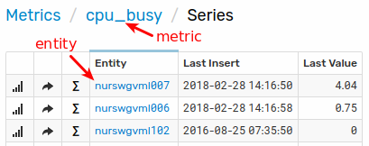
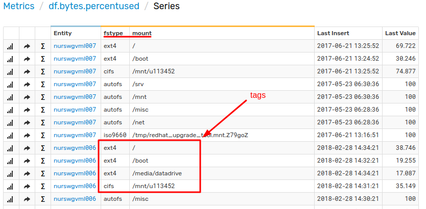

# Selecting Series

## Reference

* [Database Schema](#database-schema)
* [Exploring Series](#exploring-series)
* [Selecting Specific Series](#selecting-specific-series)
* [Selecting Multiple Series with Tags](#selecting-multiple-series-with-tags)
* [Merging Series](#merging-series)
* [Selecting Series for Multiple Entities](#selecting-series-for-multiple-entities)
* [Retrieving Series from the Database](#retrieving-series-from-the-database)
* [Controlling Displayed Series](#controlling-displayed-series)

## Database Schema

Widget configuration syntax provides a way to load and display time series data stored in a database. As series values
change over time, their history can be visualized on portals with [various widgets](https://axibase.com/docs/charts/#widgets).

```ls
[widget]
  type = chart
  # widget settings
  [series]
  # series 1 settings
  [series]
  # series 2 settings
```

Each series is identified by a composite key which consists of a **metric**, **entity**, and optional name/value pairs called **series tags**.

```ls
[series]
  metric = cpu_busy
  entity = nurswgvml007
[series]
  metric = df.bytes.percentused
  entity = nurswgvml006
  [tags]
    mount = /
    fstype = ext4
```

* An **entity** is a physical or logical object such as `nurswgvml007` (hostname) or `br-1705` (equipment).
* A **metric** represents the name of a measurable numeric attribute such as `cpu_busy` or `temperature`.
* **Series tags** provide an additional level of detail for measurements such as a disk mount point or process Id. The series tags are optional.

An entity can be instrumented and monitored with multiple metrics, just as the same metric can be collected for multiple entities.

## Exploring Series

Search available series from the **Series** tab in the main menu.

Alternatively, for known entities, explore metrics and series via portals containing [drop-down list](https://axibase.com/docs/charts/configuration/drop-down-lists.html#drop-down-lists) selectors.

[](https://apps.axibase.com/chartlab/d6e73e37/2)

## Selecting Specific Series

To display values for a specific series, specify the exact series key at the configuration `[series]` level:

```ls
# Series without Tags
metric = cpu_busy
entity = nurswgvml007
```



```ls
# Series with Tags
metric = df.bytes.percentused
entity = nurswgvml006
[tags]
  mount = /
  fstype = ext4
```



[](https://apps.axibase.com/chartlab/cdfb34c5/3)

## Selecting Multiple Series with Tags

By default, the database returns all series matching the request, including series with additional tags not enumerated in the request.

This enables loading series using only a subset of tags that are still sufficient to uniquely identify the series:

```ls
# Series with Tags
metric = df.bytes.percentused
entity = nurswgvml006
[tags]
  mount = /
```

The above configuration matches all series with `mount=/` tag, **including** series that have other tags.

To disable partial tag match, use the `exact-match = true | false` setting:

```ls
# Series with Tags
metric = df.bytes.percentused
entity = nurswgvml006
exact-match = true
[tags]
  mount = /
```

When partial match is disabled, ATSD returns series with exactly the same combination of tags as specified in
the request.

The partial match, while making the configuration compact, can produce undetermined results if the partial key matches multiple
series where only one series is expected:

```ls
# Series with Tags
metric = df.bytes.percentused
entity = nurswgvml006
[tags]
  fstype = ext4
```

In the above example, the response contains three different series with the same file system type `ext4` but with different
mount points: `/`, `/boot/`, `/media/datadrive`.

The resulting series is merged from three underlying series and provides a meaningless result.

[](https://apps.axibase.com/chartlab/cdfb34c5/7)

To control how multiple matched series are processed, use the `multiple-series` setting.

```ls
# Display all series with tag fstype=ext4 without merging
multiple-series = true
[series]
  [tags]
    fstype = ext4
```

Use the `multiple-series` setting to display all series without specifying any tags in the widget configuration:

```ls
# Display all series without merging
multiple-series = true
[series]
```

The default value of the `multiple-series` setting is `true` in the following cases:

* Multiple entities are specified, for example `entity = nur1, nur2`
* Multiple tag values are specified, for example `[tags] mount = /, /tmp`
* Entity name contains a [wildcard character](https://axibase.com/docs/charts/syntax/wildcards.html#wildcards), for example `entity = nur*`
* Tag value contains a [wildcard character](https://axibase.com/docs/charts/syntax/wildcards.html#wildcards), for example `[tags] mount = /t*`
* `entity-expression`, `entity-group`, or `tag-expression` is present


```ls
# Select series using tag value wildcards: 'multiple-series' set to true (enabled)
[tags]
  fstype = ext4
  mount = *media*

# Select series with any value for the specified tag: 'multiple-series' set to true (enabled)
[tags]
  fstype = ext4
  mount = *

# Select series with any value for the specified tag: 'multiple-series' set to false (disabled)
[tags]
  fstype = ext4

# Select series with tag values from the specified list: 'multiple-series' set to true (enabled)
[tags]
  fstype = cifs, autofs

# Select series with tag values matching specified wildcard patterns: 'multiple-series' set to true (enabled)
[tags]
  fstype = cifs, auto*

# Select series with tags matching an expression: multiple-series set to true (enabled)
tag-expression = tags.mount NOT LIKE '/m*'
```


## Merging Series

Joining multiple series with different tags into one series is useful when certain tags can be ignored.
<!-- markdownlint-disable MD107 -->

```txt
               date                 metric          entity                   tags     value
2018-06-15 00:00:00   df.bytes.percentused    nurswgvml006    mount=/,fstype=ext3      10.2    <- series-1
2018-06-15 01:00:00   df.bytes.percentused    nurswgvml006    mount=/,fstype=ext3      10.3    <- series-1
2018-06-15 02:00:00   df.bytes.percentused    nurswgvml006    mount=/,fstype=ext4      10.1    <- series-2
2018-06-15 03:00:00   df.bytes.percentused    nurswgvml006    mount=/,fstype=ext4      10.2    <- series-2
```

<!-- markdownlint-enable MD107 -->
In the previous example, the underlying series do not overlap and can be merged without duplication.
<!-- markdownlint-disable MD107 -->

```txt
               date                 metric          entity       tags     value
2018-06-15 00:00:00   df.bytes.percentused    nurswgvml006    mount=/      10.2    <- series-3
2018-06-15 01:00:00   df.bytes.percentused    nurswgvml006    mount=/      10.3    <- series-3
2018-06-15 02:00:00   df.bytes.percentused    nurswgvml006    mount=/      10.1    <- series-3
2018-06-15 03:00:00   df.bytes.percentused    nurswgvml006    mount=/      10.2    <- series-3
```

<!-- markdownlint-enable MD107 -->
**Examples**:

* `/media/datadrive` file system re-mounted on a larger disk without change to mount point.
* Containers with different identifiers launched on schedule to perform identically named daily tasks.
* Measurements recorded for scientific experiments and tags contain experiment ID and input parameters.


[](https://apps.axibase.com/chartlab/cdfb34c5/15/)

## Selecting Series for Multiple Entities

`[widget]` syntax provides a number of options to select series for multiple entities with same metric:

```ls
# Select specific entity by name
entity = nurswgvml006

# Select multiple entities by name using ? and * wildcards
entity = nurswgvml*

# Select all entities
entity = *

# Select an array of entities by name
entities = nurswgvml006, nurswgvml007

# Select an array of entities by name or pattern
entities = nurswgvml111, nurswgvml00*

# Select entities matching an expression referencing name, label, entity tags, properties
entity-expression = tags.app = 'ATSD'

# Select entities belonging to the specified entity group
entity-group = nur-collectors
```

Refer to the [Data API Documentation](../api/data/filter-entity.md#entity-filter-fields) for details on entity filters.

```ls
# Retrieve series for entities starting with nurswgvml00
[series]
  entity = nurswgvml00*
  [tags]
    mount = /
    fstype = ext4
```


[](https://apps.axibase.com/chartlab/cdfb34c5/8)

## Retrieving Series from the Database

As an alternative to defining a `[series]` manually or using wildcards, widget syntax supports the [`getSeries()`](https://axibase.com/docs/charts/syntax/api-functions.html#getseries) and [`getTags()`](https://axibase.com/docs/charts/syntax/api-functions.html#gettags) functions to retrieve series lists from the server.

`getTags()` function:

```ls
var tags = getTags('df.bytes.percentused', 'mount', 'nurswgvml006')

for tagValue in tags
  [series]
    [tags]
      mount = @{tagValue}
endfor
```

`getSeries()` function:

```ls
var seriesList = getSeries('df.bytes.percentused', 'nurswgvml006')

for sobj in seriesList
  [series]
    [tags]
    for tagName in Object.keys(sobj.tags)
      "@{tagName}" = @{sobj.tags[tagName]}
    endfor
endfor
```

[](https://apps.axibase.com/chartlab/cdfb34c5/14/)

## Controlling Displayed Series

The `series-limit` setting limits the number of possible series returned by the database for wildcard queries.
Because the limit is applied to matched series before sorting, results can vary between requests which makes the setting
helpful when exploring a dataset by preventing a widget from loading excessive series into browser memory.

```ls
entity = *
series-limit = 10
[series]
  [tags]
    fstype = ext4
```

To control which series are displayed, use the `display` and `enabled` filter settings which are evaluated on the client.

```ls
entity = *
display = value == top(1) || value == bottom(1)
[series]
  [tags]
    fstype = ext4
```


Additionally, the `limit` setting reduces the number of samples displayed for each series. This makes queries
execute faster when loading data for high-frequency series from the server, in particular during design and validation stages.

[](https://apps.axibase.com/chartlab/cdfb34c5/13/)
