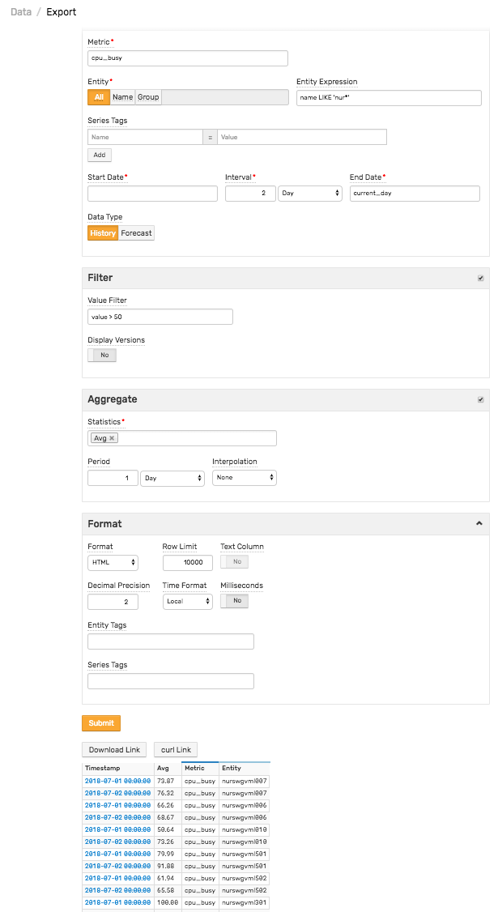

# Ad Hoc Exporting

Ad hoc exporting is an interactive interface to export historical data and forecasts in CSV and HTML formats.

## Ad hoc Export Settings

| Setting | Description |
| --- | --- |
|  Export Type  |  Data Type: Historical or Forecast.  |
|  Metric  |  Metric name of exported data. Data can be exported for one metric at a time.  |
|  Entity  |  If selected, exported data is limited to the specified entity. Supersedes **Entity Group** field.  |
|  Entity Group  |  If selected, exported data is limited to entities contained in the specified entity group. Supersedes **Entity Expression** field.  |
|  Entity Expression  |  Expression to filter selected data by entity name and entity tags. For example: `name LIKE 'nur*' AND tags.environment = 'prod'`.  |
|  Tags  |  An optional set of series tag pairs. For example, `file_system = /` for the `disk_used_percent` metric. Note that series tags are inserted along with value, and are therefore different from entity and metric tags. Wildcard symbols `*` and `?` are supported in tag values.  |
|  Sample Filter  |  Expression to fetch only detailed samples that satisfy a condition. For example, `value != 0`. Sample Filter is applied before aggregation and therefore affects aggregated statistics. To filter deleted values, use the `Double.isNaN(value)` syntax.  |
|  Selection Interval  | Time period of exported data. Optionally define the end of this period in the End Time field. The default value is current time. The Selection Interval setting is ignored if both the Start Time and End Time fields are set.  |
|  Start Time  |  Start time of the selection interval. This field supports [calendar](../shared/calendar.md) keywords. For example `previous_day`. If not defined, Start Time is calculated as End Time minus the Selection Interval.  |
|  End Time  |  Selection period end time. This field supports [calendar](../shared/calendar.md) keywords. For example `next_day`. If not defined, End Time is calculated as Start Time plus the Selection Interval. If Start Time is not defined, End Time is set to current time.  |
|  Aggregate  |  Enable period aggregations based on the selected detailed samples, after the optional Sample Filter is applied.  |
|  Aggregation Period  |  Period of time over which the detailed samples are aggregated.  |
|  Interpolation  |  Insert missing periods in aggregated results. A period is considered to be missing if it contains no detailed samples.  Supported options: `STEP` – Value of missing period equals value of the previous period. `LINEAR` – Value is linearly interpolated between previous and next available value. `NONE` – Missing periods are not inserted.   |
|  Aggregate Statistics  |  One or multiple aggregation functions:  average, minimum, maximum, sum, count, standard deviation, weighted average, weighted time average, median (percentile 50), first, last, percentile 50/75/90/95/99/99.5/99.9, `MinValueTime`, `MaxValueTime`.  |
|  Versioning  |  Display value history for metric that is enabled for Versioning. Versioning is displayed only for detailed, non-aggregated samples.  |
|  Revisions Only  |  Filters displayed versions only for samples with values changes. Excludes samples without versions.  |
|  Version Filter  |  Expression to filter value history (versions) by version value, status, source, or time. For example: `(version_status = 'Deleted' OR version_source LIKE '*user*') AND NOT Double.isNaN(value)`. To filter by version time, use the `date()` function. For example, `version_time > date('2018-08-11T16:00:00Z') OR version_time > date('current_day')`. The `date()` function accepts [calendar](../shared/calendar.md) keywords.  |
|  Export Format  |  Export format – CSV or HTML. If HTML is selected, number of rows can be limited with Row Limit setting.  |
|  Row Limit  |  Maximum Number of Rows displayed in HTML format.  Tables with greater than 10,000 rows are not recommended for HTML format.  |
|  Entity Tags  |  List of entity tags included as columns in the exported file/table.  |
|  Decimal Precision  |  Number of fractional digits displayed. If a negative value such as `-1` is specified, stored numbers are displayed without formatting.  |
|  Time Format  |  Format for displaying series sample timestamps: Local Time (server time zone) or [ISO format](../shared/date-format.md) (UTC time). Local = `yyyy-MM-dd HH:mm:ss` ISO = `yyyy-MM-ddTHH:mm:ssZ`  |

