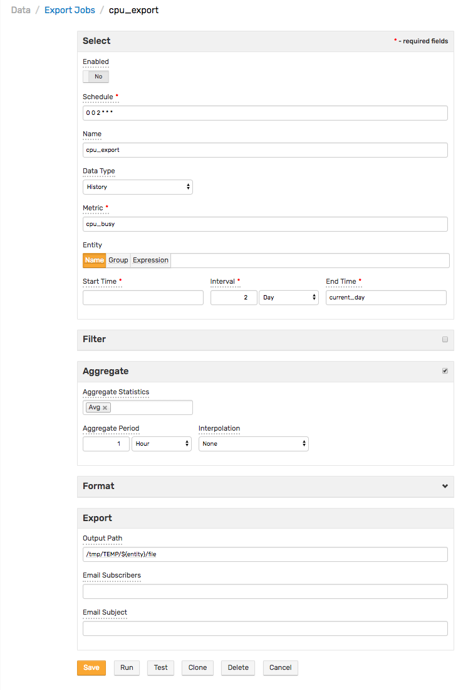

# Scheduled Exporting

Scheduled exporting operations perform historical data and forecast export to a local file system in CSV or Excel formats, as well as the delivery of produced reports to email subscribers.

## Scheduled Exporting Settings

### Schedule

Control scheduled export operations via `cron` expression. See [Scheduling](../shared/scheduling.md) for example and instructions about scheduling export jobs.

Concurrent executions for the same job are not allowed.

Export job settings are located in `/opt/atsd/atsd/conf/server.properties`:

* `export.worker.count (default = 8)`: Number of simultaneously executable export jobs.
* `export.worker.queue (default = 8)`: Number of export jobs that can be queued for execution.

If a new job is queued for execution while the queue is already full, the job is rejected.

### Export Job Logging

Each export job execution is logged in ATSD. Messages are saved to track the status. Logging parameters are enumerated below.

The administrator can create rules to notify if a job is not executed according to schedule.

`entity=atsd` common tags: `type=application`, `source=atsd_export`, `hostname={HOST}`

|  Event | Status | Severity | Name | Message | Start Time | End Time |
| --- | --- | --- | --- | --- | --- | --- |
|  Job start  |  `status=started`  |  `severity=INFO`  |  `name={job_name}`  |  `message=Job started`  |  `start_time={start_time_iso}`  |  |
|  Job complete  |  `status=complete`  |  `severity=INFO`  |  `name={job_name}`  |  `message=Job completed`  |  `start_time={start_time_iso}`  |  `end_time={start_time_iso}`  |
|  Job queued  |  `status=queued`  |  `severity=WARN`  |  `name={job_name}`  |  `message=Job queued`  |  `start_time={start_time_iso}`  |  |
|  Job blocked `*`  |  `status=blocked`  |  `severity=ERROR`  |  `name={job_name}`  |  `message=Job blocked`  |  `start_time={start_time_iso}`  |  |
|  Job rejected  |  `status=rejected`  |  `severity=ERROR`  |  `name={job_name}`  |  `message=Job rejected`  |  `start_time={start_time_iso}`  |  |
|  Job failed  |  `status=failed`  |  `severity=ERROR`  |  `name={job_name}`  |  `message=Job failed`  |  `start_time={start_time_iso}`  |  `end_time={start_time_iso}`  |

> `*` Raised when a job starts while the previous instance of the same job is still running.

### Dataset

| Field | Description |
| --- | --- |
|  Name  |  Export job name.  |
|  Data Type  |  Type of data exported. Allowed values: `History`, `Forecast`.  |
|  Metric  |  Metric name for which data is exported. Data is exported for one metric at a time.  |
|  Entity  |  If selected, exported data is limited to the specified entity. Supersedes the **Entity Group** field.  |
|  Entity Group  |  If selected, exported data is limited to entities contained in the specified entity group. Supersedes **Entity Expression** field.  |
|  Entity Expression  |  An expression to filter selected data by entity name and entity tags. For example: `name LIKE 'nur*' AND tags.environment = 'prod'`  |
|  Value Filter  |  Expression defines a condition for which to check when fetching detailed samples. For example, `value != 0`. Value Filter is applied before aggregation and therefore impacts aggregated statistics values. To filter deleted values, use `Double.isNaN(value)` syntax.  |
|  Selection Interval  |  Time period of exported data. Optionally define the end of this period in the End Time field. The default value is current time. The Selection Interval setting is ignored if both the Start Time and End Time fields are set.  |
|  Start Time  |  Start time of the selection interval. This field supports [calendar](../shared/calendar.md) keywords, for example `previous_day`. If not defined, Start Time is calculated as End Time minus Selection Interval.  |
|  End Time  |  End time of the selection interval. This field supports [calendar](../shared/calendar.md) keywords, for example `next_day`. If not defined, End Time is calculated as Start Time plus Selection Interval. If Start Time is not defined, End Time is set to current time.  |
|  Versioning  |  Display value history for metrics with enabled Versioning. Versioning is displayed only for detailed, non-aggregated samples.  |
|  Revisions Only  |  Filters samples by versions with value changes. Excludes samples without versions.  |
|  Version Filter  |  Expression to filter value history (versions) by version value, status, source, or time. For example: `(version_status = 'Deleted' or version_source LIKE '*user*') AND value > 0`. To filter by version time, use the `date()` function. For example, `version_time > date('2015-08-11T16:00:00Z') or version_time > date('current_day')`. `date()` function accepts [calendar](../shared/calendar.md) keywords.  |
|  Aggregate  |  Enable period aggregations based on selected detailed samples, after the optional Value Filter is applied.  |
|  Aggregation Period  |  Period of time over which detailed samples are aggregated.  |
|  Interpolation  |  Insert missing periods in aggregated results. The period is considered missing if it contains no detailed samples. Supported options: `STEP` – Value of missing period equals value of the previous period. `LINEAR` – Value is linearly interpolated between previous and next available value. `NONE` – missing periods are not inserted.  |
|  Aggregate Statistics  |  One or multiple aggregation functions: average, minimum, maximum, sum, count, standard deviation, weighted average, weighted time average, median (percentile 50), first, last, percentile 50/75/90/95/99/99.5/99.9, `MinValueTime`, `MaxValueTime`.  |

### Output

| Field | Description |
| --- | --- |
|  Format  |  Export file format. Allowed values: `CSV`, `XLSX`.  |
|  Compression  |  Compression of exported files. Allowed values: `none`, `gzip`, `zip`.  |
|  Output Path  |  Absolute path for exported files. Expressions can be used to create timestamped files. For example: `/tmp/daily/${yyyy-MM-dd}.csv` which creates the following file `/tmp/daily/2015/08/02.csv`. This means that exported files are grouped by month and year, each in their relevant directory. Supported placeholders: `${ENTITY}, ${ENTITY.tagName}, ${METRIC}, ${METRIC.tagName}, ${yyyy-MM-dd}, ${yyyy/MM/dd}`.  |
|  Split by Entity  |  Creates a new file for each exported entity, which is helpful when exporting data for multiple entities. If Output Path contains `${ENTITY}`, then for each entity the name is substituted. If Output Path does not contain `${ENTITY}`, then the entity name is added to the end of the file name. For example: `daily2015-07-31-nurswgsvl007.csv`.  |
|  Annotation  |  Custom annotation that is added above the exported time series. Can include any text, characters, and numbers. If the field is left empty, no custom annotation is added. To include entity name, entity tags, metric names, or metric tags use the following placeholders as part of the annotation text: `${ENTITY}` `${ENTITY.tag1}` `${METRIC}` `${METRIC.tag2}`  |
|  Entity Tags  |  List of entity tags included as columns in the exported file.  |
|  Metric Tags  |  List of metric tags included as columns in the exported file.  |
|  Decimal Precision  |  Number of fractional digits displayed. If a negative value such as -1 is specified, stored numbers are displayed without any formatting.  |
|  Time Format  |  Format for displaying series sample timestamps: Local Time (server time zone) or [ISO format](../shared/date-format.md) (UTC time). Local = `yyyy-MM-dd HH:mm:ss` ISO = `yyyy-MM-dd'T'HH:mm:ss'Z'`  |

### Distribution

| Field | Description |
| --- | --- |
|  Email Subscribers  |  List of email addresses separated by commas, white spaces, or semi-colons, to which the exported files are sent as attachments.  |
|  Email Subject  |  Email subject. Supports placeholders: `${ENTITY}, ${ENTITY.tagName}, ${METRIC}, ${METRIC.tagName}, ${yyyy-MM-dd}`.  |

Clicking **Test** exports the first file, displays the file name, and provides a link to download the file.

