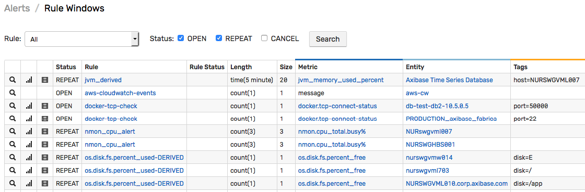

# Rule Engine

The rule engine enables automation of repetitive tasks based on real-time statistical analysis of incoming data.

Such tasks include triggering an outgoing webhook, executing a Python script, sending an [email](email.md)/[Slack](notifications/README.md) alert, or generating derived statistics.

The engine evaluates incoming `series`, `message`, and `property` commands and executes response actions when appropriate:

```javascript
IF condition = true THEN action-1, ... action-N
```

Example

```javascript
IF percentile(75) > 300 THEN alert_slack_channel
```

A rule [condition](condition.md) can operate on a single metric defined in the current rule or correlate multiple metrics using [`value`](functions-value.md), [`database`](functions-series.md), and [`rule`](functions-rules.md) functions.

## Processing Pipeline

The incoming data is consumed by the rule engine independently of the persistence path.


The data is maintained in [windows](window.md) which are `in-memory` structures initialized for each unique combination of metric, entity, and grouping tags extracted from incoming commands.

The processing pipeline consists of the following stages:

## Filtering

The incoming data samples are processed by a chain of filters prior to the grouping stage. Such filters include:

* **Input Filter**. All samples are discarded if the **Settings > Input Settings > Rule Engine** option is disabled.

* **Status Filter**. Samples are discarded for metrics and entities that are disabled.

* [Rule Filter](filters.md) accepts data that satisfies the metric, entity, and tag filters specified in the rule.

## Grouping

Once the sample passes through the filter chain, the sample is allocated to matching [windows](window.md) grouped by metric, entity, and optional tags. Each window maintains its own array of data samples in working memory.

The commands can be associated with windows in a 1-to-1 fashion by enabling the `All Tags` setting or by enumerating all tags as the [grouping](grouping.md) tags.


If the **Group by Entity** option is cleared, the `entity` field is ignored for grouping purposes and the window is grouped only by metric and tags.

### Window Length

The rule engine supports two types of windows:

* Count-based
* Time-based

**Count-based** windows accumulate up to the specified number of samples. The samples are sorted in the order received, with the most recently received sample being placed at the end of the array. When the window reaches the limit, the first sample (oldest by arrival time) is removed from the window to free up space at the end of the array for an incoming sample.

**Time-based** windows store samples that are timestamped within the specified interval of time, ending with the current time. The time-based window does not limit how many samples can be held by the window and its time range is continuously updated. Old records are automatically removed from the window once they are outside of the time range.

## Condition Checking

[Windows](window.md) are continuously updated as new samples are added and old samples are
removed.

When a window is updated, the rule engine checks the [condition](condition.md) and triggers various response actions based on the condition result.

Condition example:

```javascript
avg() > 80
```

### Window Status

[Windows](window.md) are stateful. When the condition for a given window changes to `true`, the window is initialized in memory with the status `OPEN`.

On subsequent `true` evaluations, the status transitions to `REPEAT`.

When the condition becomes `false`, the window status is reverted to `CANCEL`.

The current window status is displayed on the **Alerts > Rule Windows** page.


Windows are updated when the commands `enter` or `exit` the windows. Scheduled rules that are checked at a regular interval, regardless of incoming data, can be constructed using the built-in [`timer`](scheduled-rules.md) metrics.

## Actions

Actions are triggered on window status changes, for example upon window `OPEN` status or every N-th `REPEAT` status occurrence.

Supported response actions:

* [Send email](email.md)
* [Trigger webhook](notifications/README.md)
* [Execute script](commands.md)
* [Generate derived metrics](derived.md)
* [Log alert to file](logging.md)

Triggers for the above actions can be configured independently, for example to send email every 6 hours yet to log events for all repeat occurrences.

## Correlation

Each rule evaluates data received for only one specified metric. To create conditions that check values for multiple metrics, use [value](functions-value.md), [database](functions-series.md), and [rule](functions-rules.md) functions.

* Value functions:

```javascript
percentile(95) > 80 && values('metric2') != 0
```

* Database functions:

```javascript
percentile(95) > 80 && db_statistic('max', '1 hour', 'metric2') < 10*1024
```

* Rule functions:

```javascript
percentile(95) > 80 && rule_open('inside_temperature_check')
```

## Developing Rules

Rules can be considered software programs in their own right and as such involve initial development, testing, documentation and maintenance efforts.

To minimize the number of rules with manual thresholds, the rule engine in ATSD provides the following capabilities:

* Condition [overrides](overrides.md).
* Comparison of windows with different lengths.
* Automated thresholds.

### Manual Thresholds

Thresholds can be set manually which requires some trial and error to determine a level that strikes a balance between false positives and missed alerts.

```javascript
value > 90
```

Since a single baseline cannot handle all edge cases, the [`Overrides`](#overrides) can be used to enumerate exceptions.

To reduce false positives, apply an averaging function to longer windows.

```javascript
avg() > 90
```

To reduce distortions caused by a small number of outliers, use percentiles instead of averages.

```javascript
percetile(75) > 90
```

Alternatively, use the `minimum` or a low percentile function with the reversed comparator to check that all samples in the window exceed the threshold. This is equivalent to checking that the last-N consecutive samples are above the threshold.

```javascript
// all samples are above 90
min() > 90
```

```javascript
// only 10% of the smallest samples are below 90
percentile(10) >= 90
```

### Deviation Thresholds

Short-term anomalies can be spotted by comparing statistical functions for different overlapping intervals.

The condition below activates an alert if the 5-minute average exceeds the 1-hour average by more than `20` and by more than `10%`.

```javascript
avg('5 minute') - avg() > 20 && avg('5 minute') / avg() > 1.1
```

### Forecast Thresholds

The  `forecast` function returns an estimated value for the current series based on the Holt-Winters or ARIMA [forecasting](../forecasting/README.md) algorithms.
The condition fires if the window average deviates from the expected value by more than `25%` in any direction.

```javascript
abs(avg() - forecast()) > 25
```

Similarly, the `forecast_deviation` function can be utilized to compare actual and expected values as a ratio of standard deviation.

```javascript
abs(forecast_deviation(avg())) > 2
```

### Correlation Thresholds

In cases where the analyzed metric is related to another metric, use the [database functions](functions-series.md) to identify abnormal behavior in both metrics.

The primary metric is expected to be below `50` as long as the second metric remains below `100`. Otherwise, an alert is raised.

```javascript
avg() > 50 && db_statistic('avg', '1 hour', 'page_views_per_minute') < 100
```

The same condition can be generalized with a ratio as well.

```javascript
avg() / db_statistic('avg', '1 hour', 'page_views_per_minute') > 2
```

As an alternative, use the [`value(metric)`](functions-value.md) function to access the last value for metrics submitted within the same `series` command or parsed from the same row in CSV files.

```javascript
value > 75 && value('page_views_per_minute') < 1000
```

### Overrides

The default baseline can be adjusted for particular series using the [Overrides](overrides.md) table.


## Alert Severity

Severity is a measure of criticality assigned to alerts generated by the rule. The severity level ranges between `NORMAL` and `FATAL` and is specified on the **Logging** tab in the rule editor.

If an alert is raised by a condition defined in the `Overrides` table, its severity supersedes the default severity.

In rules operating on `message` commands, the alert severity can be inherited from the `severity` field of the underlying message.
To enable this behavior, set Severity on the **Logging** tab to `unknown`.

## Complex Rules

In cases that involve processing of large volumes of historical data, use [Scheduled SQL](../sql/scheduled-sql.md) queries to analyze the data.

To trigger an email notification from an SQL query, use `WHERE` and `HAVING` filters to develop a query that returns **no rows** if the situation is normal.

```sql
SELECT entity, tags, percentile(90, value) FROM page_views
  WHERE datetime >= current_day
  GROUP BY entity, tags, period(1 DAY)
HAVING percentile(90, value) > 1000
-- HAVING condition acts as a rule filter
```

* Set **Send Empty Report** parameter to `No`.
* Specify triggers such as an email notification or a file export.

As a result, the query triggers actions only when it returns at least one row.


## Monitoring

### Open Alerts

Open alerts are displayed on the **Alerts > Open Alerts** page and can be retrieved with [`/alert/query`](../api/data/alerts/README.md) Data API query and incorporated into portals using the [console](https://axibase.com/products/axibase-time-series-database/visualization/widgets/alert-console-widget/) widget.


### Rule Windows

 Rule windows are initialized in memory and are displayed on the **Alerts > Rule Errors** page. If no windows are present for the given rule, check that the rule is enabled and that data is not discarded by one of the [filters](filters.md).



### Rule Errors

Rule Errors can occur in case of invalid or malformed expressions. The **Alerts > Rule Errors** page contains the list of most recent errors as well as the relevant context and the command details.
