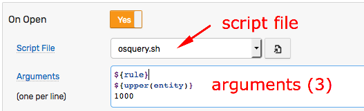

# Commands

## Overview

Command actions execute pre-defined scripts on the ATSD server to complete advanced processing and integration tasks.

These tasks include running `bash` or Python scripts and integrating with external systems using tools such as IBM [`itmcmd`](https://www.ibm.com/support/knowledgecenter/en/SSTFXA_6.2.1/com.ibm.itm.doc_6.2.1/itm_cmdref113.htm)/[`tacmd`](https://www.ibm.com/support/knowledgecenter/en/SS3JRN_7.2.0/com.ibm.itm.doc_6.2.2fp2/tacmd.htm) or [AWS CLI](https://aws.amazon.com/cli/).

## Configuration

### Script File

To configure a command action, create a script file in the `/opt/atsd/atsd/conf/script` directory. The `axibase` user has `execute` permission for this directory.

The list of files is displayed in the **Script File** drop-down list on the **System Commands** tab.


To view the script, click **Show script** icon.

Select the script file to execute, for example `disk_cleanup.sh`, from the **System Commands** tab.

### Script Arguments

Specify optional arguments passed to the script, **one argument per line**. Arguments with whitespace or quote characters are automatically quoted.

Arguments can include [window fields](window.md#window-fields) and calculated values using [placeholder](placeholders.md) syntax, for example `${tags.location}`, `${upper(entity)}`, or `${avg()/100}`. If the placeholder is not found, the placeholder is replaced with an empty string.



### Environment Variables

As an alternative to passing arguments, access [window fields](window.md#window-fields) and user-defined [variables](variables.md) as environment variables.

* `bash` script

```bash
#!/usr/bin/env bash

# access window fields by name
ent=${entity}

# use awk to access variables that contain special characters
dsk=$(awk 'BEGIN {print ENVIRON["tags.disk"]}')

echo "entity = ${ent}"
echo "disk   = ${dsk}"
echo "-------------"
printenv | sort
```

```txt
entity = nursvgvml007
disk   = sda1
-------------
HOME=/home/axibase
JAVA_HOME=/usr/lib/jvm/java-8-openjdk-amd64/
...
alert_duration=00:00:10:49
alert_duration_interval=10m:49s
...
tags.disk=sda1
value=10.0
...
```

* Python script

```python
#!/usr/bin/env python
import os

# use os.getenv to access environment variables
ent=os.getenv("entity")
dsk=os.getenv("tags.disk")

print("entity={}".format(ent))
print("disk={}".format(dsk))

print("\n-------------")
for key, value in sorted(os.environ.items()):
    print("{}={}".format(key, value))

```

### Working Directory

The working directory is `/opt/atsd/atsd/conf/script`.

Since the working directory path can change, use the absolute path in script arguments where appropriate.

### Creating a Test Script

```bash
nano /opt/atsd/atsd/conf/script/test.sh
```

```bash
#!/usr/bin/env bash

# print all arguments to temporary file
echo "Test: $@" > /tmp/atsd/test.out
echo "========" >> /tmp/atsd/test.out
printenv | sort >> /tmp/atsd/test.out
```

```bash
chmod +x /opt/atsd/atsd/conf/script/test.sh
```

The script is selectable on the **System Commands** tab.


## Execution

A script can run on `OPEN`, `CANCEL` and `REPEAT` status changes. To execute the script, enable the trigger and select the script file from the drop-down list or click **Same as 'On Open'** to re-use the configuration.

Only **one** script can be executed for each trigger. If you need to execute multiple scripts, create a wrapper script.

### Timeout

The script must complete within the timeout defined in the `system.commands.timeout.seconds` property on the **Settings > Server Properties** page. The default timeout is **15 seconds**.

If the script fails to exit within the timeout limit, the script process is stopped with `SIGTERM` and the following text is added to the output:

```txt
Script terminated on timeout: {current timeout value}
```

### Security

Only scripts in the `/opt/atsd/atsd/conf/script` can be executed. Script text can be modified by editing the file on the file system. Modifying scripts from within the ATSD web interface is not supported.

Scripts are executed under the `axibase` user context.

Ensure that the `axibase` user has permissions to execute the script and that the script has the `+x` execution bit.

To disable script execution in the rule engine, set `system.commands.enabled` property to `No` on the **Settings > Server Properties** page.

### Logging

If **Log Output** option is enabled, both `system.out` and `system.err` outputs are logged to the `atsd.log` file for each script execution.

The output is limited to 10,240 characters.

```txt
2017-11-30 13:32:26,597;INFO;Exec Default Executor;com.axibase.tsd.service.rule.ExecutionAlertEndpoint;

KUIEXC001I: Content of the response file /tmp/itmcmd-atsd.log is:
------Command-------
find /opt/atsd/atsd/backup/* -mtime +15 -type f
------Command Result-------
0
------Standard Error-------
------Standard Output-------
/opt/atsd/atsd/backup/entities_20171111233000.xml
/opt/atsd/atsd/backup/entity-groups_20171111233000.xml
/opt/atsd/atsd/backup/entity-views_20171111233000.xml

KUIEXC000I: Executecommand request was performed successfully. The return value of the command run on the remote systems is 0

2017-11-30 13:32:26,597;INFO;Exec Default Executor;com.axibase.tsd.service.rule.ExecutionAlertEndpoint;Script successful: exit code = 0, cmd: '[/opt/atsd/atsd/conf/script/disk_cleanup.sh, NURSWGVML007, /tmp, 15d]'
```

## Examples

### Clean up disk on a remote system using `tacmd` command

#### Description

If disk space is low, the command reads user credentials from the `itm.pwd` file located in the `axibase` user home directory. After a successful login to the ITM hub server, [`tacmd executecommand`](https://www.ibm.com/support/knowledgecenter/en/SS3JRN_7.2.0/com.ibm.itm.doc_6.2.2fp2/tacmd.htm) is launched on the remote server where old files in `/tmp` directory (older than 15 days) are deleted with logging. Finally, the process logs out from the ITM hub server.

On `OPEN` status, the script executes the disk cleanup procedure on the system where the disk space rule alert is raised, identified with `${upper(entity)}:LZ` placeholder.

A follow-up action on `REPEAT` status, can be configured to cleanup other directories, to further reduce disk space usage.

#### Prerequisites

Tivoli Enterprise Services User Interface Extensions must be installed on the ATSD server. To install this component, launch the `install.sh` script and select the `KUE` module from the list.

```txt
  ... installing "Tivoli Enterprise Services User Interface Extensions  V06.30.06.00 for Linux x86_64 R2.6, R3.0 (64 bit)"; please wait.
  => installed "Tivoli Enterprise Services User Interface Extensions  V06.30.06.00 for Linux x86_64 R2.6, R3.0 (64 bit)".
  ... Initializing component Tivoli Enterprise Services User Interface Extensions  V06.30.06.00 for Linux x86_64 R2.6, R3.0 (64 bit).
  ... Tivoli Enterprise Services User Interface Extensions  V06.30.06.00 for Linux x86_64 R2.6, R3.0 (64 bit) initialized.
```

Modify the Hub TEMS configuration file `/opt/IBM/ITM/config/ms.config` and set the following parameter.

```elm
  KT1_TEMS_SECURE='YES'
```

TEMS restart is required to activate this setting.

#### Configuration
  
* Create the `disk_cleanup.sh` file in `/opt/atsd/atsd/conf/script` directory.

```bash
cat ~/itm.pwd | /opt/IBM/ITM/bin/tacmd login -stdin > /dev/null && \
/opt/IBM/ITM/bin/tacmd executecommand -m $1:LZ -o -e -r -l -f ALL -d /tmp/itmcmd-atsd.log -v -c "find $2 -mtime +$3 -type f -delete -print" && \
/opt/IBM/ITM/bin/tacmd logout > /dev/null
```

* Make the script executable.

```bash
sudo chmod +x /opt/atsd/atsd/conf/script/disk_cleanup.sh
```

* The script is now displayed in the **Script File** drop-down list, and the content is visible on the **Show Script** page.


#### Arguments

```bash
${upper(entity)}
/tmp
15d
```

#### Output Log

```txt
  2017-11-30 14:23:28,647;INFO;Exec Default Executor;com.axibase.tsd.service.rule.ExecutionAlertEndpoint;

  KUIEXC001I: Content of the response file /tmp/itmcmd-atsd.log is:
  ------Command-------
  find /tmp -mtime +15 -type f -delete -print
  ------Command Result-------
  0
  ------Standard Error-------
  ------Standard Output-------
  /tmp/hsperfdata_root/7640

  KUIEXC000I: Executecommand request was performed successfully. The return value of the command run on the remote systems is 0

  2017-11-30 14:23:28,647;INFO;Exec Default Executor;com.axibase.tsd.service.rule.ExecutionAlertEndpoint;Script successful: exit code = 0, cmd: '[/opt/atsd/atsd/conf/script/disk_cleanup.sh, NURSWGVML007, /tmp, 15d]'
```