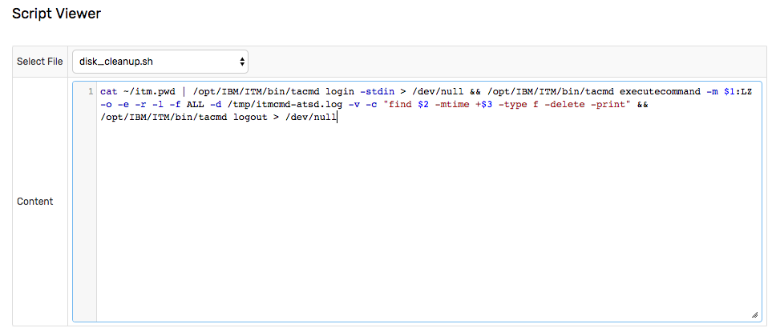

# Commands

## Overview

A command action executes system commands on the ATSD server to trigger advanced processing and integration tasks based on analysis of incoming data.

Such tasks include running Shell or Python scripts, or integrating with external systems using their built-in command line tools such as IBM ITM [`itmcmd`](https://www.ibm.com/support/knowledgecenter/en/SSTFXA_6.2.1/com.ibm.itm.doc_6.2.1/itm_cmdref113.htm)/[`tacmd`](https://www.ibm.com/support/knowledgecenter/en/SS3JRN_7.2.0/com.ibm.itm.doc_6.2.2fp2/tacmd.htm) or [AWS CLI](https://aws.amazon.com/cli/).

## Command Interpreter

To execute a command, specify a name of the executable and optional arguments.

### Program Path

Select the name of the executable, for example `disk_cleanup.sh`. The executable must be located in the `/opt/atsd/atsd/conf/script` directory. `axibase` user must have `execute` permissions granted for this file.

> Do **not** include arguments in the **Executable Path** field.

### Program Arguments

Specify optional arguments passed to the executable, one argument per line. Arguments with whitespace or quote characters are automatically quoted.

The arguments can include [window fields](window.md#window-fields) and calculated values using [placeholder](placeholders.md) syntax, for example `${tags.location}` or `${upper(entity)}`. If the placeholder is not found, the placeholder is replaced with an empty string.


### Environment Variables

As an alternative to passing arguments, you can access [window fields](window.md#window-fields) and user-defined rule [variables](variables.md) as environment variables.

* `bash` script

```bash
#!/usr/bin/env bash

# access window fields by name
ent=${entity}

# use awk to access variables that contain special characters
dsk=$(awk 'BEGIN {print ENVIRON["tags.disk"]}')

echo "entity = ${ent}"
echo "disk   = ${dsk}"
echo "-------------"
printenv | sort
```

```txt
entity = nursvgvml007
disk   = sda1
-------------
HOME=/home/axibase
JAVA_HOME=/usr/lib/jvm/java-8-openjdk-amd64/
...
alert_duration=00:00:10:49
alert_duration_interval=10m:49s
...
tags.disk=sda1
value=10.0
...
```

* Python script

```python
#!/usr/bin/env python
import os

# use os.getenv to access environment variables
ent=os.getenv("entity")
dsk=os.getenv("tags.disk")

print("entity={}".format(ent))
print("disk={}".format(dsk))

print("\n-------------")
for key, value in sorted(os.environ.items()):
    print("{}={}".format(key, value))

```

### Piping, Redirection, Shell Expansion

The command interpreter in ATSD does not support piping, I/O redirection or shell expansion. If the command needs to perform these operations, specify these operations in the script file.

## Command Execution

The command can be configured to execute on `OPEN`, `CANCEL` and `REPEAT` status changes. To execute the command, enter a valid executable path for the selected status trigger or click **Same as 'On Open'** to re-use the configuration.

If the executable path is empty, no command is executed for this status trigger.

Only **one** command can be executed for each status change. If you need to execute multiple commands, create a wrapper script with multiple commands.

* Wrapper script `docker_restart_prd_aer.sh`

```sh
docker restart prd_aer && docker exec -it -u axibase prd_aer /home/axibase/aer/start.sh
```

The command must complete within the timeout value specified in **Settings > Server Properties > system.commands.timeout.seconds**. The default timeout is 15 seconds.

If the command times out, the script process is stopped with `SIGTERM` and the following text is added to the output:

```txt
Script terminated on timeout: {current timeout value}
```

## Working Directory

The working directory is `/opt/atsd/atsd/conf/script`.

Since the working directory path can change, use the absolute path in command arguments where appropriate.

## Security

Commands are executed by the `axibase` user.

Ensure that the `axibase` user has permissions to execute the command and that the script has the `+x` execution bit.

To disable execution of system commands in the rule engine, set `system.commands.enabled` setting to `No` on the **Settings > Server Properties** page.

## Logging

When **Log Output** option is enabled, both `system.out` and `system.err` outputs are logged to the `atsd.log` file for each command execution.

The output is limited to 10240 characters.

```txt
2017-11-30 13:32:26,597;INFO;Exec Default Executor;com.axibase.tsd.service.rule.ExecutionAlertEndpoint;

KUIEXC001I: Content of the response file /tmp/itmcmd-atsd.log is:
------Command-------
find /opt/atsd/atsd/backup/* -mtime +15 -type f
------Command Result-------
0
------Standard Error-------
------Standard Output-------
/opt/atsd/atsd/backup/entities_20171111233000.xml
/opt/atsd/atsd/backup/entity-groups_20171111233000.xml
/opt/atsd/atsd/backup/entity-views_20171111233000.xml
...

KUIEXC000I: Executecommand request was performed successfully. The return value of the command run on the remote systems is 0

2017-11-30 13:32:26,597;INFO;Exec Default Executor;com.axibase.tsd.service.rule.ExecutionAlertEndpoint;Script successful: exit code = 0, cmd: '[/opt/atsd/atsd/conf/script/disk_cleanup.sh, NURSWGVML007, /tmp, 15d]'
```

## Examples

### Clean up disk space on a remote system using IBM Tivoli `tacmd` command

#### Description

If disk space is low, the command reads user credentials from the `itm.pwd` file located in the `axibase` user home directory. After a successful login to the ITM hub server, [`tacmd executecommand`](https://www.ibm.com/support/knowledgecenter/en/SS3JRN_7.2.0/com.ibm.itm.doc_6.2.2fp2/tacmd.htm)) is launched on the remote server `${upper(entity)}:LZ` where it finds old files in `/tmp` directory (older than 15 days) and deletes them with logging. Finally, the process logs out from the ITM hub server.

By using the `${upper(entity)}` placeholder, the script executes the disk cleanup procedure on the system where the disc space rule alert is raised, to `OPEN` status.

A follow-up action, at the `REPEAT` status, can be further configured to cleanup other directories, to bring disk space usage down.

#### Prerequisites

* Tivoli Enterprise Services User Interface Extensions installed on the ATSD server. To install the component, launch the `install.sh` script and select the `KUE` module from the list.

```txt
  ... installing "Tivoli Enterprise Services User Interface Extensions  V06.30.06.00 for Linux x86_64 R2.6, R3.0 (64 bit)"; please wait.
  => installed "Tivoli Enterprise Services User Interface Extensions  V06.30.06.00 for Linux x86_64 R2.6, R3.0 (64 bit)".
  ... Initializing component Tivoli Enterprise Services User Interface Extensions  V06.30.06.00 for Linux x86_64 R2.6, R3.0 (64 bit).
  ... Tivoli Enterprise Services User Interface Extensions  V06.30.06.00 for Linux x86_64 R2.6, R3.0 (64 bit) initialized.
```

* Modify the Hub TEMS configuration file `/opt/IBM/ITM/config/ms.config` and set the following parameter.

```txt
  KT1_TEMS_SECURE='YES'
```

> Note that TEMS restart is required to activate this setting.
  
* Create the `disk_cleanup.sh` file in `/opt/atsd/atsd/conf/script` directory.

```txt
cat ~/itm.pwd | /opt/IBM/ITM/bin/tacmd login -stdin > /dev/null && /opt/IBM/ITM/bin/tacmd executecommand -m $1:LZ -o -e -r -l -f ALL -d /tmp/itmcmd-atsd.log -v -c "find $2 -mtime +$3 -type f -delete -print" && /opt/IBM/ITM/bin/tacmd logout > /dev/null
```

* Make the script executable.

```sh
sudo chmod +x /opt/atsd/atsd/conf/script/disk_cleanup.sh
```

* The script must be available in `Script File` drop-down list, and the content must be visible in `Show Script` form.




#### Script File

```sh
  disk_cleanup.sh
```

#### Arguments

```bash
${upper(entity)}
/tmp
15d
```

#### Output Log

```txt
  2017-11-30 14:23:28,647;INFO;Exec Default Executor;com.axibase.tsd.service.rule.ExecutionAlertEndpoint;

  KUIEXC001I: Content of the response file /tmp/itmcmd-atsd.log is:
  ------Command-------
  find /tmp -mtime +15 -type f -delete -print
  ------Command Result-------
  0
  ------Standard Error-------
  ------Standard Output-------
  /tmp/hsperfdata_root/7640

  KUIEXC000I: Executecommand request was performed successfully. The return value of the command run on the remote systems is 0

  2017-11-30 14:23:28,647;INFO;Exec Default Executor;com.axibase.tsd.service.rule.ExecutionAlertEndpoint;Script successful: exit code = 0, cmd: '[/opt/atsd/atsd/conf/script/disk_cleanup.sh, NURSWGVML007, /tmp, 15d]'
```
