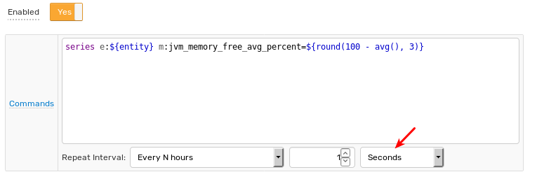

# Derived Commands

## Overview

Derived command actions store new calculated metrics in the database by creating and processing custom commands defined with [Network API](../api/network/README.md#network-api) syntax.

## Command Template

To configure a command action, specify a template which contains a command name, command fields and command values.

### Supported Commands

* [`series`](../api/network/series.md)
* [`property`](../api/network/property.md)
* [`message`](../api/network/message.md)
* [`entity`](../api/network/entity.md)
* [`metric`](../api/network/metric.md)

### Fields

Templates can include plaintext and [placeholders](placeholders.md).

```bash
series e:${entity} m:jvm_memory_free_avg_percent=${round(100 - avg(), 3)}
```

Reference other metrics with calculated metrics via the [`db_last`](functions-series.md#db_laststring-m) and [`db_statistic`](functions-series.md#db_statistic) functions.

```bash
series e:${entity} m:jvm_memory_used_bytes=${value * db_last('jvm_memory_total_bytes') / 100.0}
```

### Tags

Use the special placeholder `${commandTags}` to print all window tags supported by [Network API](../api/network/series.md#syntax) syntax. The placeholder appends tags to the command without knowledge of the tag names in advance.

Using the command below:

```bash
series e:${entity} m:disk_free=${100 - value} ${commandTags}
```

Upon the following incoming command:

```ls
series e:test m:disk_used=25 t:mount_point=/ t:file_system=sda
```

Produces the derived command:

```ls
series e:test m:disk_free=75 t:mount_point=/ t:file_system=sda
```

### Time

#### Current Server Time

To store derived commands with the current server time, omit `datetime` fields (`ms`, `s`, `d`) from the derived command.

```bash
series e:${entity} m:disk_free=${100 - value} ${commandTags}
```

Alternatively, use the [`now`](window-fields.md#date-fields) placeholder to access current server time.

```bash
series e:${entity} m:disk_free=${100 - value} ${commandTags} ms:${now.getMillis()}
```

To store commands with seconds precision, round the current time using the [`floor`](functions.md#mathematical) function and the `s:` seconds parameter:

```bash
series e:${entity} m:disk_free=${100 - value} ${commandTags} s:${floor(now.getMillis()/1000)}
```

#### Received Time

To store a derived command with the same time as an incoming command, set the `ms:` millisecond parameter to [`${timestamp}`](window-fields.md#date-fields). This placeholder represents the timestamp of the command that caused the window status event.

```bash
series e:${entity} m:disk_free=${100 - value} ${commandTags} ms:${timestamp}
```

> If the **Check on Exit** option is enabled for time-based window, some events are caused by exiting commands and the `timestamp` field returns the time of the oldest command, rounded to seconds.

To round the input time to seconds, use the  `s:` seconds parameter and [`floor`](functions.md#mathematical) function:

```bash
series e:${entity} m:disk_free=${100 - value} ${commandTags} s:${floor(timestamp/1000)}
```

## Frequency

Store derived commands each time a command is received or removed from the window by setting the **Repeat** parameter to **All**.

The frequency can be lowered by adjusting the repeat interval.



Produced commands are queued in memory and persisted to the database once per second.

## Multiple Commands

Multiple commands, including commands of different types, can be specified at the same time. Each command must be specified on a separate line.

```bash
series e:${entity} m:jvm_memory_free_avg_percent=${round(100 - avg(), 3)}
series e:${entity} m:jvm_memory_free_min_percent=${round(100 - max(), 3)}
```

To create multiple metrics within the same command, use a `for` loop to iterate over a collection or array.

```bash
series e:${entity} @{s = ""; for (stat : stats) {s = s + " m:" + stat.split(":")[0] + "=" + stat.split(":")[1];} return s;}
```

If the `stats` collection is `['a:10', 'b:20', 'c:30']`, the produced command is inserted as shown below:

```ls
series e:entity1 m:a=10 m:b=20 m:c=30
```

## Condition

If the purpose of a rule is to create derived series, without alerting, set the `Condition` field to a static `true` value to minimize processing overhead.


## Examples

### Moving Average, Last `n` Count

* **Window Size**: `count`
* Window Length: `10`
* **Condition**: `true`
* **Derived Command**:

  ```bash
  series e:${entity} m:${metric}_movavg=${avg()} ${commandTags}
  ```

### Moving Average, Last `n` Time

* **Window Size**: `time`
* Window Length: `10 Minute`
* **Condition**: `true`
* **Derived Command**:

  ```bash
  series e:${entity} m:${metric}_movavg=${avg()} ${commandTags}
  ```

### Roll Up (All Matching Entities)

* **Window Type**: `time`
* Window Length: `1 Minute`
* **Group by Entity**: Not Enabled
* **Condition**: `true`
* **Derived Command**:

  ```bash
  series e:total m:${metric}_sum=${sum()}
  ```

### Reverse / Inverse Metric

* **Window Type**: `count`
* Window Length: `1`
* **Condition**: `true`
* **Derived Command**:

  ```bash
  series e:${entity} m:${metric}_rev=${100-value} ${commandTags}
  ```

  ```bash
  series e:${entity} m:${metric}_inv=${value = 0 ? 0 : 1/value} $  {commandTags}
  ```

### Ratio / Percentage

* **Window Type**: `count`
* Window Length: `1`
* **Condition**: `true`
* **Derived Command**:

  ```bash
  series e:${entity} m:${metric}_percent=${100 * value/value('total')} $  {commandTags}
  ```

### Message to Series

* **Window Type**: `count`
* Window Length: `1`
* Condition: `true`
* **Derived Command**:

  ```bash
  series e:${entity} m:job_execution_time=$  {tags.job_execution_time.replaceAll("[a-zA-Z]", "").trim()}
  ```
