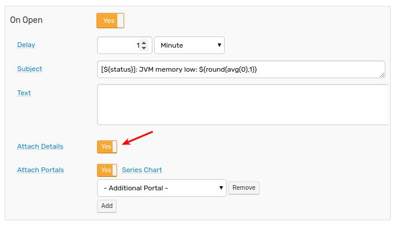
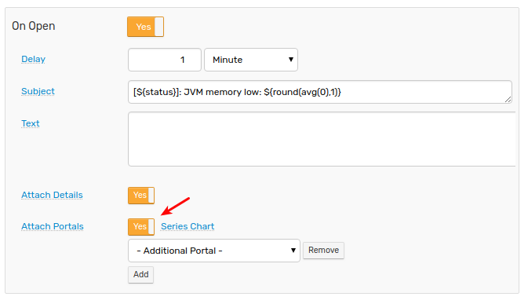
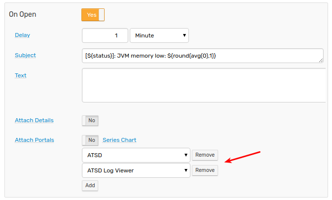

# Email Action

Email action delivers messages to email subscribers based on [window](window.md) status events.

Notifications can be triggered by numerous events such as when a window changes status or maintains the `REPEAT` status for a defined interval.

## Email Client

Messages generated by Rule Engine are sent via built-in [Mail Client](../administration/mail-client.md) which is configurable at **Settings > Mail Client**.

Custom Mail Client formatting options such as [header and footer](../administration/mail-client.md#header-and-footer) are applied to all outgoing messages.

## Enable Notifications

Navigate to the **Email Notifications** tab in the Rule Editor.

Set `Enabled` status and enter one or ]more email addresses, separated by comma, semi-colon, or whitespace.

Set toggle to **Yes** to subscribe to notifications initiated by `OPEN`, `REPEAT`, or `CANCEL` triggers.


For repeat notifications, adjust the notification frequency using **Repeat Interval**, for example every **6 hours** or every **10 events**.

If necessary, clear the **Same as On Open** checkbox to configure message content independently.

## Settings

| Name | Description |
| --- | --- |
| Enabled | Enable or disable email delivery. |
| Name | User-defined email configuration name. Each rule can have multiple independently executed configurations. |
| Recipients | One or more email subscribers which receive messages. Use a comma, semi-colon, or whitespace to separate multiple addresses. |
| Priority | Message priority to classify messages in commonly used email clients: `Low`, `Normal`, `High`. |
| Merge Messages | Merge multiple notifications from different rules into one email message for the same subscriber to prevent excessive emails from arriving within a short time span.<br>The subject line of merged messages is generated automatically and contains rule names, metric names, and the total number of merged notifications in the given message. <br>For example: `Alerts(2)-cpu_busy: statistical-time, nmon_cpu`. |
| Minimum Notification Interval | Minimum interval between messages to prevent too many email messages generated by the rule. The rule engine discards messages that are generated by the rule before the specified interval from the last sent message expires. |

## Configure Message Content

Fill out the message **Subject** and **Text fields**.

Both fields can include any text as well as [placeholders](placeholders.md) to customize outgoing messages based on alert details.

```bash
Warning! Rule ${rule} for server ${entity} is active.
```

[Placeholders](placeholders.md), escaped with `$` and wrapped in curly brackets `${expression}`, are evaluated and replaced with actual values when the notification is sent.

```bash
Warning! Rule JVM Memory Low for server nurswgvml007 is active.
```

### Subject Field

The **Subject** field can include plain text, HTML [entity characters](https://dev.w3.org/html5/html-author/charref), and [emoji](https://unicode.org/emoji/charts/full-emoji-list.html). HTML markup is **not** supported.


Note that long subjects that exceed the `78` character limit according to [RFC 2822](https://www.ietf.org/rfc/rfc2822.txt), Section `2.1.1` can be truncated or rejected by mail servers. The actual limit is typically higher but is implementation-specific.

If placeholders in the subject can potentially evaluate to long strings, apply [`truncate`](functions-text.md#truncate) or [`abbreviate`](functions-text.md#abbreviate) functions to ensure that the subject length remains within the limit.

```bash
${entity} received message '${abbreviate(tags.notification, 50)}'
```

### Text Field

The **Text** field can include any text including [emoji](https://unicode.org/emoji/charts/full-emoji-list.html) and HTML [entity characters](https://dev.w3.org/html5/html-author/charref) as well as [placeholders](placeholders.md).

Unlike the **Subject** field, **Text** is not constrained by a length limit and supports HTML markup.

```bash
Database Error.
Code: <b>${tags.code}</b>
<pre>
${message}
</pre>
```

The message text can include output of scripts, SQL queries, and API calls formatted as HTML tables.

```bash
Top-10 running containers by CPU:
${addTable(executeSqlQuery(query), 'html', true)}
```

In addition, the **Text** field can invoke [attachment](functions-portal.md#portal-functions) functions to include portal screenshots as inline images or CSV files as attachments.

```bash
${addPortal('AWS Route53 Health Check Detail', aws_entity)}
```

The **Text** field supports [control flow](control-flow.md#control-flow) syntax which supports the customization of content based on alert details.

```bash
@if{tags.payload.type != 'cron'}
    ${detailsTable('html')}
@end{}
```

## Trigger Settings

| Setting | Description |
| --- | --- |
| Delay on Open | Delay interval for sending notification for `OPEN` status.<br>If the window changes to `CANCEL` status within the specified delay interval, no `OPEN` status email is sent.<br>Set this interval to prevent emails on momentary spikes. |
| Repeat Interval | Interval for sending `REPEAT` status notifications.<br>If **Repeat Interval** is set in time units, the exact interval can vary because the `REPEAT` notifications are triggered by incoming data.<br>In particular, `REPEAT` notifications are not sent if the incoming data flow ceases. |
| Subject | Custom subject text, specified for each status separately.<br>The subject can include placeholders with built-in fields, functions, and expressions, for example: `${round(avg())}`. <br>Note that the maximum allowed length of the subject is limited to several hundred characters in most email clients.|
| Text | Custom message text, specified for each status separately.<br>The text can include placeholders with built-in fields, functions, and expressions, for example: `${round(avg())}`. |
| Attach Details | Include a [summary table](window-fields.md#details-tables) with window statistics and action links. |
| Attach Portals | One or more portal screenshots attached to the message as inline images.<br>If a portal is a template, placeholders such as entity, metric, tags are resolved from the window fields.<br> **Series Chart**: attach a screenshot containing series monitored by this rule. |

## Grouping

The incoming data is [grouped](grouping.md) into windows by metric, entity, and command tags with each window generating emails separately from the others.


If the rule creates too many windows, restrict the rule [filter](filters.md) or add [`Override`](overrides.md) exceptions that disable alerting for a particular series.


The override table below contains rules that always return `false` for the matching series since the value cannot exceed 100%.


## Message Composition

* Subject
* Content
  * Header
  * Text
  * Detail Table
    * Entity tags
    * Alert fields
    * Command/Event tags
    * User variables
  * Portal Screenshots (inline images in `png` format)
  * Footer
  * Attachments
    * Files (CSV, Excel, PDF, etc)


### Subject

The subject can include [placeholders](placeholders.md) with fields and expressions which are replaced by actual values when the message is sent. If a placeholder is not found, the placeholder is replaced with an empty string.

**Sample subject**:

```bash
[${status}] Rule ${rule} for ${entity} ${tags}
```

When using placeholders that can be replaced with text of arbitrary length, apply the [`truncate`](functions-text.md#truncate) or [`abbreviate`](functions-text.md#abbreviate) functions to limit the subject length.

```bash
[${status}] Rule ${rule} for ${entity}: ${truncate(tags.error, 100)}
```

### Text

The message text (body) can include [placeholders](placeholders.md) as well.

Use the HTML tag `<br>` to split content into multiple lines.

```bash
Start Time: ${windowStartTime}<br>
Duration: ${(timestamp / 1000 - windowStartTime) * 1000} ms
```

Placeholders with [link](links.md) fields are automatically inlined.

Message text can include [control flow](control-flow.md) statements for conditional processing.

```bash
[${upper(tags.status)}] ${entityLink} Ω ${getEntityLink(tags.docker-host)}
<span style='color: orange'>${marker}</span>
@if{is_launch}
  ${addTable(entity.tags, 'html')}
@end{}
```

### Header and Footer

A [header and footer](../administration/mail-client.md#header-and-footer) can be specified in both plaintext and HTML format in Email Client settings and applied to all messages.

Header and footer do **not** support any placeholders.

```html
<p style="color: #8db600; font-weight: bold; margin: 0px; padding: 0px;">Classification: UNCLASSIFIED</p>
```

```html
<p style="color: #8db600;">END of MESSAGE</p>
```


### Details Table

The details table is optional and is formatted with styles for enhanced readability in commonly used email client software.



Each table includes multiple parts which are compiled depending on the alert context.

Below the table, links are provided to view extended alert information, open charts, and export underlying data.


Decimal numbers are rounded to five significant digits for readability.

### Portals

To attach screenshots, a [web driver](notifications/web-driver.md) must be installed and configured. To attach default portal for the metric, entity and tags to the outgoing message, enable **Series Chart**.



Charts can include multiple series depending on statistical functions referenced in the condition.

```javascript
abs(forecast_deviation(median())) > 2 && (median() < 200 || median() > 600)
```


Similarly, if a rule correlates multiple metrics using [database functions](functions-series.md) or [rules functions](functions-rules.md) these metrics can be included in the screenshot on the right axis.

```javascript
avg() > 10 && db_last('memfree') < 500000
```


To attach additional portals, select them from the **Additional Portal** drop-down list.



If a portal is a [template](../portals/portals-overview.md#template-portals), placeholders such as entity, metric, tags are set based on the current window fields.

## Monitoring

Monitor the number of messages sent per minute with the [`email_notifications_per_minute`](../administration/monitoring.md#rule-engine) metric collected by ATSD.

```elm
https://atsd_hostname:8443/portals/series?entity=atsd&metric=email_notifications_per_minute
```


