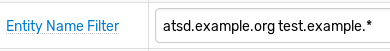

# Filters

## Overview

Filters determine which commands are processed by the given rule.

Commands that satisfy all filters are allocated to matching [windows](window.md).

| **Filter** | **Description** |
|---|---|
| Data Type | Allow commands of the specified type: `series`, `property`, or `message`. |
| Metric | Allow `series` commands with the specified metric name. |
| Type/Source | Allow `message` commands with the specified type and source tags. |
| Type | Allow `property` commands with the specified property type. |
| Entity Names | Allow commands for the specified list of entity names or name patterns. |
| Entity Group | Allow commands for entities that belong to one of the selected groups. |
| Expression | Allow commands for which the filter expression returns `true`. |
| Time Offset | Allow commands timestamped close to current server time. |
| Out-of-order | Allow ordered commands. |

## Data Type Filter

The filter checks that the command is of the specified data type: `series`, `property`, or `message` and ignores commands if their type is different from what is specified in the filter. For example, a `series` filter ignores `message` and `property` commands.


## Metric, Type, Source Filter

* The **Metric** filter applies to `series` commands.
* The **Type** filter applies to `property` commands.
* The **Type** and **Source** filters apply to `message` commands.


## Entity Names Filter

Specify one or more entity names or patterns to allow commands only from specific entities. Separate multiple names or patterns with whitespace. Patterns support `*` wildcard characters.



For more flexible filtering, use the main [Expression](#filter-expression) filter described below, for example:

* Exclude entities using negation:

  ```javascript
  entity != 'abc'
  ```

* Include entities based on entity label:

  ```javascript
  entity.displayName NOT LIKE '*test*'
  ```

* Include entities based on entity tags:

  ```javascript
  entity.tags.location IN ('SVL', 'NUR')
  ```

## Entity Group Filter

The filter discards commands for entities that do not belong to one of the entity groups specified in the rule. The filter is applied only if the list of selected entity groups is not empty.


## Filter Expression

The filter matches commands for which the expression returns `true`.

The expression consists of one or multiple boolean checks joined with [boolean operators](operators.md#boolean-operators) `AND`, `OR`, and `NOT`.

The expression can include command fields listed below, literal values, and [functions](functions.md) except [statistical functions](functions-statistical.md).

| Base | Series | Message | Property |
|---|---|---|---|
| <ul><li>`entity`</li><li>`tags.{name}`</li><li>`entity.tags.{name}`</li><li>`entity.field`</li><li>`metric.tags.{name}`</li><li>`metric.field`</li></ul>| <ul><li>`metric`</li><li>`value`</li></ul>|<ul><li>`type`</li><li>`source`</li><li>`severity`</li><li>`message`</li></ul> | <ul><li>`type`</li><li>`keys`</li><li>`keys.{name}`</li><li>`properties`</li><li>`properties.{name}`</li></ul>|

```javascript
entity != 'nurswgvml007'
```

```javascript
entity.displayName NOT LIKE '*test*'
  && entity.tags.location = 'SVL'
```

Tag values can be accessed using dot notation `tags.{tag-name}` or square brackets `tags['tag-name']`.

```javascript
tags.location LIKE 'nur*' && tags.state = 'CA'
```

```javascript
type = 'activemq_service' AND keys.service = 'health'
```

```javascript
entity.tags.environment != 'test'
  && message NOT IN collection('linux-ignore-commands')
```


```javascript
tags.method = 'get' AND tags.site = 'OperationsManager2007WebConsole'
```

Use square brackets if the tag name contains special characters such as `-,+,=`.

```javascript
tags['mount-point'] NOT LIKE '*u113452*'
```

To allow commands only during specific times of the date, check the built-in [`now`](object-datetime.md) object.

```javascript
// Active on Fridays between [09:00-19:00) server time
now.day_of_week == 'Friday'
  && now.hourOfDay BETWEEN 9 AND 18
  && /* remaining checks */
```

## Time Offset Filter

If set to a positive value, the filter discards commands with a timestamp that deviates by more than specified `grace` interval from the current **server** time. This filter can be used to ignore historical and future data.


Set count to `0` to disable the filter.

## Out-of-Order Filter

The filter discards commands timestamped **earlier** than the time of the most recent command in the given window.


## Filter Log

To view the list of commands that matched the **Data Type** and **Metric/Type/Source** filters and the results of their evaluation by other filters, click **View Filter Log** located on the **Filters** tab.


## Filter vs Condition

While the same checks can be performed in the filter expression and in the alert condition, performance increases if checks that refer to command fields are specified in the filter expression whereas checks that require the [window](window.md) object are specified in the alert condition. Discarding unnecessary commands early minimizes the number of windows maintained by the rule engine.

For example, `tags.mount_point = '/'` refers to the `tags` field which is present in the incoming command and therefore can be checked in the filter expression. As a result commands with other tag values (for example `mount_point` = `/dev`) are discarded early in the process without causing additional windows to be created.

[Statistical functions](functions-statistical.md), on the other hand, operate on values stored in the window and therefore cannot be used during the filtering stage. Since the window is not available at the filtering stage, the statistical functions shall return `zero` if included in a filter expression.
