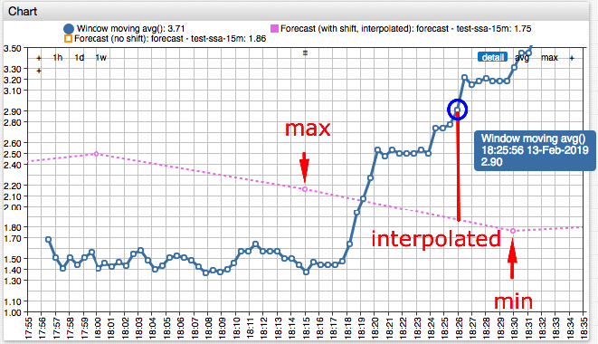

# Statistical Forecast Functions

## Overview

## Reference

* [`forecast`](#forecast)
* [`forecast_stdev`](#forecast_stdev)
* [`forecast_score_stdev`](#forecast_score_stdev)
* [`forecast_score_deviation`](#forecast_score_deviation)
* [`forecast_deviation`](#forecast_deviation)
* [`thresholdTime`](#thresholdtime)

## `forecast()`

```csharp
forecast([string name]) object
```

Returns forecast object for the entity, metric, and tags in the current window. The object contains neighboring forecast periods based on `time` field calculated by subtracting 50% of the forecast period from the window center (`windowTime`).

If the `name` is specified, the forecast object is retrieved for the named forecast settings.

The object contains the following fields:

* `previous` - Previous period value.
* `next` - Next period value.
* `min` - Minimum of the previous and the next period values.
* `max` - Maximum of the previous and the next period values.
* `linear` - Linearly interpolated value between previous and next periods based on `time` field.
* `windowTime` - Window center time calculated as average of first and last timestamps in the current window.
* `time` - Forecast time calculated as `windowTime - 0.50*forecast_series_period`.
* `previousTime` - Previous period start time.
* `nextTime` - Next period start time.

| **Parameter** | **Time** | **Date**  |
|---:|---|---|
| `command.time` | `1550082342000` | `2019-02-13 18:25:56` |
| `previousTime` | `1550080800000` | `2019-02-13 18:00:00` |
| `nextTime` | `1550081700000` | `2019-02-13 18:15:00` |
| `windowTime` | `1550081922000` | `2019-02-13 18:18:42` |
| `time` | `1550081472000` | `2019-02-13 18:11:12` |

The `violates()` function in the forecast object returns `true` if the input value deviates by more than the specified delta from the `min` and `max` range. The delta must be a non-negative number.

```javascript
violates(double a, double delta) {
  return a < min - delta || a > max + delta;
}
```



[](https://apps.axibase.com/chartlab/4d42110e/12/)

Example:

```javascript
violates(avg(), 10)
```

## `forecast_stdev`

```csharp
forecast_stdev() double
```

Returns forecast standard deviation.

## `forecast_score_stdev`

Returns the standard deviation of aggregated values from the best fitting forecast model values within the scoring interval.

Scoring is a procedure that identifies parameters that produce the best fitting forecast with the smallest standard deviation from observed aggregated values.

```csharp
forecast_score_stdev(string forecastName) double
```

## `forecast_score_deviation`

```csharp
forecast_score_deviation(string forecastName, double a) double
```

Returns the difference between a number `a` (such as the last value, or moving average `avg()`) and the `forecast().linear` value, divided by the forecast score standard deviation.

The function returns `NaN` if either forecast or forecast score standard deviation cannot be retrieved, or if the standard deviation is zero.

The formula is:

```javascript
(a - forecast(name).linear/forecast_score_stdev(name)
```

## `forecast_deviation`

```csharp
forecast_deviation(number a) double
```

Returns difference between a number `a` and the `forecast().linear` value, divided by the forecast standard deviation.

```javascript
(a - forecast().linear)/forecast_stdev()
```

## `thresholdTime`

```csharp
thresholdTime(number min, number max [, string interval]) long
```

Returns Unix time in milliseconds when the [stored forecast value](../forecasting/README.md) is outside of the `(min, max)` range for the first time during time interval `interval`.

`interval` is specified as count and [unit](../api/data/series/time-unit.md), for example `1 WEEK`. If `interval` is not specified, the function checks all forecast values in the future.

Thresholds `min` and `max` are ignored by the function if either is set to `null`. If both `min` and `max` are specified, the following rules apply:

* If threshold `max` is equal or greater than `min`, the function returns time when the forecast value is **outside** of the specified range.
* If threshold `min` exceeds `max`, the function returns time when the forecast value is **within** the specified range.

The function returns `null` if no stored forecast is found in the database.

### Example

```javascript
/* Returns time, within the next 6 hours, when the forecast exceeds 90.
Returns `null`, if all forecast values are below 90 or the violation occurs after the `6 HOUR` window. */
thresholdTime(null, 90, '6 HOUR')
```

### Example Table

Current time is `2018-Jul-07 15:00`, or `1530975600000` in Unix time (milliseconds).

Forecast Values:

| **Value** | **Date** | **Time**  | **Note** |
|---:|---|---|---|
| `70` | `2018-Jul-08 15:00` | `1530975600000` | 1 day from `now` |
| `80` | `2018-Jul-09 15:00` | `1531148400000` | 2 days from `now` |
| `90` | `2018-Jul-10 15:00` | `1531234800000` | 3 days from `now` |
| `100` | `2018-Jul-16 15:00` | `1531753200000` | 9 days from `now` |

```javascript
/* Returns 1531753200000 (2018-Jul-16 15:00)
First time when the forecast 100 exceeds 'max' threshold 95 */
thresholdTime(null, 95)
```

```javascript
/* Returns null. No forecast value exceeds 120. */
thresholdTime(null, 120)
```

```javascript
/* Returns null. No forecast value exceeds 95 within the next 7 days, by 2018-Jul-14 15:00. */
thresholdTime(null, 95, '7 DAY')
```

```javascript
/* Returns 1531234800000 (2018-Jul-10 15:00).
First time when the forecast 90 exceeds 'max' threshold 80.
Forecast 80 on 2018-Jul-09 15:00 is ignored as not exceeding the threshold. */
thresholdTime(null, 80, '7 DAY')
```

```javascript
/* Returns 1530975600000 (2018-Jul-08 15:00).
First time when the forecast 70 is below 'min' threshold 80. */
thresholdTime(80, null, '7 DAY')
```

```javascript
/* Returns 1531753200000 (2018-Jul-16 15:00)
Outside range check: case when 'max' threshold is greater than 'min' threshold.
First time when the forecast 100 is either below 70 OR above 90. */
thresholdTime(70, 90)
```

```javascript
/* Returns 1531148400000 (2018-Jul-09 15:00)
Within range check: case when 'min' threshold is greater than 'max' threshold.
First time when the forecast 80 is BOTH above 'max' threshold 70 AND below 'min' threshold 90. */
thresholdTime(90, 70)
```

```javascript
/* Returns 1531148400000 (2018-Jul-09 15:00)
Case when 'min' threshold equals 'max' threshold.
First time when the forecast 80 is either below 70 (false) OR above 70 (true). */
thresholdTime(70, 70)
```
