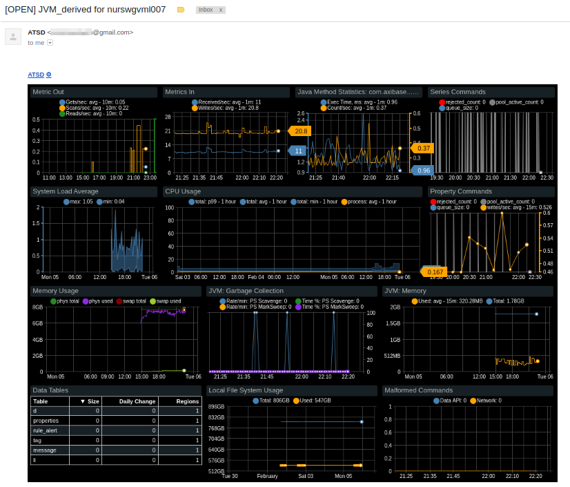

# Portal Functions

## Overview

The `addPortal` function provides a way to enrich notifications with any predefined portals, if the web service configuration supports sending screenshots.

## Common Use Cases

* Generate a portal for entity outside of current window context
* Supply portal screenshot with significant description

## Syntax

```javascript
addPortal(string portal)
addPortal(string portal, string entity / List<?> entities)
addPortal(string portal, string entity / List<?> entities, string comment)
addPortal(string portal, string entity / List<?> entities, string comment, [] additionalParams)
```
* [**required**] `portal` - Name of the preconfigured portal. If asterisk `*` is specified, all portals for the given entity will be attached to notification. If portal is not found by the specified name, a case-insensitive match without non-alphanumeric characters is used, e.g. 'tcollector - Linux' becomes 'tcollectorlinux'and returned the first matching portal.
* `entity` or `entities` - Entities for which the portal will be generated. Required if the portal type is [template](../portals/creating-and-assigning-portals.md#template-portals).
  * `entity` - Entity name `string` is converted to `entity` url parameter (`&entity=test_e`). If entity is not found by name, it's matched by label (case insensitive match).
  * `entities` - `List<?>` are converted to `entities` url parameter as comma-separated list (`&entities=test_e,test_e1,test_e2`). If element type is `Entity`, entity.name would be substituted, `Strinng.valueOf(element)` otherwise.
* `comment` - Optional description for the chart. If not specified or empty, default comment is generated as `${portalName} for ${ifEmpty(entity_label, entity)}`and can be retrieved with special placeholder `caption`. Default comment contains links to the portal, entity and rule for [Email](email.md), [Slack](notifications/slack.md) and [Discord](notifications/discord.md) notifications.
* `additionalParams` - Map to be provided to portal configuration template.

The parameters may include literal values or window [placeholders](placeholders.md) such as the `entity` or `tag` value.

If `entity` or `portal` cannot be found, "Entity '`entity`' not found" or "Portal '`portal`' not found" messages are sent.

## Supported endpoints

The function is supported by the following configurations:
* [Email](email.md)
* [Telegram](notifications/telegram.md)
* [Slack](notifications/slack.md)
* [Discord](notifications/discord.md)
* [Hipchat](notifications/hipchat.md)

Used with other configurations, the function will evaluate to an empty string.

## Examples

* No optional parameters

```javascript
addPortal('atsd')
```



* Entity is specified

```javascript
addPortal('Linux nmon', 'nurswgvml007')
```


* Entity and comment are specified

```javascript
addPortal('collectd', 'nurswgvml007', '$caption | <@' + tags.event.user + '>')
```
