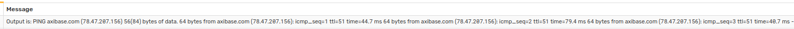
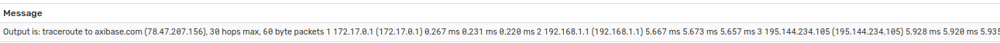
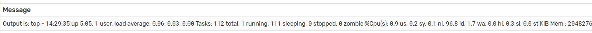
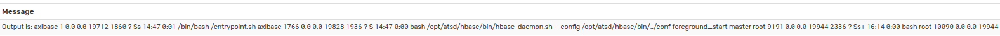
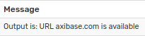
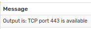
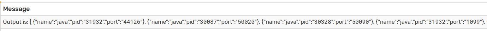

# Functions: script

## Overview

Function `scriptOut` returns standard output/error of a bash or python script stored on the ATSD file system.
For security purposes, the script must exist in the directory `/opt/atsd/atsd/conf/script/`.

## Syntax

```java
scriptOut(String scriptFileName, List arguments)
```

## Examples

The following examples use the **Message** field at the **Logging** tab with enabled **Log to ATSD** option.

 * Script to [test ping](resources/ping.sh) of host n number of times.
 
    ```bash
    #!/usr/bin/env bash
 
    host=${1}
    count=${2}
 
    ping -c ${count} ${host}

    ```
    **Message** field:
 
   ```bash
   Output is: ${scriptOut('ping.sh', ['axibase.com','3'])}
   ```
 
    Received message:
 
    
 
 * Script to [return traceroute](resources/traceroute.sh) to host.
 
    ```bash
    #!/usr/bin/env bash
 
    kill_after=${1}
    host=${2}
 
    timeout ${kill_after} traceroute ${host}; echo $?

    ```
    **Message** field:
  
    ```bash
    Output is: ${scriptOut('traceroute.sh', ['3','axibase.com'])}
    ```
  
    Received message:
  
    
  
 
 * Script that returns [output of top](resources/remote_top_batch.sh) (in batch mode) from a remote server (using ssh with key authentication, key stored in a known location).
 
    ```bash
    #!/usr/bin/env bash
 
    host=$1
    id_file=$2
    count=$3
    delay=$4
 
    ssh -i ${id_file} ${host} top -b -n ${count} -d ${delay}
    ```
 
    **Message** field:
   
    ```bash
    Output is: ${scriptOut('remote_top_batch.sh', ['axibase.com','/home/axibase/ssh_host_rsa_key', '5', '3'])}
    ```
   
    Received message:
   
    
   
 *  Script that returns [ps output](resources/ps.sh) for the specified grep pattern
 
    ```bash
    #!/usr/bin/env bash
    
    pattern=${1}
    
    ps aux | grep ${pattern}

    ```
  
    **Message** field:
    
    ```bash
    Output is: ${scriptOut('ps.sh', ['bash'])}
    ```
    
    Received message:
       
    
    
 * Script that tests [URL availability](resources/url_avail.sh).
 
    ```bash
    #!/usr/bin/env bash
    
    url=$1
    
    curl --head ${url} 2>/dev/null | head -n 1 | grep -q "HTTP/... [23].."
    if [[ $? -eq 0 ]] ; then
      echo URL ${url} is available
    else
      echo URL ${url} is unavailable
    fi
    ```
    **Message** field:
    
    ```bash
    Output is: ${scriptOut('url_avail.sh', ['axibase.com'])}
    ```
    Received message:
           
    
    
 * Script that tests [TCP availability](resources/tcp.sh).
 
    ```bash
    #!/usr/bin/env bash
    
    kill_after=${1}
    host=${2}
    port=${3}
    
    timeout ${kill_after} bash -c "</dev/tcp/${host}/${port}"
    
    if [[ $? -eq 0 ]]; then
    	echo "TCP port ${port} is available"	
    else
    	echo "TCP port ${port} is unavailable"
    fi
    ```
    **Message** field:
    
    ```bash
    Output is: ${scriptOut('tcp.sh', ['2','axibase.com', '443'])}
    ```
    Received message:
               
    
 
 * Script that [executes a osquery](resources/osquery.sh) query against a remote server via ssh command (key stored in a known location).
 
    ```bash
    #!/usr/bin/env bash
    
    key_location=${1}
    user=${2}
    host=${3}
    
    ssh -i ${key_location} ${user}@${host} 'osqueryi --json  "SELECT DISTINCT processes.name, listening_ports.port, processes.pid FROM listening_ports JOIN processes USING (pid) WHERE listening_ports.address = '\''0.0.0.0'\'';"'

    ```
    
    **Message** field:
        
    ```bash
    Output is: ${scriptOut('osquery.sh', ['/home/axibase/ssh_host_rsa_key','axibase', 'axibase.com'])}
    ```
    Received message:
                   
    
    