# Functions: script

## Overview

Function `scriptOut` returns standard output/error of a bash or python script stored on the ATSD file system.
For security purposes, the script must exist in the directory `./atsd/conf/script/`.

## Syntax

```java
scriptOut(String scriptFileName, List arguments)
```

## Examples

### ping

Script to [test ping](resources/ping.sh) of host n number of times.

#### Script text

```bash
#!/usr/bin/env bash
 
host=${1}
count=${2}
 
ping -c ${count} ${host}

```
#### Function command

```bash
Output is: ${scriptOut('ping.sh', ['axibase.com','3'])}
```

#### Launch command

```
ping -c 3 axibase.com
```
   
#### Output

```bash
PING axibase.com (78.47.207.156) 56(84) bytes of data.
64 bytes from axibase.com (78.47.207.156): icmp_seq=1 ttl=52 time=45.5 ms
64 bytes from axibase.com (78.47.207.156): icmp_seq=2 ttl=52 time=40.0 ms
64 bytes from axibase.com (78.47.207.156): icmp_seq=3 ttl=52 time=43.9 ms

--- axibase.com ping statistics ---
3 packets transmitted, 3 received, 0% packet loss, time 2002ms
rtt min/avg/max/mdev = 40.078/43.189/45.588/2.305 ms
```

#### Notification Example

Telegram:

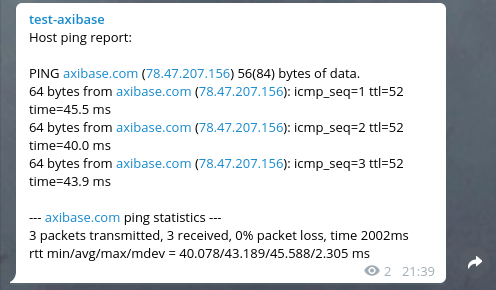

Discord:

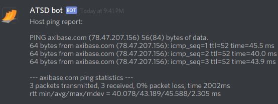

Slack:


### traceroute

Script to [return traceroute](resources/traceroute.sh) to host.

#### Script text

```bash
#!/usr/bin/env bash

kill_after=${1}
host=${2}

timeout ${kill_after} traceroute ${host}; echo $?

```

#### Function command

```bash
Output is: ${scriptOut('traceroute.sh', ['3','axibase.com'])}
```
    
#### Launch command

```bash
timeout 3 traceroute axibase.com; echo $?
```
#### Output

```bash
traceroute to axibase.com (78.47.207.156), 30 hops max, 60 byte packets
 1  172.17.0.1 (172.17.0.1)  0.271 ms  0.237 ms  0.219 ms
 2  192.168.1.1 (192.168.1.1)  1.578 ms  1.722 ms  1.743 ms
 3  195.144.234.105 (195.144.234.105)  2.946 ms  3.349 ms  3.375 ms
 4  10.78.242.161 (10.78.242.161)  3.366 ms  3.389 ms  3.380 ms
 5  78.25.80.94 (78.25.80.94)  11.125 ms  11.267 ms  11.453 ms
 6  10.222.78.125 (10.222.78.125)  37.343 ms  36.109 ms  36.438 ms
 7  83.169.204.78 (83.169.204.78)  16.013 ms  14.191 ms  14.533 ms
 8  83.169.204.104 (83.169.204.104)  33.581 ms  33.207 ms  33.549 ms
 9  37.29.109.222 (37.29.109.222)  34.547 ms  33.527 ms  33.519 ms
10  core4.fra.hetzner.com (213.239.203.237)  33.867 ms core1.fra.hetzner.com (213.239.245.6)  34.520 ms  34.791 ms
11  core24.fsn1.hetzner.com (213.239.229.78)  38.259 ms  37.819 ms core23.fsn1.hetzner.com (213.239.229.74)  43.815 ms
12  ex9k2.dc8.fsn1.hetzner.com (213.239.229.18)  38.443 ms ex9k2.dc8.fsn1.hetzner.com (213.239.229.22)  38.388 ms ex9k2.dc8.fsn1.hetzner.com (213.239.229.18)  37.721 ms
13  cnode3.6.fsn1.your-cloud.host (136.243.180.196)  38.035 ms  38.038 ms  38.031 ms
14  axibase.com (78.47.207.156)  38.607 ms  38.005 ms  37.997 ms124

```

#### Notification Example

 Telegram:
 
 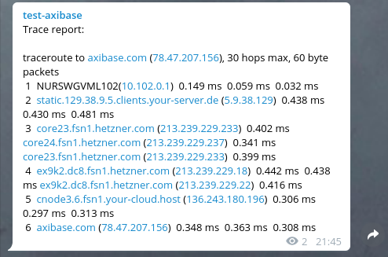
 
 Discord:
 
 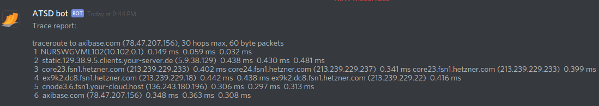
 
 Slack:
 
 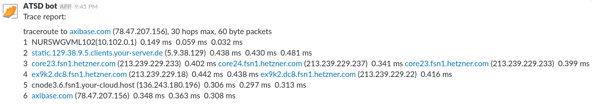


### top

Script that returns [output of top](resources/remote_top_batch.sh) (in batch mode) from a remote server (using ssh with key authentication, key stored in a known location).

#### Script text

```bash
#!/usr/bin/env bash

host=$1
id_file=$2
count=$3
delay=$4

ssh -i ${id_file} ${host} top -b -n ${count} -d ${delay}

```
#### Function command

```bash
Output is: ${scriptOut('remote_top_batch.sh', ['axibase.com','/home/axibase/ssh_host_rsa_key', '1', '1'])}
```
#### Launch command

```bash
ssh -i /home/axibase/ssh_host_rsa_key axibase.com top -b -n 1 -d 1
```

#### Output

```bash
top - 07:02:11 up 13 min,  1 user,  load average: 0.00, 0.19, 0.27
Tasks: 105 total,   1 running, 104 sleeping,   0 stopped,   0 zombie
%Cpu(s):  5.8 us,  0.7 sy,  0.2 ni, 86.9 id,  4.9 wa,  0.0 hi,  1.4 si,  0.0 st
KiB Mem :  2048272 total,   281016 free,  1163632 used,   603624 buff/cache
KiB Swap:  2095100 total,  2095100 free,        0 used.   720312 avail Mem 

  PID USER      PR  NI    VIRT    RES    SHR S %CPU %MEM     TIME+ COMMAND
    1 root      20   0   37720   5768   3984 S  0.0  0.3   0:00.98 systemd
    2 root      20   0       0      0      0 S  0.0  0.0   0:00.00 kthreadd
    3 root      20   0       0      0      0 S  0.0  0.0   0:00.05 ksoftirqd/0
    5 root       0 -20       0      0      0 S  0.0  0.0   0:00.00 kworker/0:0H
    6 root      20   0       0      0      0 S  0.0  0.0   0:00.05 kworker/u2:0
    7 root      20   0       0      0      0 S  0.0  0.0   0:00.12 rcu_sched
    8 root      20   0       0      0      0 S  0.0  0.0   0:00.00 rcu_bh
    9 root      rt   0       0      0      0 S  0.0  0.0   0:00.00 migration/0
   10 root      rt   0       0      0      0 S  0.0  0.0   0:00.00 watchdog/0
   11 root      20   0       0      0      0 S  0.0  0.0   0:00.00 kdevtmpfs
   12 root       0 -20       0      0      0 S  0.0  0.0   0:00.00 netns
   13 root       0 -20       0      0      0 S  0.0  0.0   0:00.00 perf
   14 root      20   0       0      0      0 S  0.0  0.0   0:00.00 khungtaskd
   15 root       0 -20       0      0      0 S  0.0  0.0   0:00.00 writeback
   16 root      25   5       0      0      0 S  0.0  0.0   0:00.00 ksmd
...
```

#### Notification Example

Slack:

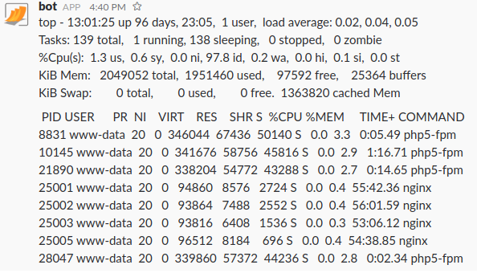   
   
      
### ps

 Script that returns [ps output](resources/ps.sh) for the specified grep pattern
 
#### Script text

```bash
#!/usr/bin/env bash

pattern=${1}

ps aux | grep ${pattern}

```
#### Function command

```bash
Output is: ${scriptOut('ps.sh', ['bash'])}
```
#### Launch command

```bash
ps aux | grep bash
```

#### Output

```bash
axibase      1  0.0  0.0  19712  3304 ?        Ss   11:07   0:00 /bin/bash /entrypoint.sh
axibase   2807  0.0  0.0  19828  3464 ?        S    11:09   0:00 bash /opt/atsd/hbase/bin/hbase-daemon.sh --config /opt/atsd/hbase/bin/../conf foreground_start master
root      5993  0.0  0.0  19944  3736 ?        Ss   11:24   0:00 bash
root      6015  0.0  0.0  12944  1016 ?        S+   11:24   0:00 grep --color=auto bash
```

#### Notification Example   
 
 Telegram:
 
 
 
 Discord:
 
 
 
 Slack:
 
    
      

### URL availability

Script that tests [URL availability](resources/url_avail.sh).

#### Script text

```bash
#!/usr/bin/env bash

url=$1

curl --head ${url} 2>/dev/null | head -n 1 | grep -q "HTTP/... [23].."
if [[ $? -eq 0 ]] ; then
  echo URL ${url} is available
else
  echo URL ${url} is unavailable
fi
```

#### Function command

```bash
Output is: ${scriptOut('url_avail.sh', ['axibase.com'])}
```
#### Launch command

```bash
curl --head axibase.com 2>/dev/null | head -n 1 | grep -q "HTTP/... [23].."
```
#### Output

```bash
URL axibase.com is available
```
#### Notification Example  

 Telegram:
 
 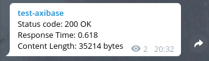
 
 Discord:
 
 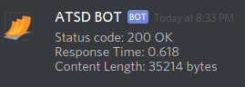
 
 Slack:
 
 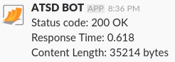   


### TCP availability

Script that tests [TCP availability](resources/tcp.sh).

#### Script text

```bash
#!/usr/bin/env bash

kill_after=${1}
host=${2}
port=${3}

timeout ${kill_after} bash -c "</dev/tcp/${host}/${port}"

if [[ $? -eq 0 ]]; then
   echo "TCP port ${port} is available"	
else
   echo "TCP port ${port} is unavailable"
fi
```
#### Function command

```bash
Output is: ${scriptOut('tcp.sh', ['2','axibase.com', '443'])}
```
#### Launch command

```bash
timeout 2 bash -c "</dev/tcp/axibase.com/443"
```
#### Output

```bash
TCP port 443 is available
```
#### Notification Example

 Telegram:
 
 
 
 Discord:
 
 
 
 Slack:
 
   


### osquery

Script that [executes a osquery](resources/osquery.sh) query against a remote server via ssh command (key stored in a known location).

#### Script text

```bash
#!/usr/bin/env bash

key_location=${1}
host=${2}

ssh -i ${key_location} ${host} 'osqueryi --json  "SELECT DISTINCT processes.name, listening_ports.port, processes.pid FROM listening_ports JOIN processes USING (pid) WHERE listening_ports.address = '\''0.0.0.0'\'';"'
```
#### Function command

```bash
Output is: ${scriptOut('osquery.sh', ['/home/axibase/ssh_host_rsa_key', 'axibase.com'])}
```
#### Launch command

```bash
ssh -i /home/axibase/ssh_host_rsa_key axibase.com 'osqueryi --json  "SELECT DISTINCT processes.name, listening_ports.port, processes.pid FROM listening_ports JOIN processes USING (pid) WHERE listening_ports.address = '\''0.0.0.0'\'';"'
```
#### Output

```json
[
  {"name":"java","pid":"1887","port":"50010"},
  {"name":"java","pid":"1887","port":"50075"},
  {"name":"java","pid":"1887","port":"50020"},
  {"name":"java","pid":"2181","port":"50090"},
  {"name":"java","pid":"1728","port":"50070"}
]
```
#### Notification Example

 Telegram:
 
 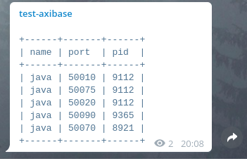
 
 Discord:
 
 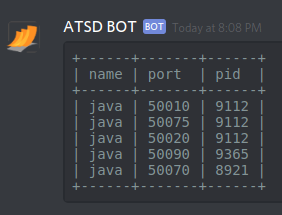
 
 Slack:
 
 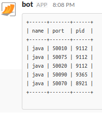    