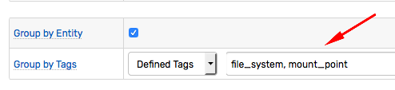

# Grouping

## Overview

Incoming commands are assigned to in-memory [windows](window.md) based on the grouping key which consists of the following field values:

* Data Type: `series`, `message`, or `property`
* Metric Name
* Entity Name
* Command Tags

Commands with equal grouping keys are assigned to the same window.

**Data Type** and **Metric Name** fields are mandatory parts of the key whereas grouping by entity and tags is optional and can be configured for each rule separately.

## Tag Grouping

For `series` commands, default grouping is set by the entity and **all** tags. The list of grouping tags can be adjusted by enumerating them on the **Overview** tab.



For `message` and `property` commands, default grouping by tags is disabled to avoid creating too many windows in the application memory.

## Entity Grouping

Entity grouping can be disabled to apply an aggregate function to data coming from multiple entities that matched certain filters, for example, to calculate an average for all matching entities.

## Examples

Assuming that incoming data is represented with the three `series` commands shown here, the examples below illustrate the effect of group settings on window formations.

| Data Type | Metric | Entity | Tags |
|---|---|---|:---|
| series | m1 | e1 | t1=v1 t2=v2 |
| series | m1 | e1 | t1=v1 t2=v3 |
| series | m1 | e3 | t1=v4 t2=v3 |

```ls
series e:e1 t:t1=v1 t:t2=v2 m:m1=80
series e:e1 t:t1=v1 t:t2=v3 m:m1=10
series e:e3 t:t1=v4 t:t2=v3 m:m1=50
```

### Group By Entity and All Tags

* Group by `series` type, `m1` metric.
* Group by entity.
* Group by all tags (`t1`, `t2`).


| Data Type | Metric | Entity | Tags | Grouping Key |
|---|---|---|:---|:---|
| series | m1 | e1 | t1=v1 t2=v2 | series-m1-e1-t1=v1-t2=v2 |
| series | m1 | e1 | t1=v1 t2=v3 | series-m1-e1-t1=v1-t2=v3 |
| series | m1 | e3 | t1=v4 t2=v3 | series-m1-e3-t1=v4-t2=v3 |


### Group By Entity

* Group by `series` type, `m1` metric.
* Group by entity.
* Do not group by any tags.


| Data Type | Metric | Entity | Tags | Grouping Key |
|---|---|---|:---|:---|
| series | m1 | e1 | t1=v1 t2=v2 | series-m1-e1 |
| series | m1 | e1 | t1=v1 t2=v3 | series-m1-e1 |
| series | m1 | e3 | t1=v4 t2=v3 | series-m1-e3 |


### Group By Entity and Tag `t1`

* Group by `series` type, `m1` metric.
* Group by entity.
* Group by one of the tags (`t1`).


| Data Type | Metric | Entity | Tags | Grouping Key |
|---|---|---|:---|:---|
| series | m1 | e1 | t1=v1 t2=v2 | series-m1-e1-t1=v1 |
| series | m1 | e1 | t1=v1 t2=v3 | series-m1-e1-t1=v1 |
| series | m1 | e3 | t1=v4 t2=v3 | series-m1-e3-t1=v4 |


### Group By Tag `t1`

* Group by `series` type, `m1` metric.
* Do not group by entity.
* Group by one of the tags (`t1`).


| Data Type | Metric | Entity | Tags | Grouping Key |
|---|---|---|:---|:---|
| series | m1 | e1 | t1=v1 t2=v2 | series-m1-t1=v1 |
| series | m1 | e1 | t1=v1 t2=v3 | series-m1-t1=v1 |
| series | m1 | e3 | t1=v4 t2=v3 | series-m1-t1=v4 |


### Group By Tag `t2`

* Group by `series` type, `m1` metric.
* Do not group by entity.
* Group by one of the tags (`t2`).


| Data Type | Metric | Entity | Tags | Grouping Key |
|---|---|---|:---|:---|
| series | m1 | e1 | t1=v1 t2=v2 | series-m1-t2=v2 |
| series | m1 | e1 | t1=v1 t2=v3 | series-m1-t2=v3 |
| series | m1 | e3 | t1=v4 t2=v3 | series-m1-t2=v3 |


