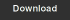

# Holiday Calendar

## Overview

Holiday Calendar is a data structure containing national holiday and work day information. [DateTime object](object-datetime.md) methods `is_weekday` and `is_weekend` use Holiday Calendar to
 accurately determine the working days of a given country.

## Default calendars

ATSD contains pre-defined holiday calendars for several countries in calendar year 2018.
These calendars include national holidays and additional non-working days.

List of default holiday calendars:

 **Country** | **Calendar Code** | **Download**
----|----|----
Australia | `aus` | [](https://raw.githubusercontent.com/axibase/atsd/master/rule-engine/resources/calendars/aus_2018.json)
Austria| `aut` | [](https://raw.githubusercontent.com/axibase/atsd/master/rule-engine/resources/calendars/aut_2018.json)
Brazil | `bra` | [](https://raw.githubusercontent.com/axibase/atsd/master/rule-engine/resources/calendars/bra_2018.json)
Canada | `can` | [](https://raw.githubusercontent.com/axibase/atsd/master/rule-engine/resources/calendars/can_2018.json)
China | `chn` | [](https://raw.githubusercontent.com/axibase/atsd/master/rule-engine/resources/calendars/chn_2018.json)
Germany | `deu` | [](https://raw.githubusercontent.com/axibase/atsd/master/rule-engine/resources/calendars/deu_2018.json)
France | `fra` | [](https://raw.githubusercontent.com/axibase/atsd/master/rule-engine/resources/calendars/fra_2018.json)
Great Britain | `gbr` | [](https://raw.githubusercontent.com/axibase/atsd/master/rule-engine/resources/calendars/gbr_2018.json)
Japan | `jpn` | [](https://raw.githubusercontent.com/axibase/atsd/master/rule-engine/resources/calendars/jpn_2018.json)
Korea | `kor` | [](https://raw.githubusercontent.com/axibase/atsd/master/rule-engine/resources/calendars/kor_2018.json)
Russia | `rus` | [](https://raw.githubusercontent.com/axibase/atsd/master/rule-engine/resources/calendars/rus_2018.json)
Singapore | `sgp` | [](https://raw.githubusercontent.com/axibase/atsd/master/rule-engine/resources/calendars/sgp_2018.json)
USA | `usa` | [](https://raw.githubusercontent.com/axibase/atsd/master/rule-engine/resources/calendars/usa_2018.json)

## Creating New Calendars

### Location

Calendars are represented as JSON documents located in `/opt/atsd/atsd/conf/calendars` directory.
The file with calendar data structure can be named as follows:

* `{calendar_key}.json`
* `{calendar_key}_{yyyy}.json`

### JSON Schema

```json
{
  "$id": "https://example.com/usa_2018.json",
  "type": "array",
  "definitions": {},
  "$schema": "http://json-schema.org/draft-07/schema#",
  "items": {
    "$id": "https://example.com/usa_2018.json/items",
    "type": "object",
    "properties": {
      "date": {
        "$id": "https://example.com/usa_2018.json/items/properties/date",
        "type": "object",
        "properties": {
          "day": {
            "$id": "https://example.com/usa_2018.json/items/properties/date/properties/day",
            "type": "integer",
            "title": "The Day Schema ",
            "default": 0,
            "examples": [
              1
            ]
          },
          "month": {
            "$id": "https://example.com/usa_2018.json/items/properties/date/properties/month",
            "type": "integer",
            "title": "The Month Schema ",
            "default": 0,
            "examples": [
              1
            ]
          },
          "year": {
            "$id": "https://example.com/usa_2018.json/items/properties/date/properties/year",
            "type": "integer",
            "title": "The Year Schema ",
            "default": 0,
            "examples": [
              2018
            ]
          },
          "dayOfWeek": {
            "$id": "https://example.com/usa_2018.json/items/properties/date/properties/dayOfWeek",
            "type": "integer",
            "title": "The Dayofweek Schema ",
            "default": 0,
            "examples": [
              1
            ]
          }
        }
      },
      "holidayType": {
        "$id": "https://example.com/usa_2018.json/items/properties/holidayType",
        "type": "string",
        "title": "The Holidaytype Schema ",
        "default": "",
        "examples": [
          "public_holiday"
        ]
      },
      "name": {
        "$id": "https://example.com/usa_2018.json/items/properties/name",
        "type": "array",
        "items": {
          "$id": "https://example.com/usa_2018.json/items/properties/name/items",
          "type": "object",
          "properties": {
            "lang": {
              "$id": "https://example.com/usa_2018.json/items/properties/name/items/properties/lang",
              "type": "string",
              "title": "The Lang Schema ",
              "default": "",
              "examples": [
                "en"
              ]
            },
            "text": {
              "$id": "https://example.com/usa_2018.json/items/properties/name/items/properties/text",
              "type": "string",
              "title": "The Text Schema ",
              "default": "",
              "examples": [
                "New Year's Day"
              ]
            }
          }
        }
      }
    }
  }
}
```

### Example

```json
[
  {
    "date": {
      "day": 1,
      "month": 1,
      "year": 2018,
      "dayOfWeek": 1
    },
    "holidayType": "public_holiday",
    "name": [
      {
        "lang": "en",
        "text": "New Year's Day"
      }
    ]
  },
  {
    "date": {
      "day": 28,
      "month": 5,
      "year": 2018,
      "dayOfWeek": 1
    },
    "holidayType": "public_holiday",
    "name": [
      {
        "lang": "en",
        "text": "Memorial Day"
      }
    ]
  },
  {
    "date": {
      "day": 4,
      "month": 7,
      "year": 2018,
      "dayOfWeek": 3
    },
    "holidayType": "public_holiday",
    "name": [
      {
        "lang": "en",
        "text": "Independence Day"
      }
    ]
  },
  {
    "date": {
      "day": 3,
      "month": 9,
      "year": 2018,
      "dayOfWeek": 1
    },
    "holidayType": "public_holiday",
    "name": [
      {
        "lang": "en",
        "text": "Labor Day"
      }
    ]
  },
  {
    "date": {
      "day": 22,
      "month": 11,
      "year": 2018,
      "dayOfWeek": 4
    },
    "holidayType": "public_holiday",
    "name": [
      {
        "lang": "en",
        "text": "Thanksgiving Day"
      }
    ]
  },
  {
    "date": {
      "day": 25,
      "month": 12,
      "year": 2018,
      "dayOfWeek": 2
    },
    "holidayType": "public_holiday",
    "name": [
      {
        "lang": "en",
        "text": "Christmas Day"
      }
    ]
  }
]
```

## Troubleshooting

### `is_weekday` Function Throws Exception After ATSD Upgrade

Holiday calendars are included with new ATSD installations.
Download the required [calendars](#default-calendars) and store them in the `/opt/atsd/atsd/conf/calendars` directory.
