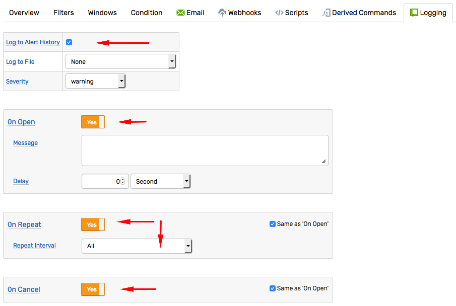
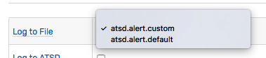

# Alert Logging

Alert Logging actions record [window](window.md) status changes in the database or log files located on the local file system for integration, testing, and audit trailing.

## Logging to Database

To record alert history, check **Log to Alert History** on the **Logging** tab, customize the message text, and enable `On Open`, `On Repeat`, and `On Cancel` triggers. **Message** text is optional.



Status changes are stored in the database and can be inspected on the **Alerts > Alert History** page, retrieved with [Data API: Alert History Query](../api/data/alerts/history-query.md), and checked with the `last_open` function.

```javascript
elapsed_minutes(last_open().command_time) > 60
```

## Logging to Files

Logging to files or remote systems via TCP loggers can be enabled for each rule separately by selecting one of the pre-configured loggers in the **File Logger** drop-down list.

Loggers can be added and modified by administrators on the **Settings > Configuration Files** page.

Open the `logback.xml` for editing, create a new logger and save changes. Once the `logback.xml` file is re-scanned, the new logger is displayed in the **Alert Logger** drop-down list.



File logging is disabled by default. To enable file logging, select one of the loggers in the **Log to File** drop-down list, customize the message text, and enable the`On Open`, `On Repeat`, and `On Cancel` triggers.

## Default File Logger

The default logger named `atsd.alert.default` is available even if undefined in the `logback.xml` file. To modify the default logger, copy the following text to `logback.xml` file and modify its properties as needed.

```xml
<appender name="defaultAlertAppender" class="ch.qos.logback.core.rolling.RollingFileAppender">
   <!-- Name of the log file where alert status changes are stored.
        The path can be absolute or relative to /opt/atsd/atsd directory.
        For example, relative path ../logs/alert.log is resolved to /opt/atsd/atsd/logs/alert.log.  -->
    <file>../logs/alert.log</file>

    <!-- Name of the archived files and their maximum count.
         The files are archived once they cross maxFileSize threshold. -->
    <rollingPolicy class="ch.qos.logback.core.rolling.FixedWindowRollingPolicy">
        <fileNamePattern>../logs/alert.%i.log.zip</fileNamePattern>
        <minIndex>1</minIndex>
        <maxIndex>10</maxIndex>
    </rollingPolicy>

    <!-- Maximum size of the log file. Once the threshold is reached, the files is compressed and rolled over. -->
    <triggeringPolicy class="ch.qos.logback.core.rolling.SizeBasedTriggeringPolicy">
        <maxFileSize>25Mb</maxFileSize>
    </triggeringPolicy>

    <!-- Pattern. The fields can include both pre-defined fields such as %date{ISO8601}, %level, %thread, %logger, %message%n
         as well as placeholders referenced with %X{name}, for example %X{entity} or %X{open_time}.
         Available placeholders are listed below. -->
    <encoder>
        <pattern>%message%n</pattern>
    </encoder>
</appender>
<logger name="atsd.alert.default" level="INFO" additivity="false">
    <appender-ref ref="defaultAlertAppender"/>
</logger>
```

## Custom File Logger

Custom logger names must begin with `atsd.alert.` and have a unique file name and a roll-over pattern. Similarly, custom loggers must specify unique appender names.

Create multiple custom loggers to customize alert logging for various rules.

```xml
<appender name="customAppender" class="ch.qos.logback.core.rolling.RollingFileAppender">
    <file>../logs/alert_custom.log</file>

    <rollingPolicy class="ch.qos.logback.core.rolling.FixedWindowRollingPolicy">
        <fileNamePattern>../logs/alert_custom.%i.log.zip</fileNamePattern>
        <minIndex>1</minIndex>
        <maxIndex>5</maxIndex>
    </rollingPolicy>

    <triggeringPolicy class="ch.qos.logback.core.rolling.SizeBasedTriggeringPolicy">
        <maxFileSize>10Mb</maxFileSize>
    </triggeringPolicy>
    <encoder>
        <pattern>%X{rule},%X{entity},%X{open_time},%message%n</pattern>
    </encoder>
</appender>
<logger name="atsd.alert.custom" level="INFO" additivity="false">
    <appender-ref ref="customAppender"/>
</logger>
```

## File Placeholders

Include placeholders in the `encoder:pattern` tag using the `%X{field-name}` syntax, for example `%X{entity}` or `%X{open_time}`.

### Base Fields

**Name**|**Example**
:---|:---
`alert_duration` | `00:00:05:12`
`alert_duration_interval` | `1m:0s`
`alert_message` | `Alert open.`
`alert_type` | `OPEN`
`columns` | `{memkb = round(value/1024)}` - variables
`entity` | `atsd`
`entity_label` | `Axibase TSD`
`entity_tags` | `{version=community}`
`entity_tags.tag_name` | `community`
`event_tags` | `{location=dc-5}`
`expression` | `value < 512 * 1024 * 1024`
`metric` | `jvm_memory_free`
`open_value` | `3103100000`
`properties` |
`repeat_count` | `0`
`repeat_interval` | `1 MINUTE`
`rule` | `memory_low`
`rule_expression` | `value < 512 * 1024 * 1024`
`rule_filter` | `entity != 'nurswghbs001'`
`rule_name` | `memory_low`
`schedule` | `* * * * MON-FRI`
`severity` | `warning`
`status` | `OPEN`
`tags.tag_name` | `nurswgvml003`
`tags` | `host=nurswgvml003`
`command_time` | `2018-09-19T11:15:15.011Z`
`value` | `3103100000`
`window` | `length(1)`
`threshold` | `max() > 20`

### Date Fields

The following [Date Fields](./window-fields.md#date-fields) contain date in [ISO format](../shared/date-format.md) in UTC time zone, for example `2018-09-19T11:15:15.011Z`:

* `open_time`
* `repeat_time`
* `cancel_time`
* `change_time`
* `add_time`
* `remove_time`
* `update_time`
* `command_time`
* `command_first_time`
* `command_last_time`

The following fields contain interval between current time and `open_time`:

* `alert_duration`, for example `00:01:11:44`
* `alert_duration_interval`, for example `1h:8m:59s`

::: warning
If [DateTime](./object-datetime.md#datetime-object) object representing the field is `null`, such field formatted as empty string.
:::
