# Outgoing Webhooks

Webhooks provide a mechanism for sending event notifications to external web services.

They can be programmed to send an alert to Slack, update a bug tracker, start a CI build, publish an event to an AWS SNS topic, or even control an IoT device.

## Messaging Webhooks

The built-in webhook types for messaging and collaboration services deliver alerts and charts to targeted subscribers.

| Type | Send Message | Send Chart | Integration Model | Hosting Model |
| --- | --- | --- | --- | --- |
| [SLACK](./slack.md) | Yes | Yes | [Slack Bot API](https://api.slack.com/bot-users) | Cloud |
| [TELEGRAM](./telegram.md) | Yes | Yes | [Telegram Bot API](https://core.telegram.org/bots/api) | Cloud |
| [DISCORD](./discord.md) | Yes | Yes | [Discord API](https://discordapp.com/developers/docs/intro) | Cloud |
| [HIPCHAT](./hipchat.md) | Yes | Yes | [HipChat Data Center API](https://www.hipchat.com/docs/apiv2/) | Self-hosted |

Example: [Slack](./slack.md) Alert

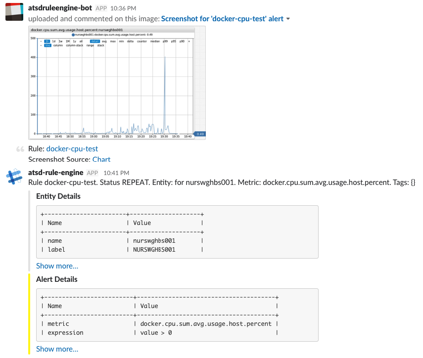

## Integration Webhooks

| Type | Customizable Fields | Description |
| --- | --- | --- |
| [AWS-API](./aws-api.md) | All | Integrate with [AWS](https://aws.amazon.com). |
| [AWS-SNS](./aws-sns.md) | Topic, Message and Subject | Publish a message to an [AWS SNS](https://aws.amazon.com/sns/?p=tile) topic. |
| [AWS-SQS](./aws-sqs.md) | Queue and Message| Send a message to an [AWS SQS](https://aws.amazon.com/sqs/?p=tile) queue. |
| [AZURE-SB](./azure-sb.md) | Queue/Topic and Message | Send a message to an [Azure Service Bus](https://docs.microsoft.com/en-us/azure/service-bus-messaging) |
| [GCP-PS](./gcp-ps.md) | Topic and Message | Send a message to a [Google Cloud Pub/Sub](https://cloud.google.com/pubsub) topic. |
| [WEBHOOK](./webhook.md) | None | Send pre-defined fields as a JSON document or form to an HTTP endpoint. |
| [CUSTOM](./custom.md) | All | Send any JSON content or form parameters to an HTTP endpoint. Examples: [`pagerduty`](./custom-pagerduty.md), [`zendesk`](./custom-zendesk.md), [`github`](./custom-github.md), [`circleci`](./custom-circleci.md), [`jenkins`](./custom-jenkins.md), [`ifttt`](./custom-ifttt.md)|

## Creating Notifications

Notifications are triggered on [window status](../window.md#window-status) events.

Open the **Alerts > Web Notifications** page and click 'Create'.

Select the webhook type in the drop-down.

Set the status to 'Enabled'.

Enter a name by which the webhook will be listed on the 'Web Notifications' tab in the rule editor.

### Payload

The payload is determined by the webhook type. Typically the payload is text content in the form of a JSON document or form fields. Some built-in webhook types support sending chart screenshots as image files in addition to text content.

### Web Driver

If the selected webhook type supports sending chart screenshots, configure the [web driver](./web-driver.md).

### Parameters

Each webhook type supports its own set of settings:

* Fixed settings that can not be customized in the rule editor.
* Editable settings which can be changed in the rule editor.

The customizable settings are marked with an enabled checkbox.

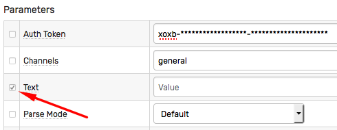

The administrator can specify which settings are fixed and which can be modified in the rule editor.

For example, an API Bot identifier or authentication token is a fixed setting, whereas the channel name and the text message are customizable.

### Testing Notifications

Fill out the required fields for the given webhook type.

Click 'Test' to verify the delivery.

If the webhookwebhook supports sending charts, select one of the portals from the 'Test Portal' drop-down.

The webhook request is successful if the endpoint returns status `200` (OK).

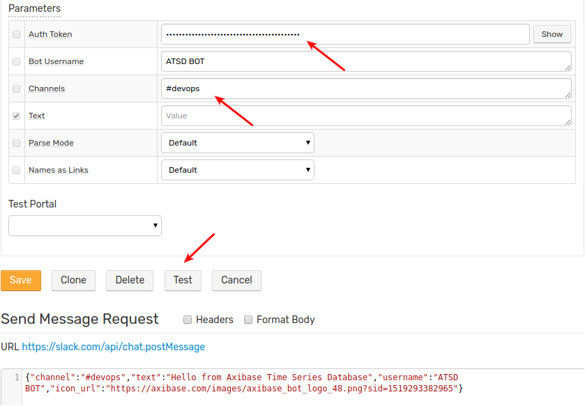

## Enabling Notifications

Open **Alerts > Rules** page.

Select a rule by name, open the 'Web Notifications' tab in the rule editor.

Choose one of the webhooks from the 'Endpoint' drop-down.

Configure when to send the notification by enabling triggers for `Open`, `Repeat`, and `Cancel` events.

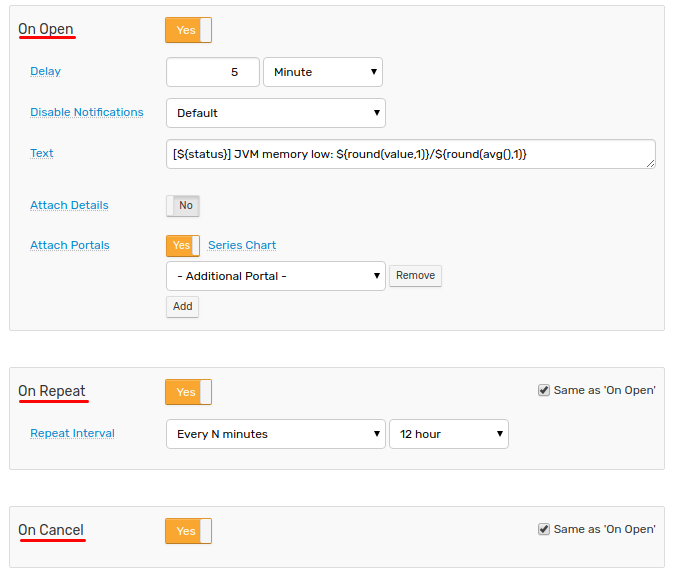

> The rule can be programmed to send notifications to multiple endpoints for  the same event.

### Jitter Control

The `Delay on 'OPEN'` setting allows deferring the trigger fired for the `OPEN` status. This is accomplished by deferring an `OPEN` notification and cancelling it in case the window status reverts to `CANCEL` within the specified grace interval.

This setting can be used to reduce alert jitter when the window alternates between the `OPEN` and `CANCEL` status.

### Repeat Alerts

If the window remains in the `REPEAT` status, it can be configured to repetitively trigger the webhook with the following frequency:

| Frequency | Description |
| --- | --- |
| All | The webhook is triggered each time the window is updated and remains in the `REPEAT` status (expression continues to be `true`). |
| Every *N* events | The webhook is triggered every Nth occurrence of the new data being added to the window. |
| Every *N* minutes | The webhook is triggered when the window is updated but no more frequently than the specified interval. |

### Message Text

The editor displays a `Text` field where the alert message can be customized with [placeholders](../placeholders.md).

Sample alert message with placeholders:

```bash
[${status}] ${rule} for ${entity} ${tags}.
```

The alert message can include links to ATSD resources using [link placeholders](../links.md) such as the `${chartLink}`.

```bash
${chartLink}
```

Utilize [control flow](../control-flow.md) statements for conditional processing.

```bash
*[${tags.status}]* <${entityLink}|${ifEmpty(entity.label, entity)}> Ω <${getEntityLink(tags.docker-host)}|${ifEmpty(getEntity(tags.docker-host).label, tags.docker-host)}>

@if{is_launch}
  ${addTable(entity.tags, 'ascii')}
@end{}
```

### Attachments

Attachment options are displayed in the rule editor if supported by the given webhook type.

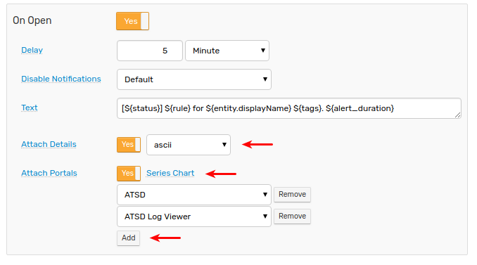

#### Attach Portals

The `Attach Portals` option sends one or more portals as an image to the target chat channel/group/user.

If the selected portal is a [template](../../portals/portals-overview.md#template-portals) portal, its entity, metric, and series tags will be resolved from the alert details in the current window.

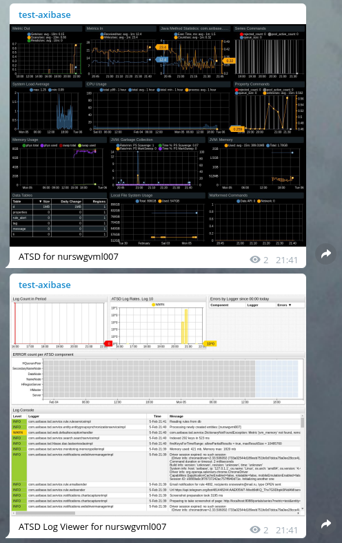

#### Attach Chart

The `Series Chart` option sends the default portal for the metric, entity and series tags in the current window.

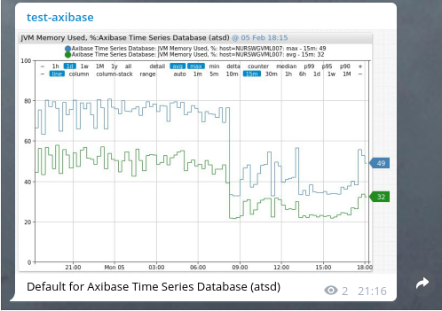

#### Attach Details

The `Attach Details` option sends an alert details table as a separate message with a choice of [formats](../details-table.md#formats).

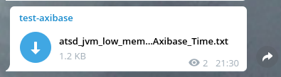

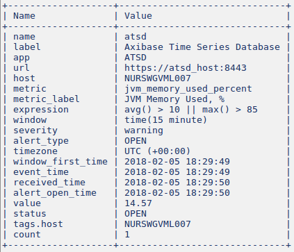

### Multiple Endpoints

To send requests to multiple endpoints for the same status change event, add multiple webhooks in the rule editor.

The order in which webhooks are delivered is non-deterministic.

## Delivery Control

### Stopping Messages

The rule engine ignores alerts initiated for disabled webhooks.

To disable sending alerts from any rule through the selected webhook, set its status to 'Disabled' on the **Alerts > Web Notifications** page.

### Notification Logs

Notification results are recorded in the database as messages and can be viewed under the `notification` type on the Message Search page.

```elm
/messages?search=1&search=&type=notification&interval.intervalCount=1&interval.intervalUnit=WEEK
```

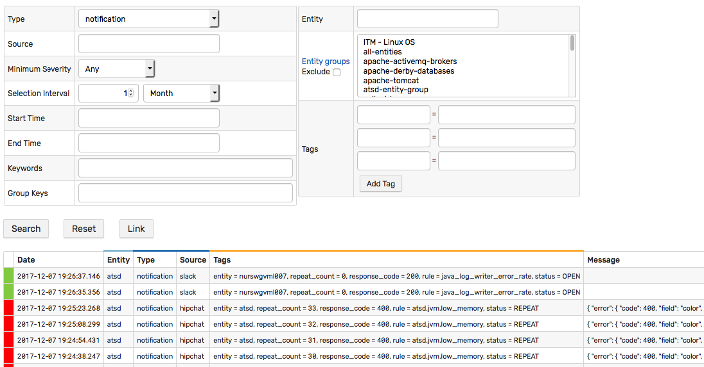

### Monitoring

The number of notifications sent per minute can be monitored with the [`web_service_notifications_per_minute`](../../administration/monitoring.md#rule-engine) metric collected by the database.

```elm
/portals/series?entity=atsd&metric=web_service_notifications_per_minute
```

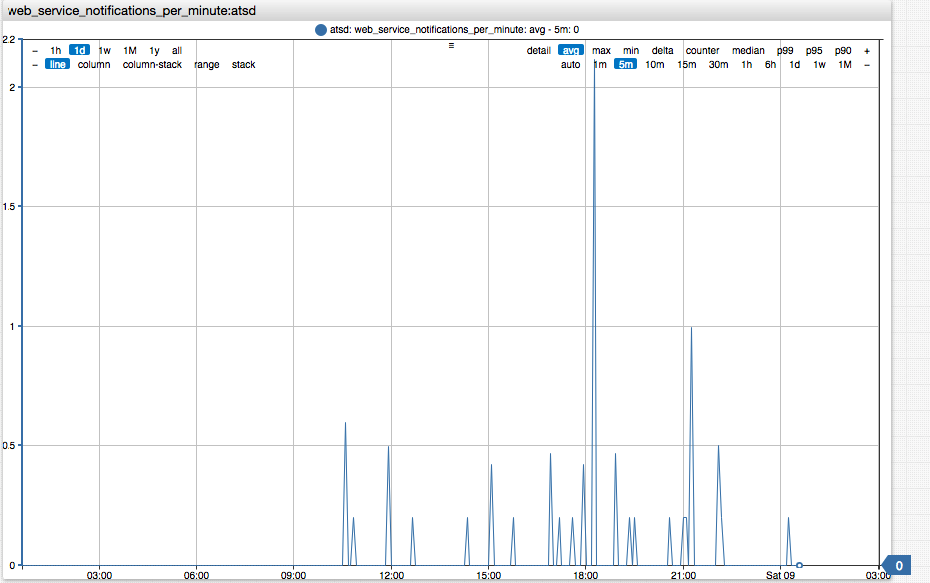

### Error Handling

The notification request is executed successfully if the endpoint returns `200` (OK) status code.

**No retry** is attempted in case of error. If the notification fails, the rule engine writes an `ERROR` event in the `atsd.log` and stores a corresponding messages with `CRITICAL` severity in the database.

If the error occurs during chart preparation, the rule engine falls back to sending a text message containing the chart link and the error details, if available.

## Network Settings

If the ATSD server cannot connect to the remote API server directly due to network restrictions, use one of the following configuration options displayed in the **Network Settings** section.

* **API Gateway**

  In this configuration, an API gateway such as an [NGINX Reverse Proxy](https://www.nginx.com/resources/admin-guide/reverse-proxy/) accepts the request from ATSD on the specified path, sends the request to the remote API server, fetches the response, and sends it back to ATSD. This proxy maps particular paths to remote servers.

  NGINX configuration for Slack:

```txt
    location /api/chat.postMessage {
        proxy_pass https://slack.com/api/chat.postMessage;
    }
    location /api/files.upload {
        proxy_pass https://slack.com/api/files.upload;
    }
```

  NGINX configuration for Telegram:

```txt
    location /bot {
        proxy_pass https://api.telegram.org/bot;
    }
```

  NGINX configuration for Discord:

```txt
    location /api/webhooks {
        proxy_pass https://discordapp.com/api/webhooks;
    }
```

  Modify the `Base URL` by replacing it with the corresponding API gateway URL.

  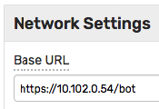

* **HTTP/HTTPS/SOCKS Proxy**

  A network proxy of this type doesn't explicitly map receive paths and remote URLs.

  Keep the `Base URL` as originally specified and instead fill out the `Proxy URL` and optional client credentials fields.

  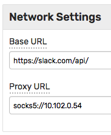

  Supported protocols are HTTP/HTTPS and SOCKS v5.

  Examples:

  * `http://10.102.0.80/proxy`
  * `https://10.102.0.80/proxy`
  * `socks5://10.102.0.54`
