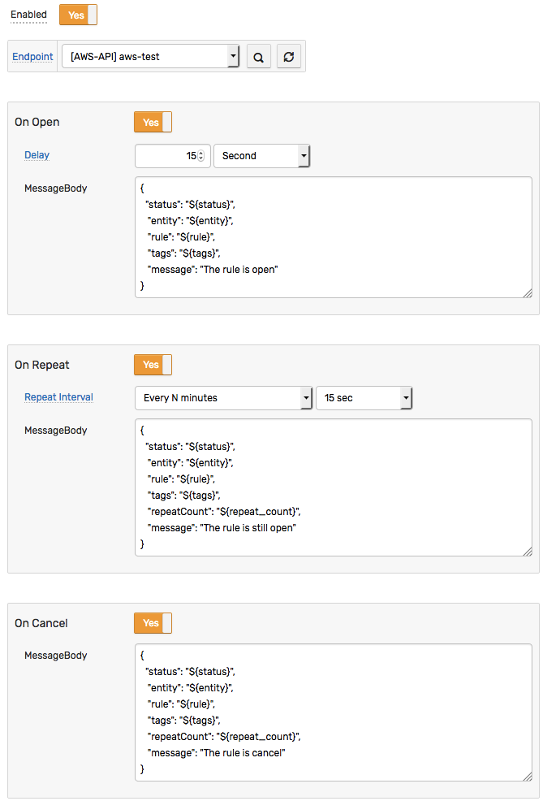

# Integration with Amazon SQS

## Overview

The following example demonstrates how to send a message to an [Amazon SQS](https://aws.amazon.com/documentation/sqs) queue using a [`AWS API`](aws-api.md) webhook.

The request is automatically signed with **AWS Signature, v4**, implemented by this webhook type, which allows submitting requests to **any** AWS endpoint that accepts **AWS Signature, v4**.

The example invokes the [Amazon SQS API](https://docs.aws.amazon.com/AWSSimpleQueueService/latest/APIReference/API_SendMessage.html) `SendMessage` action.

## Configuration

Create a new `AWS API` webhook or import the [template](./resources/aws-api-sqs-notification.xml) used in this example. To import the XML template file, open the **Alerts > Outgoing Webhooks** page, select **Import** in the split-button located below the table and complete the upload form.

To create a new webhook, open the **Alerts > Outgoing Webhooks** page and click **Create**.

### Parameters

Enter a name and specify the following parameters:

| **Name** | **Value** |
| :--- | :--- |
| Endpoint URL | `https://sqs.<AWS_REGION>.amazonaws.com` |
| Method | `POST` |
| Content Type | `application/x-www-form-urlencoded` |
| Access Key Id | `<AWS_ACCESS_KEY_ID>` |
| Secret Access Key | `<AWS_SECRET_ACCESS_KEY>` |
| Action | `SendMessage`|

Modify the **Endpoint URL** by replacing the `<AWS_REGION>` value with your [Amazon SQS region](https://docs.aws.amazon.com/general/latest/gr/rande.html#sqs_region), for example:

```elm
https://sqs.us-east-1.amazonaws.com
```

Enter the AWS key id into the **Access Key Id** field and the secret key into the **Secret Access Key** field.

Add required parameters for `SendMessage` action:

| **Name** | **Value** |
| :--- | :--- |
| `MessageBody` | `<MESSAGE_TEXT>` |
| `QueueUrl` | `<AWS_SQS_QUEUE_URL>` |

Modify **`MessageBody`** by replacing the `<MESSAGE_TEXT>` value with your text, for example:

```json
{
  "status": "${status}",
  "entity": "${entity}",
  "rule": "${rule}",
  "tags": "${tags}",
  "message": ""
}
```

The `MessageBody` text contains placeholders that are substituted with actual values when the webhook is triggered. The placeholders specified in the payload and the URL are visible as editable parameters in the rule editor.

Modify the `QueueUrl` by replacing the `<AWS_SQS_QUEUE_URL>` value with your URL, for example:

```elm
https://sqs.us-east-1.amazonaws.com/568708720055/test
```


## Rule

Create a new rule or import the [rule template](./resources/aws-api-sqs-rule.xml) used in this example. To import the XML template file, open the **Alerts > Rules** page, select **Import** in the split-button located below the table and complete the upload form.

To create a new rule, open the **Alerts > Rules** page and click **Create**.

Specify the key settings on the **Overview** tab.

| **Name** | **Value** |
| :-------- | :---- |
| Status | Enabled |
| Metric | test_m |
| Condition | `value > 1` |


Open the **Webhooks** tab.

Set **Enabled** to **Yes** and choose the previously created webhook from the **Endpoint** drop-down.

Enable **Open**, **Repeat** and **Cancel** triggers.

Specify the message text into the `MessageBody` parameter for all triggers.



## Test

Test the integration by submitting a sample `series` command on the **Data > Data Entry** page.

```ls
series e:test_e m:test_m=2
```


The value causes the condition to evaluate to `true`, which in turn triggers the webhook.
To verify that an alert is raised, open **Alerts > Open Alerts** page and check that an alert for the `test_m` metric is present in the **Alerts** table.


Check the Amazon SQS queue to ensure the new messages arrive.


