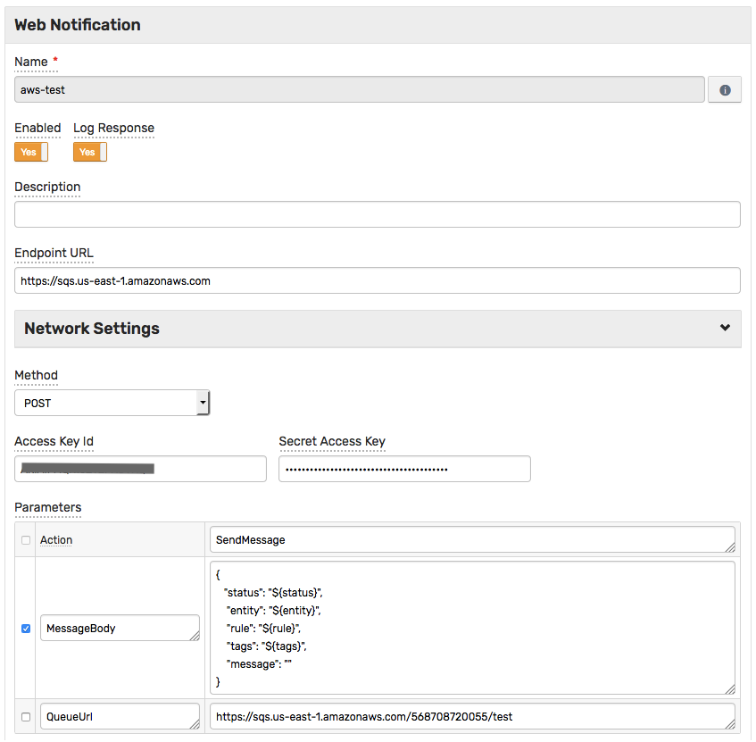
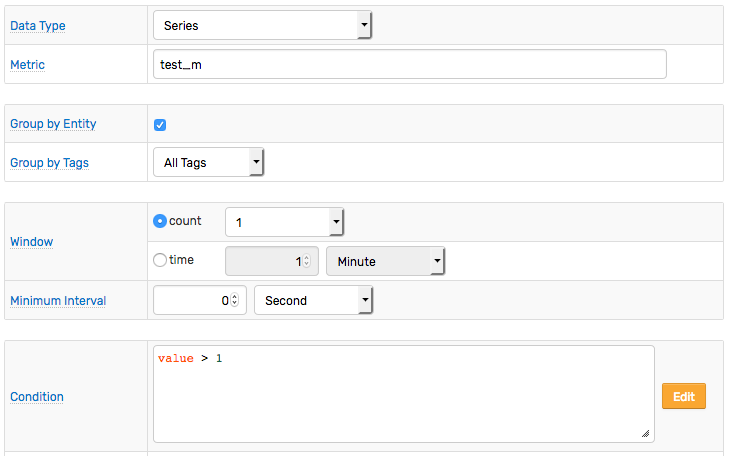

# AWS API Integration with SQS

## Overview

The following example demonstrates how to send a signed message to an [Amazon SQS](https://aws.amazon.com/documentation/sqs) queue using a [`AWS API`](aws-api.md) web notification.

The message is signed with **AWS Signature, v4** implemented in ATSD. The implementation enables submitting AWS API requests to **any** AWS service that accepts **AWS Signature, v4**.

The example described below invokes the [Amazon SQS API](http://docs.aws.amazon.com/AWSSimpleQueueService/latest/APIReference/API_SendMessage.html) `SendMessage` action.

## Configuration

Create a new `AWS API` web notification or import the [template](resources/aws-api-notification.xml) used in this example. To import the XML template file, open the **Alerts > Web Notifications** page, select **Import** in the multi-action button located below the table and follow the prompts.

To create a new notification, open the **Alerts > Web Notifications** page and click **Create**.

### Parameters

Enter a name and specify the following parameters:

| **Name** | **Value** |
| :--- | :--- |
| Endpoint URL | `https://sqs.<AWS_REGION>.amazonaws.com` |
| Method | `POST` |
| Access Key Id | `<AWS_ACCESS_KEY_ID>` |
| Secret Access Key | `<AWS_SECRET_ACCESS_KEY>` |
| Action | `SendMessage`|

Modify the `Endpoint URL` by replacing the `<AWS_REGION>` value with your AWS region, for example: `https://sqs.us-east-1.amazonaws.com`.

Enter the AWS key id into the `Access Key Id` field and the secret key into the `Secret Access Key` field.

Add required parameters for `SendMessage` action:

| **Name** | **Value** |
| :--- | :--- |
| MessageBody | `<MESSAGE_TEXT>` |
| QueueUrl | `<AWS_SQS_QUEUE_URL>` |

Modify the `MessageBody` by replacing the `<MESSAGE_TEXT>` value with your text, for example:

```json
{
  "status": "${status}",
   "entity": "${entity}",
   "rule": "${rule}",
   "tags": "${tags}",
   "message": "test"
}
```

The `MessageBody` text contains placeholders that will be substituted with actual values when the notification is triggered. The placeholders specified in the payload and the URL are visible as editable parameters in the rule editor.

Modify the `QueueUrl` by replacing the `<AWS_SQS_QUEUE_URL>` value with your url, for example:

```
https://sqs.us-east-1.amazonaws.com/568708720055/test
```



## Rule

Create a new rule or import the [rule template](resources/aws-api-rule.xml) used in this example. To import the XML template file, open the **Alerts > Rules** page, select **Import** in the multi-action button located below the table and follow the prompts.

To create a new rule, open the **Alerts > Rules** page and click **Create**.

Specify the key settings on the **Overview** tab. 

| **Name** | **Value** |
| :-------- | :---- |
| Status | Enabled |
| Metric | test_m |
| Condition | `value > 1` |



Open the **Web Notifications** tab.

Set **Enabled** to **Yes** and choose the previously created web notification from the **Endpoint** drop-down.

Enable **Open**, **Repeat** and **Cancel** triggers.

Specify the message text into the `MessageBody` parameter for all triggers.


## Test

In order to test the integration, submit sample data for the `test_m` metric into ATSD. For example, open the **Data > Data Entry** page and submit the following command:

```
  series e:test_e m:test_m=2
```


The value will cause the condition to evaluate to `true`, which in turn will trigger the notification.
To verify that an alert was raised, open **Alerts > Open Alerts** page and check that an alert for the `test_m` metric is present in the **Alerts** table.


Check the AWS SQS queue to make sure the new messages were received:


