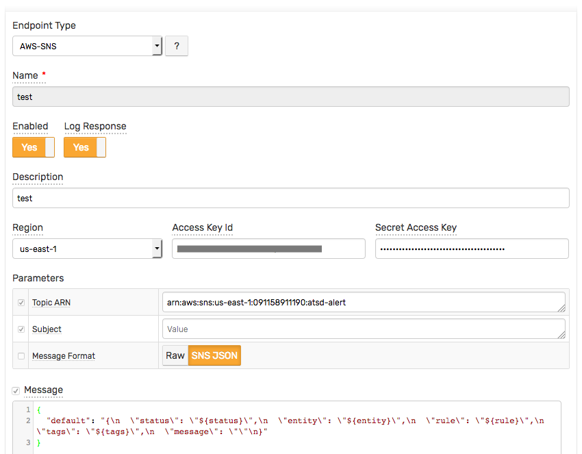
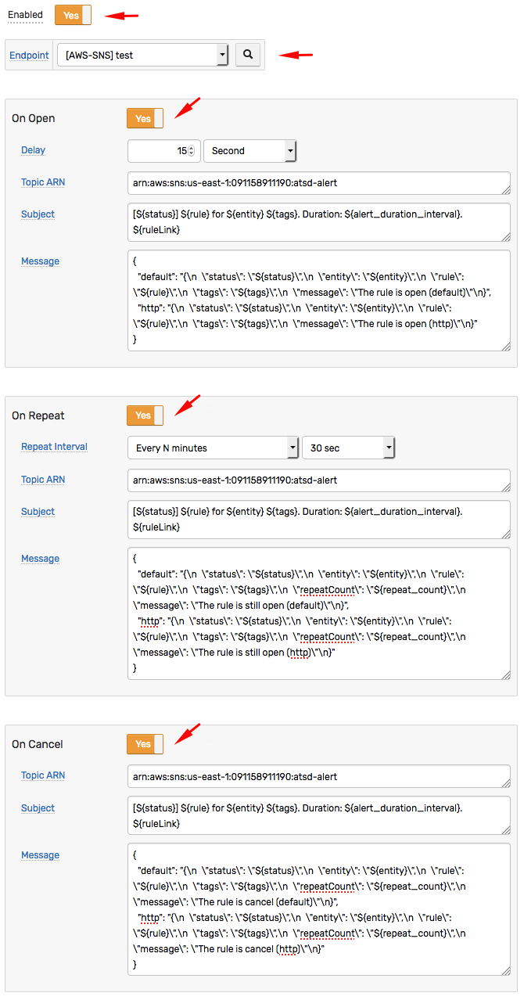
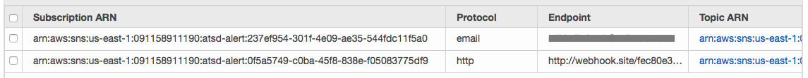
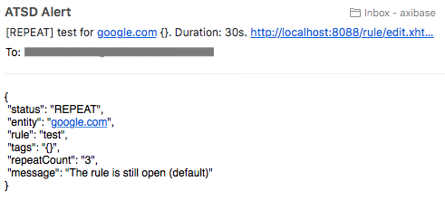
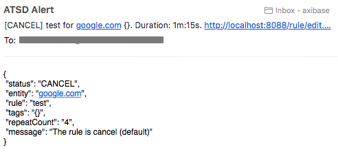
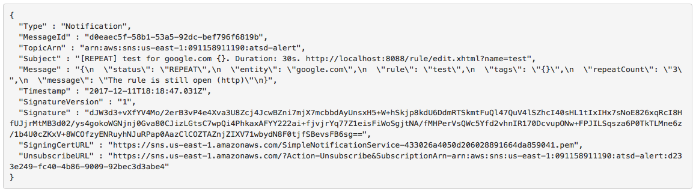
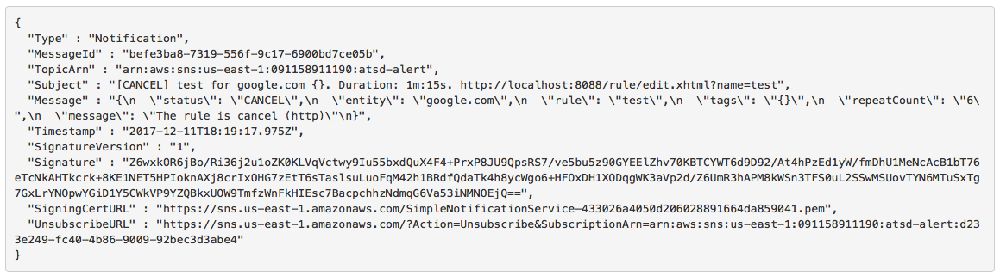
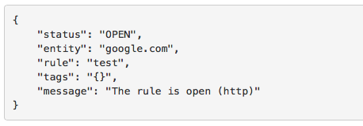
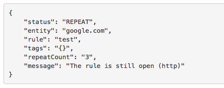
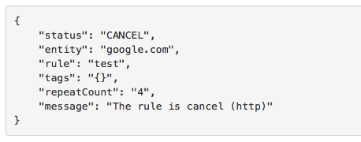

# SNS JSON Message Format Example

Create a `AWS API` notification with `Message Format = SNS JSON`, for example:



Create a new rule and open the **Webhooks** tab.

Select `[AWS-SNS] test` from the **Endpoint** drop-down.

Enable the `OPEN`, `REPEAT`, and `CANCEL` triggers.

Customize the alert messages using [placeholders](../placeholders.md) as necessary, for example:

* `OPEN`

```json
     {
        "default": "{\n  \"status\": \"${status}\",\n  \"entity\": \"${entity}\",\n  \"rule\": \"${rule}\",\n  \"tags\": \"${tags}\",\n  \"message\": \"The rule is open (default)\"\n}",
        "http": "{\n  \"status\": \"${status}\",\n  \"entity\": \"${entity}\",\n  \"rule\": \"${rule}\",\n  \"tags\": \"${tags}\",\n  \"message\": \"The rule is open (http)\"\n}"
     }
```

* `REPEAT`

```json
     {
        "default": "{\n  \"status\": \"${status}\",\n  \"entity\": \"${entity}\",\n  \"rule\": \"${rule}\",\n  \"tags\": \"${tags}\",\n  \"repeatCount\": \"${repeat_count}\",\n  \"message\": \"The rule is still open (default)\"\n}",
        "http": "{\n  \"status\": \"${status}\",\n  \"entity\": \"${entity}\",\n  \"rule\": \"${rule}\",\n  \"tags\": \"${tags}\",\n  \"repeatCount\": \"${repeat_count}\",\n  \"message\": \"The rule is still open (http)\"\n}"
     }
```

* `CANCEL`

```json
     {
        "default": "{\n  \"status\": \"${status}\",\n  \"entity\": \"${entity}\",\n  \"rule\": \"${rule}\",\n  \"tags\": \"${tags}\",\n  \"repeatCount\": \"${repeat_count}\",\n  \"message\": \"The rule is cancel (default)\"\n}",
        "http": "{\n  \"status\": \"${status}\",\n  \"entity\": \"${entity}\",\n  \"rule\": \"${rule}\",\n  \"tags\": \"${tags}\",\n  \"repeatCount\": \"${repeat_count}\",\n  \"message\": \"The rule is cancel (http)\"\n}"
     }
```

  

* Click **Save** to save the rule.

* The rule creates new windows when new commands are received by the database.

It can take a few seconds for the first commands to arrive and to trigger the webhooks. You can open and refresh the **Alerts > Open Alerts** page to verify that an alert is open for your rule.

## Test

AWS SNS Subscriptions:



## Notifications examples

### Email protocol






### Http protocol

The `HTTP` subscription with parameter `raw message delivery = false`:






### Http protocol

The `HTTP` subscription with parameter `raw message delivery = true`:






